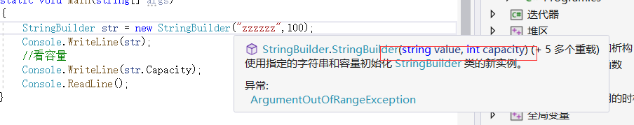

## c# StringBuilder

//C#提供的一个用于处理字符串的公共类

//主要解决的问题是:
//修改字符串而不创建新的对象,需要频繁修改和拼接的字符串可以使用它，可以提升性能

//使用前需要引用命名空间System.Text

            StringBuilder str = new StringBuilder("zzzzzz");
            Console.WriteLine(str);

/ / StringBuilder存在一个容量的问题，每次往里面增加时会自动扩容 

一般字符串不会改变 添加字符串 需要声明新的数组

后面可以指定空间 如果超过就会增加

