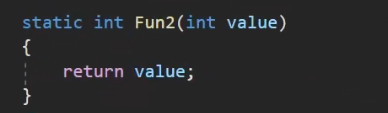

### 委托（委托别人调用函数）

委托是函数(方法)的容器
可以理解为表示函数(方法)的变量类型
用来存储、传递函数(方法)
委托的本质是一个类，用来定义函数(方法)的类型(返回值和参数的类型)
**不同的函数(方法)必须对应和各自"格式"─致的委托**

关键字:delegate
语法:访问修饰符delegate返回值委托名(参数列表);
写在哪里?
可以申明在namespace和class语句块中更多的写在namespace中
简单记忆委托语法就是函数申明语法前面加一个delegate关键字

一般使用public（默认是pulic）
访问修饰默认不写为public在别的命名空间中也能使用'private其它命名空间就不能用了

申明了一个可以用来存储无参无返回值函数的容器这里只是定义了规则并没有使用（不能重载）

委托变量可以存储多个函数（）

            //存入多个函数
            f2 += Fun;

删除函数如下

~~~c#
        f2 -= Fun;
~~~

一开始赋值以后

会出现报错

### 系统定义好的委托

使用系统自带委托需要引用using System;

~~~c#
//无参无返回值
Action action = Fun;
//可以指定可以指定返回值类型的泛型季托
Func<string> funcstring=Fun4;
Func<int> funcInt = Fun5;
//传入int参数的委托 可以传最大16个参数的
Action<int,string> action2 =Fun6; 
//可以穿n个参数的并且有返回值的系统也提供了16个委托
Func<int, int> func2 = Fun2;
~~~

//委托是支持泛型的可以让返回值和参数可变更方便我们的使用

~~~C#
delegate T MyFun3<T,K>(T V,K k);
~~~

