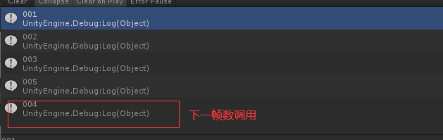
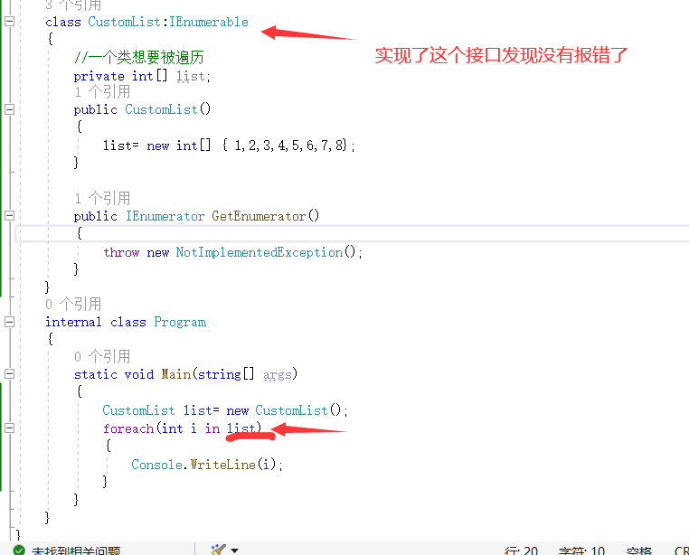

### foreach

**局限性:**

只能读取全部元素(语句本身)
不能修改元素
只能遍历实现lenumerable接口的集合对象

## Unity 3d中的协程

#### 协程的原理

首先需要了解协程不是线程，协程依旧是在主线程中进行

然后要知道协程是通过迭代器来实现功能的，通过关键字`IEnumerator`来定义一个迭代方法，注意使用的是`IEnumerator`，而不是`IEnumerable`：

两者之间的区别：

- `IEnumerator`：是一个实现迭代器功能的接口
- `IEnumerable`：是在`IEnumerator`基础上的一个封装接口，有一个`GetEnumerator()`方法返回`IEnumerator`

### 协程的使用

首先通过一个迭代器定义一个返回值为IEnumerator的方法，然后再程序中通过StartCoroutine来开启一个协程即可：

在正式开始代码之前，需要了解StartCoroutine的两种重载方式：

需要了解StartCoroutine的两种重载方式：

- `StartCoroutine（string methodName）`：这种是没有参数的情况，直接通过方法名（字符串形式）来开启协程
- StartCoroutine（IEnumerator routine）：通过方法形式调用
- StartCoroutine（string methodName，object values):带参数的通过方法名进行调用
- 
- `StopCoroutine（string methodName）`：通过方法名（字符串）来进行
- `StopCoroutine（IEnumerator routine）`:通过方法形式来调用
- `StopCoroutine(Coroutine routine)`：通过指定的协程来关闭

### yield

如果你了解`Unity`的脚本的生命周期，你一定对`yield`这几个关键词很熟悉，没错，`yield` 也是脚本生命周期的一些执行方法，不同的`yield` 的方法处于生命周期的不同位置，


yield return null; 暂停协程等待下一帧继续执行

yield return 0或其他数字; 暂停协程等待下一帧继续执行

yield return new WairForSeconds(时间); 等待规定时间后继续执行

yield return StartCoroutine("协程方法名");开启一个协程（嵌套协程)


~~~c#
public class 协程 : MonoBehaviour {

	// Use this for initialization
	void Start () {
        Debug.Log("001");
        StartCoroutine("Demo");
        Debug.Log("003");

    }
	
	// Update is called once per frame
	void Update () {
		
	}
    private void LateUpdate()
    {
        Debug.Log("005");
    }
    IEnumerator Demo()
    {
        Debug.Log("002");

        yield return 0;
        Debug.Log("004");
    }
}
~~~




接下来看几个特殊的yield，他们是用在一些特殊的区域，一般不会有机会去使用，但是对于某些特殊情况的应对会很方便

yield return GameObject; 当游戏对象被获取到之后执行
yield return new WaitForFixedUpdate()：等到下一个固定帧数更新
yield return new WaitForEndOfFrame():等到所有相机画面被渲染完毕后更新
yield break; 跳出协程对应方法，其后面的代码不会被执行
通过上面的一些yield一些用法以及其在脚本生命周期中的位置，我们也可以看到关于协程不是线程的概念的具体的解释，所有的这些方法都是在主线程中进行的，只是有别于我们正常使用的Update与LateUpdate这些可视的方法

### 案例

将一个复杂程序分帧执行：

如果一个复杂的函数对于一帧的性能需求很大，我们就可以通过yield return null将步骤拆除，从而将**性能压力分摊开来，最终获取一个流畅的过程，这就是一个简单的应用**

举一个案例，如果某一时刻需要使用Update读取一个列表，这样一般需要一个循环去遍历列表，这样每帧的代码执行量就比较大，就可以将这样的执行放置到协程中来处理：

~~~c#
public class Test : MonoBehaviour
{
    public List<int> nums = new List<int> { 1, 2, 3, 4, 5, 6 };


    private void Update()
    {
        if(Input.GetKeyDown(KeyCode.Space))
        {
            StartCoroutine(PrintNum(nums));
        }
    }
	//通过协程分帧处理
    IEnumerator PrintNum(List<int> nums)
    {
        foreach(int i in nums)
        {
            Debug.Log(i);
            yield return null;
                 
        }

    }
}

~~~

**进行计时器工作**

当然这种应用场景很少，如果我们需要计时器有很多其他更好用的方式，但是你可以了解是存在这样的操作的，要实现这样的效果，需要通过yield return new WaitForSeconds()的延时执行的功能：

	IEnumerator Test()
	{
	    Debug.Log("开始");
	    yield return new WaitForSeconds(3);
	    Debug.Log("输出开始后三秒后执行我");
	}
**异步加载等功能**

只要一说到异步，就必定离不开协程，因为在异步加载过程中可能会影响到其他任务的进程，这个时候就需要通过协程将这些可能被影响的任务剥离出来

常见的异步操作有：

AB包资源的异步加载
Reaources资源的异步加载
场景的异步加载
WWW模块的异步请求

## 迭代器

要实现迭代器最主要的是实现IEnumerable和IEnumerator这两个接口，当然实际上它们还有泛型形式IEnumerable<T>和IEnumerator<T>,而且这两个泛型形式的接口也是继承自IEnumerable和IEnumerator这两个接口。我们暂时先不管他们的泛型形式。

 我们先来看看这两个接口的样子。

  IEnumerable接口：

```csharp
[ComVisible(true)]
[Guid("496B0ABE-CDEE-11d3-88E8-00902754C43A")]
public interface IEnumerable
{
    [DispId(-4)]
    IEnumerator GetEnumerator();
}
```

  IEnumerator接口：

```csharp
[ComVisible(true)]
[Guid("496B0ABF-CDEE-11d3-88E8-00902754C43A")]
public interface IEnumerator
{
    object Current { get; }
    bool MoveNext();
    void Reset();
}
```

一个要实现GetEnumerator();

 先说IEnumerable接口，我们能看到它需要实现一个GetEnumerator方法，而这个方法的返回值正好是 IEnumerator 类型。在IEnumerator接口中，我们能看到有一个属性（Current），两个方法（MoveNext Reset）

Current表示当前项的内容，因为这里IEnumerator 不是泛型的所以，Current的类型为object。

MoveNext方法，**他返回一个bool类型的值，这个方法是个关键，因为这个方法是来判断迭代或者说循环遍历是否要往下执行的**，同时一般会在这个方法中进行数组下标值的增加。而在Current中我们一般是不处理下标值的增减，而是通过下标值和数组返回当前对应的值。

Reset方法，一般是在这里重置下标，不过一般这个方法使用的比较少，一般用来第一次调用时候重置下标记


要实现所以写一个能被foreach遍历的类



foreach执行顺序本质是

    
            // 先获取in后面这个对象的IEnumerator
            // 会调用对象其中的GetEnumerator方法来获取.
            // 执行得到这个IEnumerator对象中的MoveNext方法
           //  只要MoveNext方法的 返回值时true就会去得到current
            // 然后复制给item

所以代码如下

~~~c#
class CustomList : IEnumerable, IEnumerator
    {

        private int[] list;
        //起始位置是-1
        private int position = -1;
        public CustomList()
        {
            list = new int[] { 1, 2, 3, 4, 5, 6, 7, 8 };
        }

        public object Current
        {
            get { return list[position]; }

        }

        #region IEnumerable实现的返回
        //返回一个IEnumerator
        public IEnumerator GetEnumerator()
        {
            //自己实现了接口本身就是一个IEnumerator
            Reset();
            return this;
        }
        #endregion 

        public bool MoveNext()
        {
            position++;
            //判断position合不合法
            return position < list.Length;
        }

        public void Reset()
        {
            //第一次进行复原
            //要不然第二次就不会成功调用
            position= -1;
        }
    }
~~~


而且从名字上来看也能一目了然他们的作用。Current表示当前项的内容，因为这里IEnumerator 不是泛型的所以，Current的类型为object。接下来是MoveNext方法，他返回一个bool类型的值，这个方法是个关键，因为这个方法是来判断迭代或者说循环遍历是否要往下执行的，同时一般会在这个方法中进行数组下标值的增加。而在Current中我们一般是不处理下标值的增减，而是通过下标值和数组返回当前对应的值。最后是Reset方法，一般是在这里重置下标，不过一般这个方法使用的比较少，而且后面还会提到这个方法在有些情况下是不能调用的。

