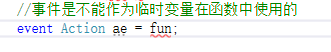

是基于委托的存在

事件是委托的安金包裹

让委托的使用更具有安全性

事件是一种特殊的变量类型

### 申明语法:

访问修饰符 event 委托类型 事件名;
//事件的使用:
//1.事件是作为成员变量存在于类中
//2.委托怎么用事件就怎么用

### 事件相对于委托的区别:

1.不能在类外部赋值

2.不能再类外部调用

**只能在类里面封装调用**

注意:
**它只能作为成员存在于类和接口以及结构体中**

委托可以这样写

### 为什么有事件

//1.防止外部随意置空委托
/ /2.防止外部随意调用委托
//3.事件相当于对委托进行了一次封装让其更加安全