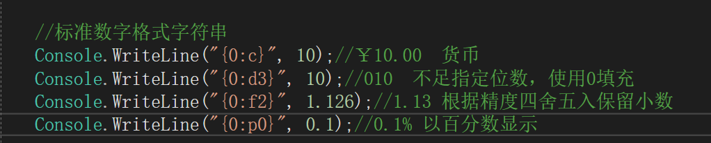
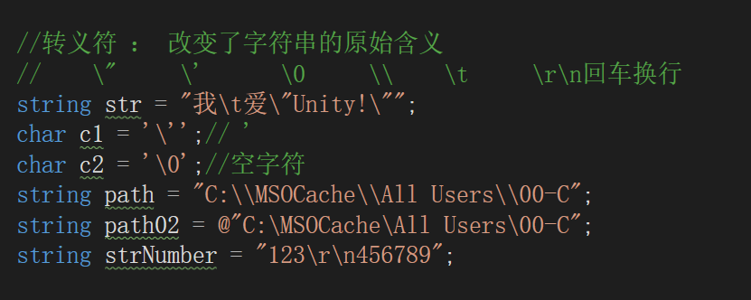

~~~c#
int age = 30;
string name="戴某人"
Console.WriteLine("名字是"+name+"年纪是"+age+"。")
Console.WriteLine("名字是{0}年纪是{1}",name,age)
string str02 = string.Format("名字是{0}年纪是{1}",name,age)
Console.WriteLine(str02)
~~~

特殊字符串

