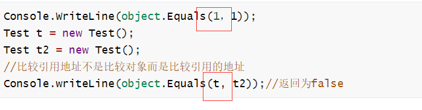
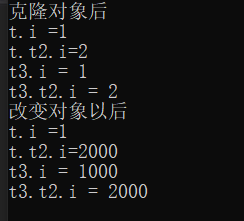

## object中的

### 静态方法Equals

静态方法Equals判断两个对象是否相等

最终的判断权，交给左侧对象的Equals方法，

不管值类型引用类型都会按照左侧对象Equals方法的规则来进行比较

就是调用它里面的虚方法（下面有介绍） 可以自己重写但是一般不重写

~~~c#
Console.WriteLine(object.Equals(1，1));
Test t = new Test();
Test t2 = new Test();
//比较引用地址不是比较对象而是比较引用的地址
Console.writeLine(object.Equals(t, t2));//返回为false
~~~

### 静态方法ReferenceEquals

比较两个对象是否是相同的引用，主要是用来比较引用类型的对象。

值类型对象返回值始终是false。

### 普通方法GetType

该方法在反射相关知识点中是非常重要的方法，该方法的主要作用就是获取对象运行时的类型Type,
通过Type结合反射相关知识点可以做很多关于对象的操作

### 普通方法MemberwiseClone

该方法用于获取对象的浅拷贝对象，意思就是会返回一个新的对象,但是新对象中的引用变量会和老对象中一致(就是拷贝指针)

一个类具有值类型与引用类型的话

~~~c#
    class Test
    {
        public int i=1;
        public TEST2 t2=new TEST2();
        public Test clone()
        {
            return MemberwiseClone() as Test;
        }

    }
    class TEST2
    {
        public int i = 2;
    }
~~~

~~~c#
            Type type=t.GetType();
            Test t3=t.clone();
            Console.WriteLine("克隆对象后"); 
            Console.WriteLine("t.i =" + t.i);
            Console.WriteLine("t.t2.i="+t.t2.i);
            Console.WriteLine( "t3.i = " + t3.i);
            Console.WriteLine("t3.t2.i = " + t3.t2.i);
            t3.i= 1000;
            t3.t2.i = 2000;
            Console.WriteLine("改变对象以后");
            Console.WriteLine("t.i =" + t.i);
            Console.WriteLine("t.t2.i=" + t.t2.i);
            Console.WriteLine("t3.i = " + t3.i);
            Console.WriteLine("t3.t2.i = " + t3.t2.i);
~~~

发现复制的引用类型改变 原来的值类型不变 就是浅拷贝

### 虚方法Equals

默认实现还是比较两者是否为同一个引用，即相当于ReferenceEquals。
但是微软在所有值类型的基类system.ValueType中重写了该方法，用来比较值相等。

我们也可以重写该方法，定义自己的比较相等的规则

### 虚方法GetHashcode

获取对象的哈希码
(一种通过算法算出的，表示对象的唯一编码，不同对象哈希码有可能一样，具体值根据哈希算法决定)，

//我们可以通过重写该函数来自己定义对象的哈希码算法，正常情况下，我们使用的极少，基本不用。

### 虚方法ToString

//该方法用于返回当前对象代表的字符串，我们可以重写它定义我们自己的对象转字符串规则,
//该方法非常常用。当我们调用打印方法时，默认使用的就是对象的ToString方法后打印出来的内容。