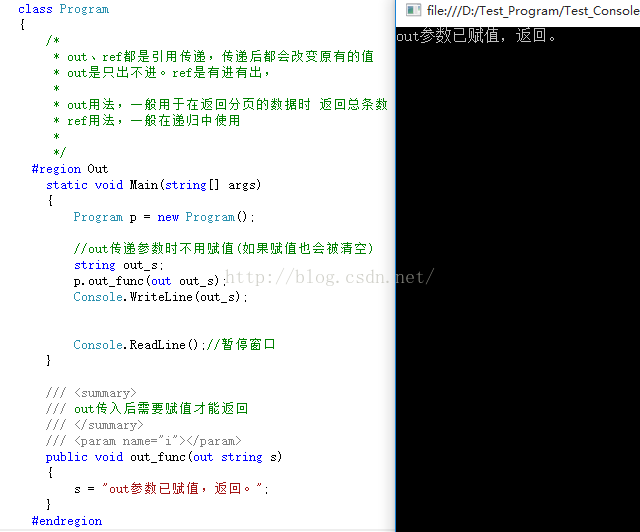
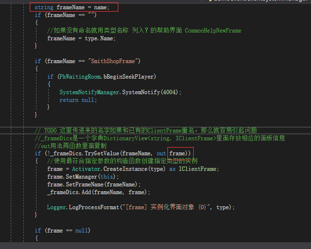
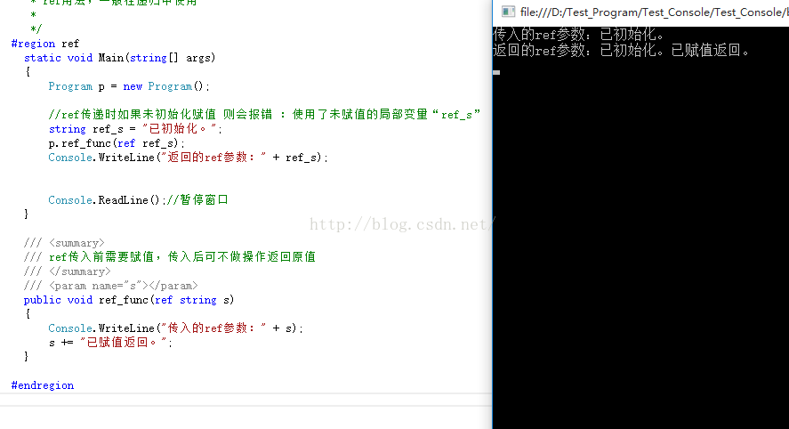

首先：两者都是按地址传递的，使用后都将改变原来参数的数值。

其次：**ref可以把参数的数值传递进函数，但是out是要把参数清空，就是说你无法把一个数值从out传递进去的，out进去后，参数的数值为空，所以你必须初始化一次**

### out

~~~C#
    class Program
    {
        /*
         * out、ref都是引用传递，传递后使用都会改变原有的值
         * out是只出不进。ref是有进有出，
         * 
         * out用法，一般用于需要返回多个参数时，如在需要返回分页的数据时 同时返回总条数或者TryParse()会用到
         * ref用法，一般用于在改变一个参数时，把他的改变反应到变量中 如在递归中
         * 
         */
      #region Out
        static void Main(string[] args)
        {
            Program p = new Program();
 
            //out传递参数时不用赋值(如果赋值也会被清空)
            string out_s;
            p.out_func(out out_s);
            Console.WriteLine(out_s);
 
 
            Console.ReadLine();//暂停窗口
        }
 
        /// 

        /// out传入后需要赋值才能返回
        /// 

        /// <param name="i"></param>
        public void out_func(out string s)
        {
            //再函数里面赋予值类型
            s = "out参数已赋值，返回。";
        }
      #endregion
    }
~~~

再项目里面实战

比如说一个字典里面有接口类有名字  就可以传入out查询时候给他复制

### ref：

~~~c#
 class Program
    {
      #region ref
        static void Main(string[] args)
        {
            Program p = new Program();
          
            //ref传递时如果未初始化赋值 则会报错 ：使用了未赋值的局部变量“ref_s”	
            string ref_s = "已初始化。";
            p.ref_func(ref ref_s);
            Console.WriteLine("返回的ref参数：" + ref_s);
 
 
            Console.ReadLine();//暂停窗口
        }
 
        /// 

        /// ref传入前需要赋值，传入后可不做操作返回原值
        /// 

        /// <param name="s"></param>
        public void ref_func(ref string s)
        {
            Console.WriteLine("传入的ref参数：" + s);
            s += "已赋值返回。";
        }
       
      #endregion
    }
~~~

-  out、ref都是引用传递 (传递后改变传递的值会影响原来的值)
-  out不需要初始化 需要在传入的方法内部完成初始化赋值   **ref必须初始化赋值**
-  out用于获取函数内部的值    ref可同时改变函数内和函数外的值