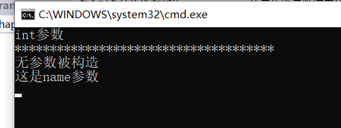

### 构造函数

#### 构造函数可以进行重载

~~~c#
    class Persson
    {
        public int age;
        public string name;
        public Persson() {
            Console.WriteLine("无参数被构造");
        }
        public Persson(int age)
        {
            Console.WriteLine("int参数");
        }
        //两个构造函数一起调用
        public Persson(string name):this() 
        {
            Console.WriteLine("这是name参数");
        }
    }
    internal class Program
    {
        static void Main(string[] args)
        {
            Persson a2 = new Persson(1);
            Console.WriteLine("*************************************");
            Persson a1 = new Persson("Zrq");
            Console.ReadLine();

        }
    }
~~~

输出



#### 如果不自己实现无参构造函数而实现了有参构造函数会失去默认的无参构造（继承会报错所以需要注意下）


### 垃圾回收机制

```c#
//垃圾回收，英文简写Gc (Garbage collector)
//垃圾回收的过程是在遍历堆(Heap)上动态分配的所有对象
//通过识别它们是否被引用来确定哪些对象是垃圾，哪些对象仍要被使用
//所胃的垃圾就是没有被任何变量，对象引用的内容
//垃圾就需要被回收释放

//垃圾回收有很多种算法，
//比如
//引用计数(Reference Counting)
//标记清除(Mark Sweep)
//标记整理( Mark Compact)
//复制集合(Copy collection)

//注意:
//GC只负责堆(Heap)内存的垃圾回收
//引用类型都是存在堆(Heap)中的，所以它的分配和释放都通过垃圾回收机制来管理
//栈(Stack)上的内存是由系统自动管理的
//值类型在栈(Stack)中分配内存的，他们有自己的生命周期，不用对他们进行管理，会自动分配和释放

//C#中内存回收机制的大概原理
//0代内存  1代内存    2代内存
//代的概念:
//代是垃圾回收机制使用的一种算法(分代算法)
//新分配的对象都会被配置在第0代内存中
//每次分配都可能会进行垃圾回收以释放内存(0代内存满时)

//在一次内存回收过程开始时，垃圾回收器会认为堆中全是垃圾，会进行以下两步
//1.标记对象从根（静态字段、方法参数）开始检查引用对象，标记后为可达对象，未标记为不可达对象不可达对象就认为是垃圾
//2.搬迁对象压缩堆―(挂起执行托管代码线程)释放未标记的对象搬迁可达对象修改引用地址

//大对象总被认为是第二代内存目的是减少性能损耗,提高性能
//不会对大对象进行搬迁压缩85ee0字节(83kb）以上的对象为大对象
```