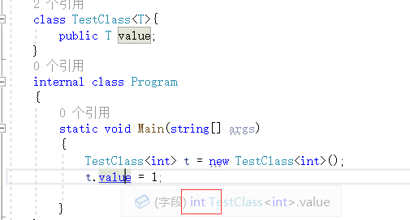
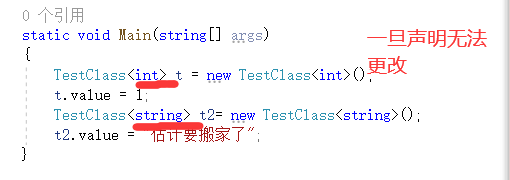
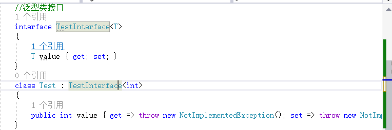
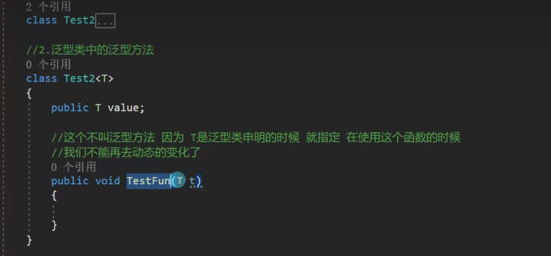
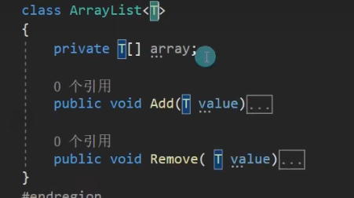

## 泛型

泛型实现了类型参数化，达到代码重用目的
通过类型参数化来实现同一份代码上操作多种类型
泛型相当于类型占位符
定义类或方法时使用替代符代表变量类型
当真正使用类或者方法时再具体指定类型

基本语法

class 类名<泛型占位字母>

interface 接口<泛型占位字母>

~~~c#
    class TestClass<T>{
        public T value;
    }
~~~

这里就是int **实现了类型参数化 很方便**

泛型占位字母可以有多个用逗号分开

~~~c#
    class Testclass2<T1, T2, K, M, LL>
    {
        public T1 value;
        public T2 value1;
        public K value2;
        public M value3;
    }
~~~

也可以使用泛型接口类

//1.不同类型对象的相同逻辑处理就可以选择泛型
//2.使用泛型可以一定程度避免装箱拆箱
//举例:优化ArrayList

### 泛型约束

让泛型的类型有一定的限制

关键字:where

//1.值类型	where 泛型字母:struct
//2.引用类型 								where泛型字母:class
//3.存在无参公共构造函数		where 泛型字母:new( )
//4.某个类本身或者其派生类	where泛型字母:类名
//5.某个接口的派生类型            where 泛型字母:接口名
//6.另一个泛型类型本身或者派生类型 where泛型字母:另一个泛型字母