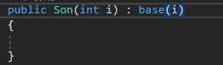

## 继承基本语法

 class类名:父类名

1.单根性:只能继承一个父类

2.传递性:子类可以继承父类的父类。。。的所有内容

3.访问修饰符对于成员的影响

4.极奇不建议使用在子类中丰明和父类同名的成员下面就是解决办法

```c#
class SomeClass
{
    public string Field1;
    ...
}
class OtherClass:SomeClass
{
    new public string Field1;
    ...
}
```

#### 继承中的构造函数

注意:
1.父类的无参构造很重要
2.子类可以通过base关键字代表父类调用父类构造



继承中构造函数的执行顺序

先执行父类的构造函数 ------>再执行子类的构造函数

子类实例化时 默认自动调用的是父类的无参构造所以如果父类无参构造被顶掉 会报错


#### 密封类是使用sealed

密封关键字修饰的类作用:让类无法再被继承

## 里氏替换原则

任何父类出现的地方，子类都可以替代 父类容器装子类对象

注意

**子类 不能装在父亲对象**

Son son = new Father();(报错)

//重点:
语法表现—父类容器装子类对象,因为子类对象包含了父类的所有内容

//作用:
方便进行对象存储和管理

#### 父亲转换成为子类

//基本概念
is:判断一个对象是否是指定类对象

返回值:bool是为真不是为假

as:将一个对象转换为指定类对象

返回值:指定类型对象
成功返回指定类型对象，失败返回null

类对象is类名	该语句块会有一个bool返回值true和false

类对象as类名	该语句块会有一个对象返回值对象和null