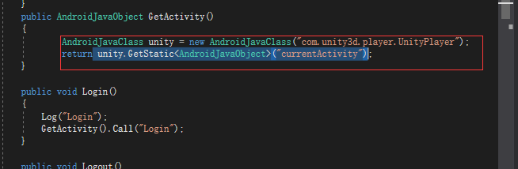
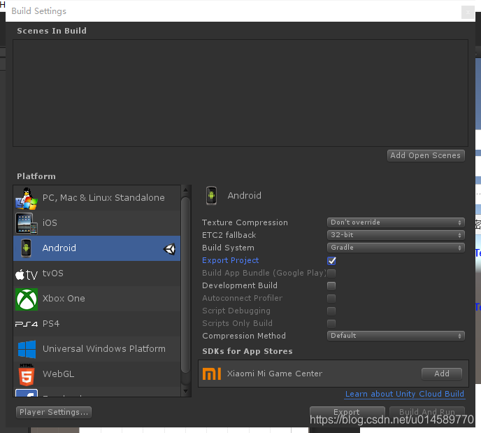

问题一为啥在一个项目中 U3D会调用如下两句话

当在Android Studio开发时，将unity的jar包导入后，可自定义一个类继承自com.unity3d.player.UnityPlayerActivity

~~~java
import com.unity3d.player.UnityPlayerActivity;

//这是我定义的一个类继承
public class MainActivity extends UnityPlayerActivity {
    @Override
    protected void onCreate(Bundle savedInstanceState) {
        super.onCreate(savedInstanceState);
    }
 }

~~~

我们再来看看父亲里面的方法 

~~~java
public class UnityPlayerActivity extends Activity {
    protected UnityPlayer mUnityPlayer;
	//无参数的父亲构造
    public UnityPlayerActivity() {
    }
	//重写的方法子类创建时不会创建父类对象，所以这个this是子类对象的引用。
    protected void onCreate(Bundle var1) {
        this.requestWindowFeature(1);
        super.onCreate(var1);
        this.mUnityPlayer = new UnityPlayer(this);
        this.setContentView(this.mUnityPlayer);
        this.mUnityPlayer.requestFocus();
    }
    ...
}

~~~

UnityPlayer的代码如下：

~~~java
 public UnityPlayer(Context var1) {
        super(var1);
        if (var1 instanceof Activity) {
            currentActivity = (Activity)var1;
            this.c = currentActivity.getRequestedOrientation();
        }
        ...
}

~~~

所以在Unity中获取的currentActivity就是MainActivity，

~~~c#
AndroidJavaClass javaClass3 = new AndroidJavaClass("com.unity3d.player.UnityPlayer");
AndroidJavaObject javaObject = javaClass.GetStatic<AndroidJavaObject>("currentActivity");

~~~

在Android中同样可以获取currentActivity

~~~c#
public static Activity GetActivity()
{
    Activity activity = null;
    try {
        Class<?> classtype = Class.forName("com.unity3d.player.UnityPlayer");
        activity = (Activity)classtype.getDeclaredField("currentActivity").get(classtype);
    }catch (Exception e)
    {

    }
    return activity;
}

~~~

此时AndroidManifest.xml中的入口Activity
此时Activity的name可以为:
name = “包名.MainActivity”
或
name = “.MainActivity” (与上面表示的相同)
另：
当改为name = “com.unity3d.player.UnityPlayerActivity” 也运行正常

~~~html
<activity android:name="包名.MainActivity">
    <intent-filter>
        <action android:name="android.intent.action.MAIN" />

        <category android:name="android.intent.category.LAUNCHER" />
    </intent-filter>

    <meta-data
        android:name="unityplayer.UnityActivity"
        android:value="true" />
</activity>

~~~

二.Unity导出project到Android进行二次开发
Andrioid平台Gradle模式 勾选Export Project

该操作会自动生成一个 包名.UnityPlayerActivity,其路径为:
xxx\src\main\java\com\xxx\xxx\UnityPlayerActivity.java

~~~java
package com.xxx.xxx;
public class UnityPlayerActivity extends Activity
{
    protected UnityPlayer mUnityPlayer; // don't change the name of this variable; referenced from native code

    // Setup activity layout
    @Override protected void onCreate(Bundle savedInstanceState)
    {
        requestWindowFeature(Window.FEATURE_NO_TITLE);
        super.onCreate(savedInstanceState);

        mUnityPlayer = new UnityPlayer(this);
        setContentView(mUnityPlayer);
        mUnityPlayer.requestFocus();
    }
    ...
}

~~~

若原本Android/plugins下没有AndroidMainfest.xml,则使用的是默认的AndroidMainfest.xml,且入口Activity默认为:name=“com.unity3d.player.UnityPlayerActivity”

~~~html
<activity android:name="com.unity3d.player.UnityPlayerActivity"
            android:label="@string/app_name">
    <intent-filter>
        <action android:name="android.intent.action.MAIN" />
        <category android:name="android.intent.category.LAUNCHER" />
    </intent-filter>
    <meta-data android:name="unityplayer.UnityActivity" android:value="true" />
</activity>
~~~

导出project生成的AndroidMainfest.xml中：

name=“包名.UnityPlayerActivity”
