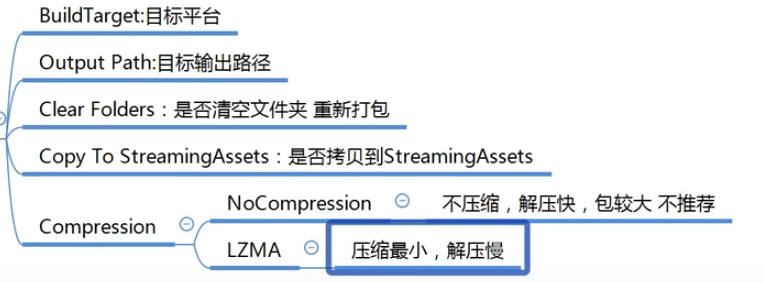

## Unity项目以及热更新AB

Unity会创建所有必要的文件夹。第一级文件夹

Assets（资产）是最主要的文件夹，保存着所有游戏用到的资产。

Library（库）文件夹用于存放引擎必需的程序集和缓存资源。Library不存在时会自动生成，不需要也不建议上传到版本仓库（如SVN或Git仓库）中去。

Logs（日志）文件夹用于存放使用时产生的日志。

### Assets

由于Asset和Resource的含义相近，而且它们在Unity中都有特定的含义，因此翻译时将Asset称为资产，Resource称为资源，以示区分。Assets文件夹下所有的文件都是资产的一部分，但某一些资产不会被“打包”到最终发布的程序中，而其他资产则会被“打包”。

#### assets下面的文件

除以上特殊文件夹，在其他非特殊文件夹中的资产，Unity会根据是否引用了该资源而决定是否打包。所有非编辑器专用的脚本资产文件都会被打包。这是由于非组件脚本也可能会被引用，不能依据是否挂载到物体上来确定一个脚本是否被用到。被打包的资产都可以看作是发布的程序的一部分，但它们都是只读的，不能在运行时改写它们。换句话说，**以上文件夹都不能用于做热更新，热更新的概念在后文会提到。**

#### META文件诞生的理由

在游戏的开发阶段会存在大量原始的资源和素材，**如何管理它们是引擎需要考虑的**。市面上的游戏引擎对原始资源的管理有以下两种主流方案。第1种，引擎统一打包和管理所有资产。添加新资源时，通过统一的导入流程打包到专门的文件中，原始文件不再使用。第2种，虽然引擎管理所有资产，但依然会使用原始资源文件。一些必要的信息（如模型的导入设置）会写在另外的配置文件中。无论哪种方案，都必须对所有资产统一管理，而不能使用未处理、无记录的原始资源。Unity所采用的方案属于上文第2种，它会对Assets文件夹下的所有文件生成一个名称相同，扩展名为meta的文件，包括文件夹也会生成对应的META文件。META文件是一个文本文件，**里面记录了很多必要的信息，包括资产唯一标识符GUID、引用关系和资源导入设置的信息等。其中资产唯一标识符GUID非常重要，它会在资源初次导入时生成，有了它就能准确定位资源文件，文件的改名、移动和内容修改都不会使GUID变化。**

所以

**在Unity之外修改文件要注意**

**Unity的Project窗口的功能齐全，支持文件的移动、重命名和复制等操作**。关键是，在Project窗口中进行文件操作，Unity会妥善处理这些改动。而如果在Unity之外操作，很可能会因找不到对应的META文件而失去对应关系。很多时候材质丢失、导入信息被重置和引用丢失等问题，都是不恰当的文件操作引起的。

META文件内容

~~~
fileFormatVersion: 2        文件格式版本
guid: 42850487fa989b342bcb1cb935a1f43d  资源唯一标识符GUID
MonoImporter:               脚本导入信息
  externalObjects: {}     
  serializedVersion: 2     
  defaultReferences: []    
  executionOrder: 0
  icon: {instanceID: 0}     图标
  userData:                 自定义数据
  assetBundleName:          Asset Bundle(资源包)名称
  assetBundleVariant:       资源包参数
~~~

所以改动META文件需要注意

一是META文件与原始资源文件要一起管理。例如，新增Assets文件或文件夹时，一定要连同生成的META文件一同提交到版本仓库。

二是重命名和移动文件要在Unity内进行，这样可以保证相应的META文件自动完成相应操作。

三是不能直接复制META文件，否则会导致GUID重复。复制资产时应尽量在Unity内用复制命令（快捷键Ctrl+D）进行，这样会自动生成GUID不同的META文件。

四是用脚本操作资产时要注意META文件的同步，尽量使用Unity提供的API，而不要使用原始的文件进行读写操作。这一点主要针对编辑器脚本，因为编辑器脚本有时会修改资源文件的内容。

### 动态加载和释放资源

1. 动态加载资源位于Resources文件夹下的资源都可以动态加载。动态加载资源的方法主要有Resources.Load()和Resources.LoadAll()两种，前者用于加载单个文件，而后者可以加载一个文件夹内的所有资源，结果以数组形式返回。值得一提的是，重复加载相同的文件不会导致文件被多次加载，引擎可以判断哪些资源已经被加载过了。

   

2.  卸载资源加载的资源会占用内存空间，不再使用资源的时候应当卸载。卸载方法有以下两个。

~~~c#
//  卸载一个资源
public static void UnloadAsset(Object assetToUnload);
//  自动卸载所有未使用的资源
public static AsyncOperation UnloadUnusedAssets();
~~~

UnloadAsset()方法用于强制卸载一个资源，不管它是不是正在被使用。如果卸载了正在使用的资源，则会直接影响当前场景的表现。

UnloadUnusedAssets()方法会用异步方法自动卸载未被使用的资源。但问题是，如果脚本中有一个变量正引用着某个资源，或是场景中某个忘记销毁的物体引用着某个资源，则该资源会因还在使用中而不会被自动卸载。可以看出，卸载背后隐含的问题要比加载多得多，对编程方法也提出了更高要求。

可以看出，卸载背后隐含的问题要比加载多得多，对编程方法也提出了更高要求。

~~~c#
using UnityEngine;

public class TestResources : MonoBehaviour {

    void Start () {
        /*--- 加载资源 ---*/
        // 预制体资源用GameObject类型表示，路径不包含"Resources"和扩展名
        GameObject go = Resources.Load<GameObject>("Prefabs/Cube");
        // 资源加载和实例化是不同的
        GameObject go2 = Instantiate(go);
                
        // 加载其他类型的资源
        Texture2D image = Resources.Load<Texture2D>("Images/1");
        Debug.Log(image.name);
                
        /*--- 卸载资源 ---*/
        // 强制卸载资源
        Resources.UnloadAsset(image);
        // 销毁物体
        Destroy(go2);
    }
}
~~~

## 资产包与热更新

#### 资产包（Asset Bundles）

新版本都会自带一个

上面名词解释

