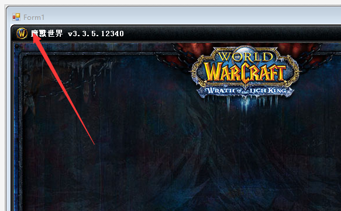
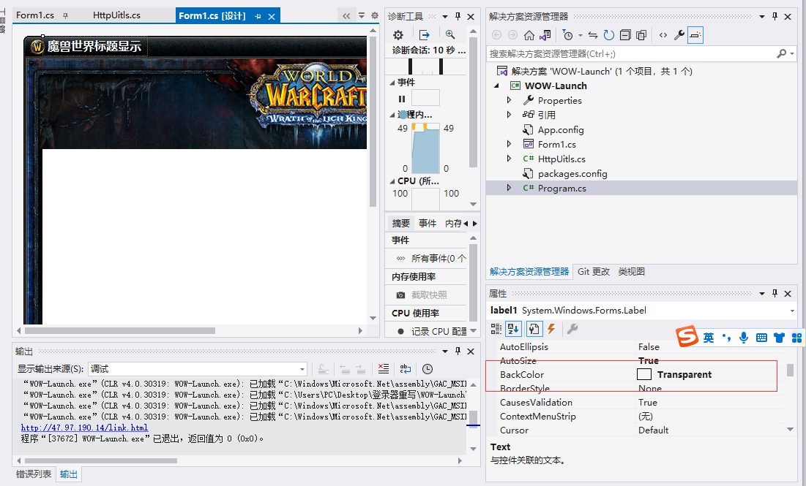
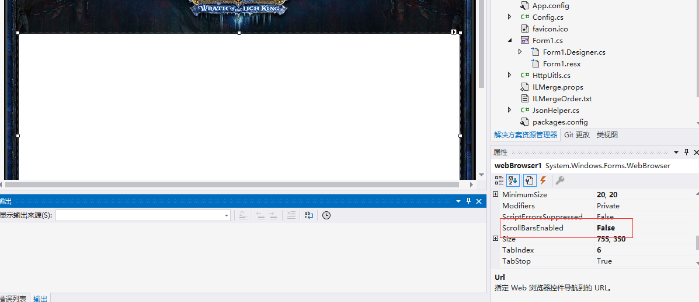
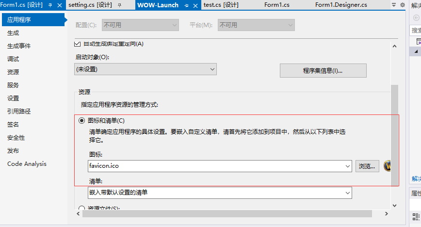

## 登陆器开发手册

### 1 如何隐藏边框将form变成 但是会出现无法移动的请款

FormBorderstyle	none

拖动功能分为 三个阶段

点击右键 拖动 放开右键 代码如下

~~~c#
 private bool moveFlag = false;//鼠标点击
        private int x = 0;
        private int y = 0;
        protected override void OnMouseMove(System.Windows.Forms.MouseEventArgs e)
        {
            if (moveFlag && (e.Button == MouseButtons.Left))
                this.SetBounds(Left + e.X - x, Top + e.Y - y, this.Width, this.Height);
            base.OnMouseMove(e);
        }

        protected override void OnMouseDown(System.Windows.Forms.MouseEventArgs e)
        {
            if (!moveFlag && e.Clicks >= 1)
                moveFlag = true;
            x = e.X;
            y = e.Y;
            base.OnMouseDown(e);
        }

        protected override void OnMouseUp(System.Windows.Forms.MouseEventArgs e)
        {
            if (moveFlag)
                moveFlag = false;
            base.OnMouseUp(e);
        }
~~~

### 2 关闭 最小化的方法

关闭应用

~~~c#
        private void button5_Click(object sender, EventArgs e)
        {
            Application.Exit();
        }
~~~

最小化

~~~c#
        private void button6_Click(object sender, EventArgs e)
        {
            this.WindowState = FormWindowState.Minimized;
        }
~~~

### 3 文字变成透明使用

### 4 取消浏览器边框

###  5 flowLayoutPanel排版

进行了对下面按钮进行排版

### 6 更换图标两个图标

### comboBox1与数据进行绑定

~~~c#
//控件操作
//始化班级下拉框
            this.comboBox1.DataSource = GetAllServerlist();
            this.comboBox1.DisplayMember = "serverName";//设置下拉框显示文本
            this.comboBox1.ValueMember = "id";//设置下拉框显示文本对应的value
            this.comboBox1.SelectedIndex = 0;//默认第一个
~~~

GetAllServerlist();方法 返回一个数组进行数据绑定

选择使用改变事件

~~~c#
            this.comboBox1.SelectedIndexChanged += 
            new System.EventHandler(ComboBox1_SelectedIndexChanged);
~~~

~~~c#
        private void ComboBox1_SelectedIndexChanged(object sender,System.EventArgs e)
        {
            System.Windows.Forms.ComboBox comboBox1 = (System.Windows.Forms.ComboBox)sender;
            int selectedEmployee = (int)comboBox1.SelectedIndex;
            list = GetAllServerlist();
            SaveServer(list[selectedEmployee].srvaddr, list[selectedEmployee].srvport);

        }
~~~

### 如何打包一个完整的exe

~~~c#
Winform：

　　安装ILmerge和MSBuild.ILMerge.Task这两个包，重新生成解决方案后在bin/debug文件夹中会生成单个的exe

WPF

　　安装Fody和Costura.Fody这两个包，其余步骤同上

上面这两个方法可以把项目引用的dll也一起打包在exe中，这样就不用用发布生成的setup文件安装程序了

 
~~~

### 配置文件json类下次就直接用

~~~c#
 public class JsonConfig
    {
        //单例模式
        public static JsonConfig Instance = LoadConfig(Form1.CONFIG_FILE);
        public string GameSourcePath { get; set; }
        public int UpdateVersion { get; set; }
        public bool FirstOpen { get; set; }
        public void SaveToFile(string filename)
        {
            if (string.IsNullOrEmpty(filename)) { throw new ArgumentNullException(nameof(filename)); }

            var dirPath = Path.GetDirectoryName(filename);
            if (string.IsNullOrEmpty(dirPath))
            {
                dirPath = Path.GetDirectoryName(typeof(JsonConfig).Assembly.Location);
            }

            if (!Directory.Exists(dirPath))
            {
                Directory.CreateDirectory(dirPath);
            }

            var str = JsonConvert.SerializeObject(this, Formatting.Indented);
            File.WriteAllText(filename, str, Encoding.UTF8);
        }
        public static JsonConfig LoadConfig(string fileName)
        {
            if (string.IsNullOrEmpty(fileName)) { throw new ArgumentNullException(nameof(fileName)); }

            JsonConfig instance;
            if (!File.Exists(fileName))
            {
                instance = new JsonConfig();

            }
            else
            {
                var str = File.ReadAllText(fileName, Encoding.UTF8);
                instance = JsonConvert.DeserializeObject<JsonConfig>(str);
            }
            return instance;
        }

    }
~~~

