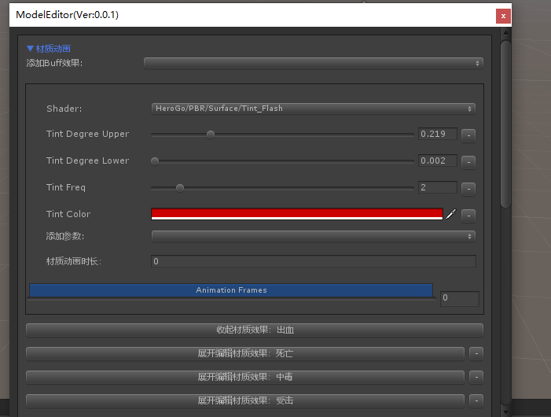

1 获得父亲物体 tran.parent.set(fales)

2 热更新时候 发现新加的图片没有成功热更新

整体的需要更新（原理有待了解）AB包

packageinfo.pak

packageinfo.pak.manifest

3为啥有两个 IOS IOSFULL项目 因为打包时候不能有resource资源所以

4 推测使用TexturePack进行打包

表单里面图集表示如下

UI/Image/Packed/p_UI_Shop.png:UI_Shop_Duihuan_Wenzi_Qunfeng

p_MainUI01.tpsheet为图片分割文件

