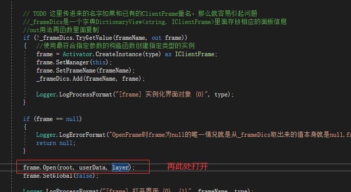
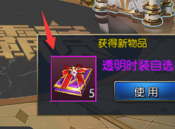

打开界面的流程

需要看的目标 所有父面板里面的异步加载方法

~~~c#
        private GameObject _loadResGameObject()
        {
            if (_isLoadFromPool())
            {
                Logger.LogProcessFormat("[ClientFrame] _loadResGameObject 从资源池子加载");
                return CGameObjectPool.instance.GetGameObject(GetPrefabPath(), enResourceType.UIPrefab, (uint)GameObjectPoolFlag.None);
            }
            else
            {
                Logger.LogProcessFormat("[ClientFrame] _loadResGameObject 直接加载");
                return AssetLoader.instance.LoadResAsGameObject(GetPrefabPath());
            }
        }
~~~

这个是控制面板类的

这是点击发送的给send绑定方法

这是一个城镇面板

父亲面板里面的内容如下

~~~c#
public void Update(float timeElapsed)
        {
            _OnUpdate(timeElapsed);
        }

        /// 

        /// 重要设置预制体的方法
        /// 

        /// <returns></returns>
        public virtual string GetPrefabPath()
        {
            return "";
        }

        /// 

        /// 附加内容
        /// 

        /// <returns></returns>
        protected virtual bool AttachContent()
        {
            return false;
        }
        /// 

        /// 打开面板时候的方法
        /// 

        protected virtual void _OnOpenFrame()
        {
        }

        void OnSceneLoadFinish(UIEvent uiEvent)
        {
            OnSceneLoadFinish();
        }
        /// 

        /// 场景加载完成以后
        /// 

        protected virtual void OnSceneLoadFinish()
        {

        }

        protected virtual void _OnDoTweenEnd()
        {
            frame.gameObject.SetActive(false);
        }
        /// 

        /// 加载预制体的时候
        /// 

        protected virtual void _OnLoadPrefabFinish()
        {

        }
        /// 

        /// 关闭面板时候调用
        /// 

        protected virtual void _OnCloseFrame()
        {

        }
        /// 

        /// 虚方给子类重写在update里面调用
        /// 

        /// <param name="timeElapsed"></param>
        protected virtual void _OnUpdate(float timeElapsed)
        {

        }
~~~

首先绑定一个 方法

方法如下

~~~c#
       
void _OnClickCallBack()
        {
            if(m_callback != null)
            {
                m_callback(gameObject, m_item);
            }
        }
~~~

点击右下角的提示 首先传递了一个委托

赋值程序

传递的方法

登录界面

 "is_recommend": 0, 推荐 一个蓝色框 1打开

获得图像

通过公共面板来进行获得

通过设置这样 

