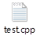
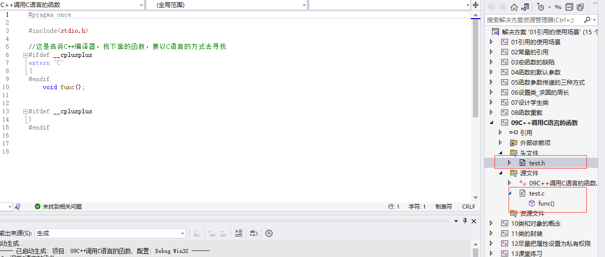
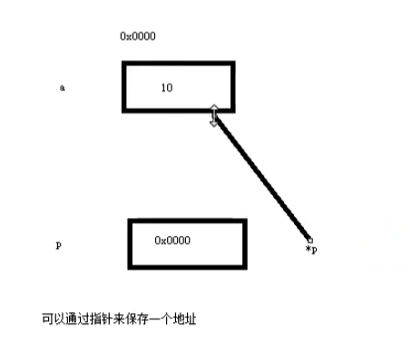
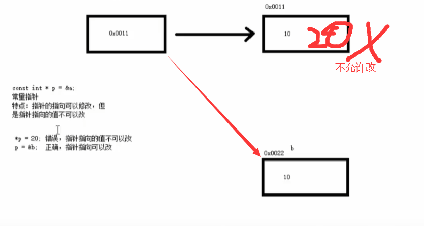
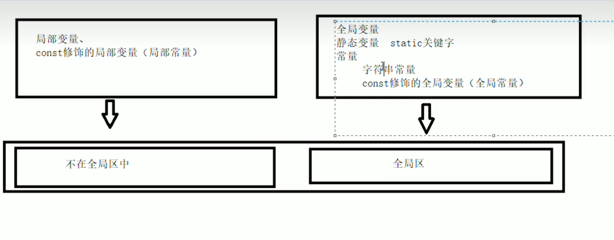
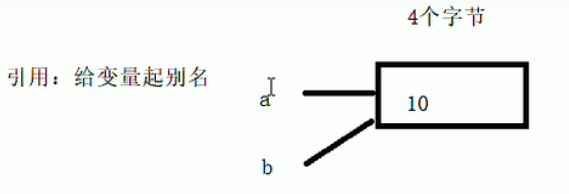
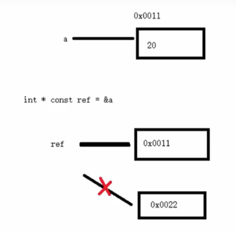

### C++作用域运算符 ：：

~~~c++
//全局变量
int a = 10;
//1. 局部变量和全局变量同名
void test(){
	int a = 20;
	//打印局部变量a
	cout << "局部变量a:" << a << endl;
	//打印全局变量a
	cout << "全局变量a:" << ::a << endl;
}

~~~

### C++命名空间(namespace)

为什么有命名空间，是因为解决多人合作时取标识符是重命名的问题

命名空间的注意

命名空间只能全局范围内定义（**以下错误写法**）

~~~c++
void test(){
	namespace A{
		int a = 10;
	}
	namespace B{
		int a = 20;
	}
	cout << "A::a : " << A::a << endl;
	cout << "B::a : " << B::a << endl;
}
~~~

命名空间可嵌套命名空间

~~~
namespace A{
	int a = 10;
	namespace B{
		int a = 20;
	}
}
void test(){
	cout << "A::a : " << A::a << endl;
	cout << "A::B::a : " << A::B::a << endl;
}
~~~

 命名空间是开放的，即可以随时把新的成员加入已有的命名空间中

~~~c++
namespace A{
	int a = 10;
}

namespace A{
	void func(){
		cout << "hello namespace!" << endl;
	}
}

void test(){
	cout << "A::a : " << A::a << endl;
	A::func();
}

~~~

声明和实现可分离


~~~c++
#pragma once

namespace MySpace{
	void func1();
	void func2(int param);
}
~~~



~~~c++
void MySpace::func1(){
	cout << "MySpace::func1" << endl;
}
void MySpace::func2(int param){
	cout << "MySpace::func2 : " << param << endl;
}
~~~

无名命名空间，意味着命名空间中的标识符只能在本文件内访问，相当于给这个标识符加上了static，使得其可以作为内部连接

~~~C++
//类似于static int d=50;
namespace
{
	int d = 50;
}
int main()
{
    cout << d << endl;
}
~~~


### using声明

using声明是让命名空间中某个标识符可以直接使用

~~~
namespace A
{
	int a = 10;
	int b = 20;
	int c = 30;
}

void test01()
{
	//using声明是让命名空间中某个标识符可以直接使用
	using A::a;
	cout <<a << endl;
	//int a = 50;//注意:using声明了某个变量，在该作用域内不能定义同名的变量
}
void test02(){
	//using编译指令，让某个命名空间中的标识符都可以直接使用
	using namespace A;
	cout << a << endl;
	int a = 100;//为什么不会冲突
	//类似于命名空中的a是全局变量，这里的a的局部变量
	cout << "a=" << a << endl;
}

~~~

### 结构体加强

~~~
//1. 结构体中即可以定义成员变量，也可以定义成员函数
struct Student{
	string mName;
	int mAge;
	void setName(string name){ mName = name; }
	void setAge(int age){ mAge = age; }
	void showStudent(){
		cout << "Name:" << mName << " Age:" << mAge << endl;
	}
};

//2. c++中定义结构体变量不需要加struct关键字
void test01(){
	Student student;
	student.setName("John");
	student.setAge(20);
	student.showStudent();
}

~~~

#### 结构体数组

创建方式

struct 结构体名 

~~~c++
strict Student stuArray[3]={
{"张三"，18，1000}，
{"张三"，18，1000}，
{"张三"，18，1000}
}
stuArray[1].name="zzz";
stuArray[2].age=22;
~~~

#### 结构体指针

利用操作符->可以通过结构体指针访问结构体属性

~~~c++
#include <iostream>
using namespace std;
struct student {
    //成员列表
    string name;
    int age;
    int score;
};
int main()
{
    struct  student stu = {"zzz",18,100};
    student * p1 = &stu;
    //访问里面的数据
    p1->name;
    cout << p1->name << endl;
}
~~~

#### 结构体做函数参数和const

~~~~c++
// 学习代码如下.cpp : 此文件包含 "main" 函数。程序执行将在此处开始并结束。
//

#include <iostream>
using namespace std;
struct student {
    //成员列表
    string name;
    int age;
    int score;
};
//将函数中的形参改为指针，可以减少内存空间，而且不会复制新的副本出来
void printStu(const struct student *s)
{   //加入const 传递值无法被改变
    s->name = "你好";
    cout << "学生姓名" << s->name << endl;
};
int main()
{
    struct  student stu = {"zzz",18,100};
    printStu(stu);
}
~~~~


## 更严格的类型转换

在C++，不同类型的变量一般是不能直接赋值的，需要相应的强转。

### c语言 const概述

会出现报错因为

~~~c
const int a = 10;//常量区，一旦初始化，不能修改


void test()
{
	//a = 200;全局的const不能直接修改
	int *p = (int*)&a;
	*p = 100;//全局的const不能间接修改
	printf("%d\n", a);

}

如果这么写:
const int arrSize = 10;
int arr[arrSize];
看似是一件合理的编码，但是这将得出一个错误。 因为arrSize占用某块内存，所以C编译器不知道它在编译时的值是多少？
~~~

***\*在c++中，一个const不必创建内存空间，而在c中，一个const总是需要一块内存空间。\****


1.C语言的const修饰的变量都有空间

2.C语言的const修饰的全局变量具有外部链接属性

3.C++语言的const修饰的变量有时有空间，有时没有空间（发生常量折叠，且没有对变量进行取址操作）

```
const int aa = 10;//没有内存

void test01()
{
	//发生了常量折叠
	cout << "aa=" << aa << endl;//在编译阶段，编译器：cout<<"aa="<<10<<endl;

	//禁止优化volatile
	//volatile const int bb = 20;//栈区
	 const int bb = 20;
	int *p = (int*)&bb;//进行了取址操作，所以有空间
	*p = 200;
	cout << "bb=" << bb << endl;//输出为20不是200 "bb=" << 20 << endl;
	cout << "*p=" << *p << endl;

	cout << "a的地址=" << (int)&bb << endl;
	cout << "p指向的地址" << (int)p << endl;


}
```

4.C++语言中const修饰的全局变量具有内部链接属性

extern const int c = 300;//加上extern就变为外部链接属性

5.C++编译器不能优化的情况

​	1.不能优化自定义数据类型

​	2.如果用变量给const修饰的局部变量赋值，那么编译器就不能优化

​	3.编译器是在编译阶段来优化数据

6.尽量用const替代define

​	1.define没有数据类型，const修饰的变量有数据类型，可以进行数据类型检查

```
#define MA 128
const short ma = 128;
void func(short a)
{
	cout << "func(short a)" << endl;
}

void func(int a)
{
	cout << "func(int a)" << endl;
}
int main()
{
	func(ma);
	system("pause");
	return EXIT_SUCCESS;
}
```

​	2.const修饰的变量有作用域，define不重视作用域，不能限定常量的使用范围


### 内联函数

~~~C
#define ADD(x,y) x+y
//在普通函数前面加上inline是向编译器申请成为内联函数
//注意：加inline可能成为内联函数，可能不成为内联函数
inline int Add(int x, int y)
{
	return x + y;
}
~~~

2.什么情况不会成为内联函数

​	1.存在过多的条件判断语句

​	2.函数体过大

​	3.对函数进行取址操作

​	4.存在任何形式的循环语句

3.内联函数的好处

​	1.有宏函数的效率，没有宏函数的缺点

​	2.类的成员函数默认加上inline

4.在普通函数前面加上inline是申请成为内联函数(不是一定要加上)

### 函数的参数传递

~~~c++
#define _CRT_SECURE_NO_WARNINGS
#include<iostream>
using namespace std;

//值传递
void swap(int a, int b)
{
	int tmp = a;
	a = b;
	b = tmp;
}

//指针传递
void swap2(int *a, int *b)
{
	int tmp = *a;
	*a = *b;
	*b = tmp;
}

//引用传递
void swap3(int &a, int &b)//int &a=a,int &b=b;
{
	int tmp = a;
	a = b;
	b = tmp;
}

//打印
void myprint(int &a,int &b)
{
	cout << "a=" << a << " b=" << b << endl;
}

int main()
{
	int a = 10;
	int b = 20;
	swap(a, b);
    //为啥没变引用传递过来的是值并不是引用
	myprint(a, b);//10,20

	swap2(&a, &b);
	myprint(a, b);//20,10

	a = 10;
	b = 20;

	swap3(a, b);
	myprint(a, b);//20,10
	system("pause");
	return EXIT_SUCCESS;
}
~~~

第一个函数分析图

### 函数的声明

提前告诉编译器函数的存在 可以利用函数的声明(因为C++是从上之下执行的)

int max(inta ,int b)

### 函数分文件编写

1.创建后缀名为.h的头文件

2.创建后缀名为.cpp的源文件

3.在头文件中写函数的声明（注意是声明不是定义）

4.在源文件中写函数的定义

swap.h文件中

~~~c++
#include<iostream>
using namespace std;
~~~

swap.cpp

~~~c++
#include "swap.h"
~~~


### 函数重载

1.函数重载是：允许函数名相同，这种现象叫函数重载

2.函数重载的作用：是为了方便使用函数名

3.函数重载的条件：同一个作用域，参数的个数不同，参数的顺序不同，参数的类型不同

~~~
//参数的个数不同
void func()
{
	cout << "func()" << endl;
}

void func(int a)
{
	cout << "func(int a)" << endl;
}

//参数的类型不同
void func(char c)
{
	cout << "func(char c)" << endl;
}
//参数的顺序不同
void func(int a, double b)
{
	cout << "func(int a, double b)" << endl;
}
void func(double b, int a)
{
	cout << "func(double b, int a)" << endl;
}
~~~

原理如下

1.函数重载的原理是在汇编时，给各个函数取别名，C语言不能重载的原因是没有取别名

2.生成汇编文件:gcc -S test.c -o test.s         g++ -S test.cpp -o test2.s

3.查看内容:type 文件名

### C++调用C语言的函数（重点）

1.C++的函数在汇编时，会给函数取别名，C语言的不会，这时，如果C++来调用C语言的函数，C++会去找取了别名的函数，但是C语言没有取别名，这时会出错

```
test.h文件中

//这是告诉C++编译器，找下面的函数，要以C语言的方式去寻找
#ifdef __cplusplus
extern "C"
{
#endif
	void func();//C语言的函数声明


#ifdef __cplusplus
}
#endif
```



### 指针

作用 通过指针间接访问内存

内存编号是从0开始记录 一般用十六进制数字表示

可以利用指针变量保存地址

int * p;

解引用指针 

*p;

~~~
int a=10;
int *p;
p = &a;
count << "a的指针地址为:"<< &a <<endl;
count <<"指针p为"<<p<<endl;
//使用指针
//指针前加*代表解引用，找到指针指向的内存中的数据
*p=20
count <<"指针a为"<<a<<endl;
~~~



#### 指针所占用内存空间

在32位操作系统下:―占用4个内存空间,64位卞占8个字书。（不管什么数据类型）

#### 空指针

空指针 指针变量指向内存编号为0的空间

用途 初始化指针变量

注意 空指针指向的内存是不可以访问的

~~~c++
int main() {
//指针变量p指向内存地址编号为0的空间
    int * p = NULL;
//访问空指针报错
//内存编号0~255为系统占用内存，不允许用户访问
    cout<<*p << endl;
}
~~~

#### 野指针

野指针:指针变量指向非法的内存空间

~~~c++
int main() {
//指针变量p指向内存地址编号为ex110的空间
    int * p = (int *)0x1100;
//访问野指针报错
cout << *p << endl;
system( "pause" );
return e;
}

~~~

总结:空指针和野指针都不是我们申请的空间，因此不要访问。

#### const常量指针

特点:指针的指向可以修改，但是指针指向的值不可以改




~~~c++
int a = 10;
int b = 10;
int *p = &a;

//常量指针
const int * p = &a;
特点 指针的指向可以修改 但是指针指向的值不可以修改
*p = 20; 错误 指针指向的值不可以改
 p = &b; 正确 指针指向可以改    
~~~

#### const 指针常量

~~~
int a = 10;
int b = 10;
int *p = &a;

//常量指针
int const  * p = &a;
特点:指针的指向不可以改，指针指向的值可以改
*p = 20; 正确 指向的值可以改
 p = &b; 错误 指针指向不可以改    
~~~

const修饰

~~~
int a = 10;
int b = 10;
int *p = &a;

//常量指针
const int *  const p = &a;
特点:指针的指向不可以改，指针指向的值可以改
*p = 20; 错误 指向的值不可以改
 p = &b; 错误 指针指向不可以改  
~~~

### 数组

数组a[3]=[1,2,3]

a就是一个指针来存放位置

~~~c++
for(int=0;i<3;i++){
cout << *p2 << endl;
//*p2++就是向前读取
p2++;
}
~~~


## 面向对象

### 内存

C++程序在执行时，将内存大方向划分为4个区域
代码区:存放函数体的二进制代码，由操作系统进行管理的

全局区:存放全局变量和静态变量以及常量

栈区:由**编译器自动分**配释放,存放函数的参数值,局部变星等

堆区:由**程序员分配**和释放,若程序员不释放,程序结束时由操作系统回收


### 程序运行前

在程序编译后，生成了exe可执行程序，**未执行该程序**前分为两个区域

代码区:
	存放CPU执行的机器指令
	代码区是共享的，共享的目的是对于频繁被执行的程序，只需要在内存中有一份代码即可

​	代码区是只读的，使其只读的原因是防止程序意外地修改了它的指令
全局区:
​    全局变量和静态变量存放在此.
​	全局区还包含了常量区,字符串常量和其他常量也存放在此.
​	该区域的教据在程序结束后由操作系统释放.




### 程序运行后

#### 栈

由编译器自动分配释放,存放函数的参数值,局部变量等
注意事项:不要返回局部变量的地址，栈区开辟的数据由编译器自动释放

#### 堆

由程序员分配释放,若程序员不释放,程序结束时由操作系统回收

在C++中主要利用new在堆区开辟内存

### new操作符

C++中利用new操作符在堆区开辟数据
堆区开辟的教据，由程序员手动开辟，手动释放，释放利用操作符deletel.

#### 语法:new数据类型

利用new创建的数据，会返回该数据对应的类型的指针

~~~c++
#include <iostream>
using namespace std;
int* func1() { 
//用new关键字可以将数据开辟到堆区
	//针本质也是局部变量，放在栈上，指针保存的数据是放在堆区

	int* p = new int(10);


	return p; //返回局部变量的地址

}
int main() {
	int* p = func1();
	cout << *p << endl;
	cout << *p << endl;
	cout << *p << endl;
	cout << *p << endl;
	cout << *p << endl;
	delete p;
    //cout << *p << endl;//报错读取访问权限冲突 报错
	system("pause");
}
~~~

#### 堆区开辟数组

~~~c++
/ /2、在堆区利用new开辟数组
void test02()
{
//创建10整型数据的数组，在堆区
int * arr = new int[10]; //10代表数组有10个元素
//释放数组释放
//释放数组的时候要加[]才可以
delete[] arr;
}

~~~


### 引用

1.引用是做什么：和C语言的指针一样的功能，并且使语法更加简洁

2.引用是什么：引用是给空间取别名



简单的

~~~~c++
void func(int &a)//int &a=a;
{
	a = 200;
}

void test02()
{
	int a = 10;
	func(a);
	cout << "a=" << a << endl;
}
~~~~

#### 引用的注意

~~~c++
//1.引用创建时，必须初始化。
//int &pRef;err
~~~

```c
//2.引用一旦初始化不能改变它的指向
int a = 10;
int &pRef = a;//给a的空间取别名为pRef;
int b = 20;
pRef = b;//赋值操作

```

#### 引用作为函数的返回值

~~~C
//2.引用作为函数的返回值
int& func2()
{
	int b = 10;//注意1：不要返回局部变量的引用（因为存放在栈区 编译器差异可能导致错误）
	int &p = b;
	return p;
}
int &func3()
{
	static int b = 10;
	return b;
}
void test02()
{
	int &q = func2();
	q = 100;
	cout << q << endl;

	func2() = 200;
	cout << q << endl;
	//---------上面的代码是错误，只是编译器没有检测出来
	cout << "func2="<<func2() << endl;

	func3() = 100;//注意2：如果要函数当左值，那么该函数必须返回引用
	cout << "func3()=" << func3() << endl;
}
~~~

#### 引用的本质

本质:引用的本质在c++内部实现是一个指针常量.

~~~c++
#include <iostream>
using namespace std;

void func(int& ref) { //发现是引用，转换为int* const ref = &a;
	ref = 100; // ref是引用，转换为 * ref = 108
};
int main() {
		int a = 10;
		//自动转换为int* const ref = &a;指针常量是指针指向不可改，也说明为什么引用不可更改
		int& ref = a;
		ref = 20;//内部发现ref是引用，自动帮我们转换为:*ref = 20;
		cout << "a :" << a << endl;
		cout << "ref: " << ref << endl;
		func(a);
		return 0;
}
~~~

如图所示

