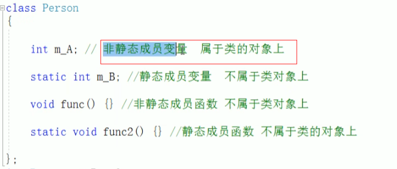

### C++的对象模型

1.空类的大小是1.

2.类的成员函数不占用类的大小，静态成员变量不占用类的大小，静态成员函数不占用类的大小

3.普通成员变量占用类的大小

4.类的成员中，成员函数和成员变量是分开存储

### this指针

每一个非静态成员函数只会诞生一份函数实例，也就是说多个同类型的对象会共用一块代码那么问题是:这一块代码是如何区分那个对象调用自己的呢?

C++通过提供特殊的对象指针，this指针，解决上述问题。this指针指向被调用的成员函数所属的对象