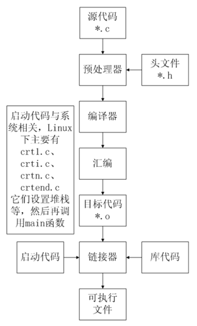
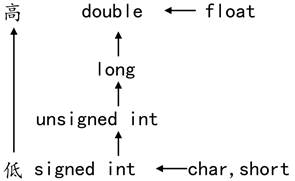
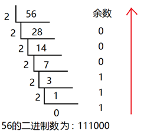
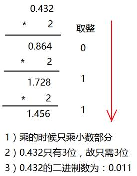
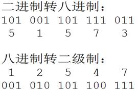
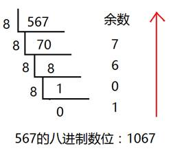
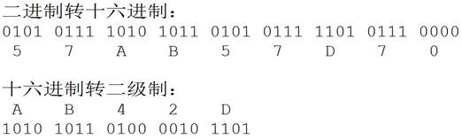
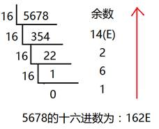
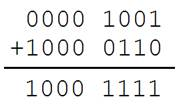
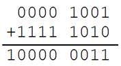

# C语言基础学习让以后的自己看的懂

###  c语言的编译步骤

预处理 ->编译->汇编->链接

~~~shell
预处理：gcc -E hello.c -o hello.i
编  译：gcc -S hello.i -o hello.s
汇  编：gcc -c hello.s -o hello.o
链  接：gcc    hello.o -o hello
~~~

**预处理**  

带#的语句就是预处理指令，预处理指令在预处理的时候处理了

头文件展开： #include <stdio.h> 包含文件stdio.h（预处理时将stdio.h 文件拷贝至预处理文件中）
删除注释： 注释有两种方法： //    /* */
宏替换： #define 代表是声明一个宏， 在预处理时会将宏给替代
预处理时 不会检查语法错误
条件编译： 条件不成立： #if 0 -> #endif   条件成立 #if 1 -> #endif 
**编译**  

将预处理文件编译生成汇编文件     检查语法错误
**汇编**  

将汇编文件编译生成二进制文件.o

**链接** 

设置运行环境，堆栈等，链接其他库

### GCC其他命令

###### 多源文件的编译方法

如果有多个源文件，基本上有两种编译方法：
 [假设有两个源文件为test.c和testfun.c]

1. 多个文件一起编译
    用法：`gcc testfun.c test.c -o test`
    作用：将testfun.c和test.c分别编译后链接成test可执行文件。
2. 分别编译各个源文件，之后对编译后输出的目标文件链接。
    用法：
    `gcc -c testfun.c` //将testfun.c编译成testfun.o
    `gcc -c test.c`   //将test.c编译成test.o
    `gcc -o testfun.o test.o -o test` //将testfun.o和test.o链接成test
    作用：以上两种方法相比较，第一中方法编译时需要所有文件重新编译，而第二种方法可以只重新编译修改的文件，未修改的文件不用重新编译。

###### 库文件连接

- 开发软件时，完全不使用第三方函数库的情况是比较少见的，通常来讲都需要借助许多函数库的支持才能够完成相应的功能。从程序员的角度看，函数库实际上就是一些头文件（.h）和库文件（so、或lib、dll）的集合。。虽然Linux下的大多数函数都默认将头文件放到/usr/include/目录下，而库文件则放到/usr/lib/目录下；Windows所使用的库文件主要放在Visual Stido的目录下的include和lib，以及系统文件夹下。但也有的时候，我们要用的库不再这些目录下，所以GCC在编译时必须用自己的办法来查找所需要的头文件和库文件。
- 例如我们的程序test.c是在linux上使用c连接mysql，这个时候我们需要去mysql官网下载MySQL Connectors的C库，下载下来解压之后，有一个include文件夹，里面包含mysql connectors的头文件，还有一个lib文件夹，里面包含二进制so文件libmysqlclient.so
   其中inclulde文件夹的路径是/usr/dev/mysql/include,lib文件夹是/usr/dev/mysql/lib

1. 编译成可执行文件
    首先我们要进行编译test.c为目标文件，这个时候需要执行
    `gcc –c –I /usr/dev/mysql/include test.c –o test.o`
2. 链接
    最后我们把所有目标文件链接成可执行文件:
    `gcc –L /usr/dev/mysql/lib –lmysqlclient test.o –o test`
    Linux下的库文件分为两大类分别是动态链接库（通常以.so结尾）和静态链接库（通常以.a结尾），二者的区别仅在于程序执行时所需的代码是在运行时动态加载的，还是在编译时静态加载的。
3. 强制链接时使用静态链接库
    默认情况下， GCC在链接时优先使用动态链接库，只有当动态链接库不存在时才考虑使用静态链接库，如果需要的话可以在编译时加上-static选项，强制使用静态链接库。
    在/usr/dev/mysql/lib目录下有链接时所需要的库文件libmysqlclient.so和libmysqlclient.a，为了让GCC在链接时只用到静态链接库，可以使用下面的命令:
    `gcc –L /usr/dev/mysql/lib –static –lmysqlclient test.o –o test`
   1. 静态库链接时搜索路径顺序：
       \1. ld会去找GCC命令中的参数-L
       \2. 再找gcc的环境变量LIBRARY_PATH
       \3. 再找内定目录 /lib /usr/lib /usr/local/lib 这是当初compile gcc时写在程序内的
   2. 动态链接时、执行时搜索路径顺序:
       \1. 编译目标代码时指定的动态库搜索路径
       \2. 环境变量LD_LIBRARY_PATH指定的动态库搜索路径
       \3. 配置文件/etc/ld.so.conf中指定的动态库搜索路径
       \4. 默认的动态库搜索路径/lib
       \5. 默认的动态库搜索路径/usr/lib
   3. 有关环境变量：
       *. LIBRARY_PATH环境变量：指定程序静态链接库文件搜索路径
       *. LD_LIBRARY_PATH环境变量：指定程序动态链接库文件搜索路径

### 寄存器 缓存 cpu 内存之间的关系

cpu  >  寄存器  >  缓存  > 内存

### 

#### helloworld程序的解释

~~~C
//# 预处理指令，在预编译时处理
#include <stdio.h>
//main() main函数也叫主函数 整个程序中仅且只有一个main函数，程序从main函数
//开始执行
//int  代表main函数结束之后的返回值类型
//return  结束这个函数，然后返回值，返回值的类型和函数定义时返回值类型一致
int main()
{		//stdio.h里面的库函数
        printf("hello world\n");//打印到终端
        return 0;
}
~~~

### 数据类型：

~~~C
int    类型    				  4字节
short  类型                     2字节
long   类型                     windows  4字节
							   linux  32位4字节 64位8字节
char   类型                     1字节
float  类型                     4字节，一般用来存小数
double 类型                     8字节，用来存小数
例子：
int   a：  //在内存中定义了一个变量a，占int类型大小4字节
char  b：  //在内存中定义了一个变量b，占char类型大小1字节
~~~

作用：  告诉编译器我这个数据在内存中需要多大的空间

常量： 程序运行中不能改变的量

变量：程序运行中可与被改变的量，存在于内存中

**变量需要定义**

定义：  在内存中开辟空间 告诉编译器我有这个变量（声明）

初始化： 定义时赋值

声明： extern 告诉编译器有这个东西，但是这里不开辟空间

~~~C
#define _CRT_SECURE_NO_WARNINGS
#include<stdio.h>
#include<string.h>
#include<stdlib.h>
#define  MAX  10//定义了一个宏（常量）  值为10
int main()
{
	//extern 关键字只做声明，不能做任何定义，后面还会学习，这里先了解
		//声明一个变量a，a在这里没有建立存储空间
	extern int a;
	//a = 10;	//err, 没有空间，就不可以赋值

	int b = 10;	//定义一个变量b，b的类型为int，b赋值为10

}
~~~

从广义的角度来讲声明中包含着定义，即定义是声明的一个特例，所以并非所有的声明都是定义：

int b 它既是声明，同时又是定义

对于 extern b来讲它只是声明不是定义

#### 整型：int

~~~c
%d 输出一个有符号的10进制int类型
%o 输出一个的8进制int类型
%x 输出16进制的int类型。字母以小写输出
%X 输出16进制的int类型,字母以大写
%u  输出输出一个10进制的无符号效
~~~

##### short、int、long、long long

~~~c
%hd   有符号打印short
%hu   无符号打印short
%ld    有符号打印long
%lu   无符号打印long
~~~

##### 有符号和无符号整型取值范围

| **数据类型**   | **占用空间** | **取值范围**                              |
| -------------- | ------------ | ----------------------------------------- |
| short          | 2字节        | -32768 到 32767 (-215  ~ 215-1)           |
| int            | 4字节        | -2147483648 到  2147483647 (-231 ~ 231-1) |
| long           | 4字节        | -2147483648 到  2147483647 (-231 ~ 231-1) |
| unsigned short | 2字节        | 0 到 65535 (0 ~ 216-1)                    |
| unsigned int   | 4字节        | 0 到 4294967295 (0  ~ 232-1)              |
| unsigned long  | 4字节        | 0 到 4294967295 (0  ~ 232-1)              |

####  字符型：char

字符变量实际上并不是把该字符本身放到变量的内存单元中去，**而是将该字符对应的 ASCII 编码放到变量的存储单元中**。char的本质就是一个1字节大小的整型。

#####  转义字符

| **转义字符** | **含义**                            | **ASCII****码值（十进制）** |
| ------------ | ----------------------------------- | --------------------------- |
| \a           | 警报                                | 007                         |
| \b           | 退格(BS) ，将当前位置移到前一列     | 008                         |
| \f           | 换页(FF)，将当前位置移到下页开头    | 012                         |
| \n           | 换行(LF) ，将当前位置移到下一行开头 | 010                         |
| \r           | 回车(CR) ，将当前位置移到本行开头   | 013                         |
| \t           | 水平制表(HT)  （跳到下一个TAB位置） | 009                         |
| \v           | 垂直制表(VT)                        | 011                         |
| \\           | 代表一个反斜线字符"\"               | 092                         |
| \'           | 代表一个单引号（撇号）字符          | 039                         |
| \"           | 代表一个双引号字符                  | 034                         |
| \?           | 代表一个问号                        | 063                         |
| \0           | 数字0                               | 000                         |
| \ddd         | 8进制转义字符，d范围0~7             | 3位8进制                    |
| \xhh         | 16进制转义字符，h范围0~9，a~f，A~F  | 3位16进制                   |

#### 实型(浮点型)：float、double

~~~c
int main()
{
        //打印时,默认输出6位小数点
        //float类型能够保证的精度是7位有效数字
        //double  类型能够保证的精度是15位有效数字
        float a = 3.1415926456;
        double b = 3.1415926456;
        printf("a=%.8f\n",a);
        printf("a=%.8lf\n", b);
        system("pause");
        return 0;
}
~~~

### 类型转换

转换的方法有两种：

l 自动转换(隐式转换)：遵循一定的规则,由编译系统自动完成。

l 强制类型转换：把表达式的运算结果强制转换成所需的数据类型。

类型转换的原则：占用内存字节数少(值域小)的类型，向占用内存字节数多(值域大)的类型转换，以保证精度不降低。

~~~~C
#include <stdio.h>

int main()
{
	int num = 5;
	printf("s1=%d\n", num / 2);
	printf("s2=%lf\n", num / 2.0);

	return 0;
}
~~~~

#### 强制转换

~~~
#include <stdio.h>

int main()
{
	float x = 0;
	int i = 0;
	x = 3.6f;

	i = x;			//x为实型, i为整型，直接赋值会有警告
	i = (int)x;		//使用强制类型转换

	printf("x=%f, i=%d\n", x, i);

	return 0;
}

~~~

#### 隐式转换

~~~c
#include <stdio.h>

int main()
{
	int num = 5;
	printf("s1=%d\n", num / 2);
	printf("s2=%lf\n", num / 2.0);

	return 0;
}

~~~

### 数组

#### 一位数组

在定义数组的同时进行赋值，称为初始化。全局数组若不初始化，编译器将其初始化为零。局部数组若不初始化，内容为随机值。

~~~c
int a[10] = { 1, 2, 3, 4, 5, 6, 7, 8, 9, 10 };//定义一个数组，同时初始化所有成员变量
int a[10] = { 1, 2, 3 };//初始化前三个成员，后面所有元素都设置为0
int a[10] = { 0 };//所有的成员都设置为0	
//[]中不定义元素个数，定义时必须初始化
int a[] = { 1, 2, 3, 4, 5 };//定义了一个数组，有5个成员

~~~

**数组名是一个地址的常量，代表数组中首元素的地址。**

~~~c
#include <stdio.h>

int main()
{
	int a[10] = { 1, 2, 3, 4, 5, 6, 7, 8, 9, 10 };//定义一个数组，同时初始化所有成员变量

	printf("a = %p\n", a);
	printf("&a[0] = %p\n", &a[0]);

	int n = sizeof(a); //数组占用内存的大小，10个int类型，10 * 4  = 40
	int n0 = sizeof(a[0]);//数组第0个元素占用内存大小，第0个元素为int，4

	int i = 0;
	for (i = 0; i < sizeof(a) / sizeof(a[0]); i++)
	{
		printf("%d ", a[i]);
	}
	printf("\n");

	return 0;
}
~~~

#### 二维数组

在内存中并不存在二维数组，二维数组实际的硬件存储器是连续编址的，也就是说内存中只有一维数组，即放完一行之后顺次放入第二行，和一维数组存放方式是一样的。

~~~c
#include <stdio.h>

int main()
{
	//定义了一个二维数组，名字叫a
	//二维数组是本质上还是一维数组，此一维数组有3个元素
//每个元素又是一个一维数组int[4]
	int a[3][4] = { 1, 2, 3, 4 , 5, 6, 7, 8, 9, 10, 11, 12  };

	//数组名为数组首元素地址，二维数组的第0个元素为一维数组
	//第0个一维数组的数组名为a[0]
	printf("a = %p\n", a);
	printf("a[0] = %p\n", a[0]);
	
	//测二维数组所占内存空间，有3个一维数组，每个一维数组的空间为4*4
	//sizeof(a) = 3 * 4 * 4 = 48
	printf("sizeof(a) = %d\n", sizeof(a));

	//测第0个元素所占内存空间，a[0]为第0个一维数组int[4]的数组名，4*4=16
	printf("sizeof(a[0]) = %d\n", sizeof(a[0]) );

	//测第0行0列元素所占内存空间，第0行0列元素为一个int类型，4字节
	printf("sizeof(a[0][0]) = %d\n", sizeof(a[0][0]));

	//求二维数组行数
	printf("i = %d\n", sizeof(a) / sizeof(a[0]));

	// 求二维数组列数
	printf("j = %d\n", sizeof(a[0]) / sizeof(a[0][0]));

	//求二维数组行*列总数
	printf("n = %d\n", sizeof(a) / sizeof(a[0][0]));

	return 0;
}

~~~

### c语言里面的函数

#### system 库函数

作用： 在程序中启动另一个程序参数：要的是待启动程序的路径名

#### scanf（）

从键盘（标准输入）读取数据

#### sizeof关键字

sizeof不是函数，所以不需要包含任何头文件，它的功能是计算一个数据类型的大小，单位为字节

sizeof的返回值为size_t  size_t类型在32位操作系统下是unsigned int，是一个无符号的整数

~~~c
#include <stdio.h>

int main()
{
    char a;
    short   b;
    int c;
    long   d;
    long long e;
    //sizeof 用来测数据类型的大小
    int len = sizeof(a);
    printf("%d\n", len);
    printf("%d\n", sizeof(a));
    printf("%d\n", sizeof(b));
    printf("%d\n", sizeof(c));
    printf("long = %d\n", sizeof(d));
    printf("%d\n", sizeof(e));
    printf("%d\n", sizeof(int));
    system("pause");
    return 0;
}

~~~

 scanf函数与getchar函数

l getchar是从标准输入设备读取一个char。

l scanf通过%转义的方式可以得到用户通过标准输入设备输入的数据。

### 字符数组与字符串

C语言中没有字符串这种数据类型，可以通过char的数组来替代；

字符串一定是一个char的数组，但char的数组未必是字符串；

数字0(和字符‘\0’等价)结尾的char数组就是一个字符串，但如果char数组没有以数字0结尾，那么就不是一个字符串，只是普通字符数组，所以字符串是一种特殊的char的数组

### C语言报错

 vs出现4996警告编号只需要在文件的最前面加上一句话：两者选其一

~~~c
#define _CRT_SECURE_NO_WARNINGS     //这个宏定义最好要放到.c文件的第一行
#pragma warning(disable:4996)    //或者使用这个
~~~

### 进制 

进制也就是进位制，是人们规定的一种进位方法。 对于任何一种进制—X进制，就表示某一位置上的数运算时是逢X进一位。 十进制是逢十进一，十六进制是逢十六进一，二进制就是逢二进一，以此类推，x进制就是逢x进位。

| **十进制** | **二进制** | **八进制** | **十六进制** |
| ---------- | ---------- | ---------- | ------------ |
| 0          | 0          | 0          | 0            |
| 1          | 1          | 1          | 1            |
| 2          | 10         | 2          | 2            |
| 3          | 11         | 3          | 3            |
| 4          | 100        | 4          | 4            |
| 5          | 101        | 5          | 5            |
| 6          | 110        | 6          | 6            |
| 7          | 111        | 7          | 7            |
| 8          | 1000       | 10         | 8            |
| 9          | 1001       | 11         | 9            |
| 10         | 1010       | 12         | A            |
| 11         | 1011       | 13         | B            |
| 12         | 1100       | 14         | C            |
| 13         | 1101       | 15         | D            |
| 14         | 1110       | 16         | E            |
| 15         | 1111       | 17         | F            |
| 16         | 10000      | 20         | 10           |

####  二进制

二进制是计算技术中广泛采用的一种数制。二进制数据是用0和1两个数码来表示的数。它的基数为2，进位规则是“逢二进一”，借位规则是“借一当二”。

当前的计算机系统使用的基本上是二进制系统，数据在计算机中主要是以补码的形式存储的。

 

| **术语**     | **含义**                                                     |
| ------------ | ------------------------------------------------------------ |
| bit(比特)    | 一个二进制代表一位，一个位只能表示0或1两种状态。数据传输是习惯以“位”（bit）为单位。 |
| Byte(字节)   | 一个字节为8个二进制，称为8位，计算机中存储的最小单位是字节。数据存储是习惯以“字节”（Byte）为单位。 |
| WORD(双字节) | 2个字节，16位                                                |
| DWORD        | 两个WORD，4个字节，32位                                      |
| 1b           | 1bit，1位                                                    |
| 1B           | 1Byte,1字节，8位                                             |
| 1k，1K       | 1024                                                         |
| 1M(1兆)      | 1024k, 1024*1024                                             |
| 1G           | 1024M                                                        |
| 1T           | 1024G                                                        |
| 1Kb(千位)    | 1024bit,1024位                                               |
| 1KB(千字节)  | 1024Byte，1024字节                                           |
| 1Mb(兆位)    | 1024Kb = 1024 * 1024bit                                      |
| 1MB(兆字节)  | 1024KB = 1024 * 1024Byte                                     |

 

 

十进制转化二进制的方法：用十进制数除以2，分别取余数和商数，商数为0的时候，将余数倒着数就是转化后的结果。

 

十进制的小数转换成二进制：小数部分和2相乘，取整数，不足1取0，每次相乘都是小数部分，顺序看取整后的数就是转化后的结果。

 

#### 八进制

八进制，Octal，缩写OCT或O，一种以8为基数的计数法，采用0，1，2，3，4，5，6，7八个数字，逢八进1。一些编程语言中常常以数字0开始表明该数字是八进制。

 

八进制的数和二进制数可以按位对应（八进制一位对应二进制三位），因此常应用在计算机语言中。

 

 

十进制转化八进制的方法：

用十进制数除以8，分别取余数和商数，商数为0的时候，将余数倒着数就是转化后的结果。

 

2.6.3 十六进制

十六进制（英文名称：Hexadecimal），同我们日常生活中的表示法不一样，它由0-9，A-F组成，字母不区分大小写。与10进制的对应关系是：0-9对应0-9，A-F对应10-15。

 

十六进制的数和二进制数可以按位对应（十六进制一位对应二进制四位），因此常应用在计算机语言中。

 

 

十进制转化十六进制的方法：

用十进制数除以16，分别取余数和商数，商数为0的时候，将余数倒着数就是转化后的结果。

2.6.4 C语言如何表示相应进制数

| 十进制   | 以正常数字1-9开头，如123  |
| -------- | ------------------------- |
| 八进制   | 以数字0开头，如0123       |
| 十六进制 | 以0x开头，如0x123         |
| 二进制   | C语言不能直接书写二进制数 |

 

\#include <stdio.h>

 

int *main*()

{

​    int a = 123;     //十进制方式赋值

​    int b = 0123;     //八进制方式赋值， 以数字0开头

​    int c = 0xABC;  //十六进制方式赋值

 

​    //如果在printf中输出一个十进制数那么用%d，八进制用%o，十六进制是%x

​    *printf*("十进制：%d\n",a );

​    *printf*("八进制：%o\n", b); //%o,为字母o,不是数字

​    *printf*("十六进制：%x\n", c);

 

​    return 0;

}

 

2.7 计算机内存数值存储方式

2.7.1 原码

一个数的原码(原始的二进制码)有如下特点：

l 最高位做为符号位，0表示正,为1表示负

l 其它数值部分就是数值本身绝对值的二进制数

l 负数的原码是在其绝对值的基础上，最高位变为1

下面数值以1字节的大小描述：

| **十进制数** | **原码**  |
| ------------ | --------- |
| +15          | 0000 1111 |
| -15          | 1000 1111 |
| +0           | 0000 0000 |
| -0           | 1000 0000 |

 

原码表示法简单易懂，与带符号数本身转换方便，只要符号还原即可，但当两个正数相减或不同符号数相加时，必须比较两个数哪个绝对值大，才能决定谁减谁，才能确定结果是正还是负，所以原码不便于加减运算。

 

2.7.2 反码

l 对于正数，反码与原码相同

l 对于负数，符号位不变，其它部分取反(1变0,0变1)

 

| **十进制数** | **反码**  |
| ------------ | --------- |
| +15          | 0000 1111 |
| -15          | 1111 0000 |
| +0           | 0000 0000 |
| -0           | 1111 1111 |

 

反码运算也不方便，通常用来作为求补码的中间过渡。

 

2.7.3 补码

**在计算机系统中，数值一律用补码来存储。**

 

补码特点：

l 对于正数，原码、反码、补码相同

l 对于负数，其补码为它的反码加1

l 补码符号位不动，其他位求反，最后整个数加1，得到原码

 

| **十进制数** | **补码**  |
| ------------ | --------- |
| +15          | 0000 1111 |
| -15          | 1111 0001 |
| +0           | 0000 0000 |
| -0           | 0000 0000 |

 

\#include <stdio.h>

 

int *main*()

{

​    int a = -15;

 

​    *printf*("%x\n", a);

​    //结果为 fffffff1

​    //fffffff1对应的二进制：1111 1111 1111 1111 1111 1111 1111 0001

​    //符号位不变，其它取反：1000 0000 0000 0000 0000 0000 0000 1110

​    //上面加1：1000 0000 0000 0000 0000 0000 0000 1111 最高位1代表负数，就是-15

 

​    return 0;

}

 

2.7.4 补码的意义

示例1：用8位二进制数分别表示+0和-0

| **十进制数** | **原码**  |
| ------------ | --------- |
| +0           | 0000 0000 |
| -0           | 1000 0000 |

 

| **十进制数** | **反码**  |
| ------------ | --------- |
| +0           | 0000 0000 |
| -0           | 1111 1111 |

 

不管以原码方式存储，还是以反码方式存储，0也有两种表示形式。为什么同样一个0有两种不同的表示方法呢？

 

但是如果以补码方式存储，补码统一了零的编码：

| **十进制数** | **补码**                                              |
| ------------ | ----------------------------------------------------- |
| +0           | 0000 0000                                             |
| -0           | 10000 0000由于只用8位描述，最高位1丢弃，变为0000 0000 |

 

示例2：计算9-6的结果

以原码方式相加：

| **十进制数** | **原码**  |
| ------------ | --------- |
| 9            | 0000 1001 |
| -6           | 1000 0110 |

 

结果为-15，不正确。

 

以补码方式相加：

| **十进制数** | **补码**  |
| ------------ | --------- |
| 9            | 0000 1001 |
| -6           | 1111 1010 |

 

 

最高位的1溢出,剩余8位二进制表示的是3，正确。

 

**在计算机系统中，数值一律用补码来存储**，主要原因是：

l 统一了零的编码

l 将符号位和其它位统一处理

l 将减法运算转变为加法运算

l 两个用补码表示的数相加时，如果最高位(符号位)有进位，则进位被舍弃

2.6.1 二进制

二进制是计算技术中广泛采用的一种数制。二进制数据是用0和1两个数码来表示的数。它的基数为2，进位规则是“逢二进一”，借位规则是“借一当二”。

 

当前的计算机系统使用的基本上是二进制系统，数据在计算机中主要是以补码的形式存储的。

 

| **术语**     | **含义**                                                     |
| ------------ | ------------------------------------------------------------ |
| bit(比特)    | 一个二进制代表一位，一个位只能表示0或1两种状态。数据传输是习惯以“位”（bit）为单位。 |
| Byte(字节)   | 一个字节为8个二进制，称为8位，计算机中存储的最小单位是字节。数据存储是习惯以“字节”（Byte）为单位。 |
| WORD(双字节) | 2个字节，16位                                                |
| DWORD        | 两个WORD，4个字节，32位                                      |
| 1b           | 1bit，1位                                                    |
| 1B           | 1Byte,1字节，8位                                             |
| 1k，1K       | 1024                                                         |
| 1M(1兆)      | 1024k, 1024*1024                                             |
| 1G           | 1024M                                                        |
| 1T           | 1024G                                                        |
| 1Kb(千位)    | 1024bit,1024位                                               |
| 1KB(千字节)  | 1024Byte，1024字节                                           |
| 1Mb(兆位)    | 1024Kb = 1024 * 1024bit                                      |
| 1MB(兆字节)  | 1024KB = 1024 * 1024Byte                                     |

 

 

十进制转化二进制的方法：用十进制数除以2，分别取余数和商数，商数为0的时候，将余数倒着数就是转化后的结果。

 

十进制的小数转换成二进制：小数部分和2相乘，取整数，不足1取0，每次相乘都是小数部分，顺序看取整后的数就是转化后的结果。

 

2.6.2 八进制

八进制，Octal，缩写OCT或O，一种以8为基数的计数法，采用0，1，2，3，4，5，6，7八个数字，逢八进1。一些编程语言中常常以数字0开始表明该数字是八进制。

 

八进制的数和二进制数可以按位对应（八进制一位对应二进制三位），因此常应用在计算机语言中。

 

 

十进制转化八进制的方法：

用十进制数除以8，分别取余数和商数，商数为0的时候，将余数倒着数就是转化后的结果。

 

2.6.3 十六进制

十六进制（英文名称：Hexadecimal），同我们日常生活中的表示法不一样，它由0-9，A-F组成，字母不区分大小写。与10进制的对应关系是：0-9对应0-9，A-F对应10-15。

 

十六进制的数和二进制数可以按位对应（十六进制一位对应二进制四位），因此常应用在计算机语言中。

 

 

十进制转化十六进制的方法：

用十进制数除以16，分别取余数和商数，商数为0的时候，将余数倒着数就是转化后的结果。

2.6.4 C语言如何表示相应进制数

| 十进制   | 以正常数字1-9开头，如123  |
| -------- | ------------------------- |
| 八进制   | 以数字0开头，如0123       |
| 十六进制 | 以0x开头，如0x123         |
| 二进制   | C语言不能直接书写二进制数 |

 

\#include <stdio.h>

 

int *main*()

{

​    int a = 123;     //十进制方式赋值

​    int b = 0123;     //八进制方式赋值， 以数字0开头

​    int c = 0xABC;  //十六进制方式赋值

 

​    //如果在printf中输出一个十进制数那么用%d，八进制用%o，十六进制是%x

​    *printf*("十进制：%d\n",a );

​    *printf*("八进制：%o\n", b); //%o,为字母o,不是数字

​    *printf*("十六进制：%x\n", c);

 

​    return 0;

}

 

2.7 计算机内存数值存储方式

2.7.1 原码

一个数的原码(原始的二进制码)有如下特点：

l 最高位做为符号位，0表示正,为1表示负

l 其它数值部分就是数值本身绝对值的二进制数

l 负数的原码是在其绝对值的基础上，最高位变为1

下面数值以1字节的大小描述：

| **十进制数** | **原码**  |
| ------------ | --------- |
| +15          | 0000 1111 |
| -15          | 1000 1111 |
| +0           | 0000 0000 |
| -0           | 1000 0000 |

 

原码表示法简单易懂，与带符号数本身转换方便，只要符号还原即可，但当两个正数相减或不同符号数相加时，必须比较两个数哪个绝对值大，才能决定谁减谁，才能确定结果是正还是负，所以原码不便于加减运算。

 

2.7.2 反码

l 对于正数，反码与原码相同

l 对于负数，符号位不变，其它部分取反(1变0,0变1)

 

| **十进制数** | **反码**  |
| ------------ | --------- |
| +15          | 0000 1111 |
| -15          | 1111 0000 |
| +0           | 0000 0000 |
| -0           | 1111 1111 |

 

反码运算也不方便，通常用来作为求补码的中间过渡。

 

2.7.3 补码

**在计算机系统中，数值一律用补码来存储。**

 

补码特点：

l 对于正数，原码、反码、补码相同

l 对于负数，其补码为它的反码加1

l 补码符号位不动，其他位求反，最后整个数加1，得到原码

 

| **十进制数** | **补码**  |
| ------------ | --------- |
| +15          | 0000 1111 |
| -15          | 1111 0001 |
| +0           | 0000 0000 |
| -0           | 0000 0000 |

 

\#include <stdio.h>

 

int *main*()

{

​    int a = -15;

 

​    *printf*("%x\n", a);

​    //结果为 fffffff1

​    //fffffff1对应的二进制：1111 1111 1111 1111 1111 1111 1111 0001

​    //符号位不变，其它取反：1000 0000 0000 0000 0000 0000 0000 1110

​    //上面加1：1000 0000 0000 0000 0000 0000 0000 1111 最高位1代表负数，就是-15

 

​    return 0;

}

 

2.7.4 补码的意义

示例1：用8位二进制数分别表示+0和-0

| **十进制数** | **原码**  |
| ------------ | --------- |
| +0           | 0000 0000 |
| -0           | 1000 0000 |

 

| **十进制数** | **反码**  |
| ------------ | --------- |
| +0           | 0000 0000 |
| -0           | 1111 1111 |

 

不管以原码方式存储，还是以反码方式存储，0也有两种表示形式。为什么同样一个0有两种不同的表示方法呢？

 

但是如果以补码方式存储，补码统一了零的编码：

| **十进制数** | **补码**                                              |
| ------------ | ----------------------------------------------------- |
| +0           | 0000 0000                                             |
| -0           | 10000 0000由于只用8位描述，最高位1丢弃，变为0000 0000 |

 

示例2：计算9-6的结果

以原码方式相加：

| **十进制数** | **原码**  |
| ------------ | --------- |
| 9            | 0000 1001 |
| -6           | 1000 0110 |

 

结果为-15，不正确。

 

以补码方式相加：

| **十进制数** | **补码**  |
| ------------ | --------- |
| 9            | 0000 1001 |
| -6           | 1111 1010 |

 

 

最高位的1溢出,剩余8位二进制表示的是3，正确。

 

**在计算机系统中，数值一律用补码来存储**，主要原因是：

 统一了零的编码

将符号位和其它位统一处理

将减法运算转变为加法运算

两个用补码表示的数相加时，如果最高位(符号位)有进位，则进位被舍弃