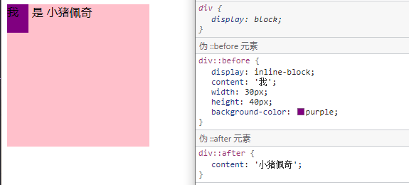
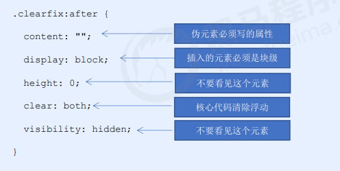
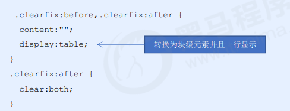

### 属性

伪元素选择器可以帮助我们利用CSS创建新标签元素，而不需要HTML标签，从而简化HTML结构。

| 选择符     | 简介                     |
| ---------- | ------------------------ |
| `::before` | 在元素内部的前面插入内容 |
| `::after`  | 在元素内部的后面插入内容 |

 before 和 after 创建一个元素，但是属于**行内元素**

 新创建的这个元素在文档树中是找不到的，所以我们称为伪元素 

 语法： element::before {}   before 和 after 必须有 content 属性

 before 在父元素内容的前面创建元素，after 在父元素内容的后面插入元素 

 伪元素选择器和标签选择器一样，权重为 1

新创建的这个元素在文档树中是找不到的，所以我们称为伪元素 

~~~
<!DOCTYPE html>
<html lang="en">

<head>
    <meta charset="UTF-8">
    <meta name="viewport" content="width=device-width, initial-scale=1.0">
    <meta http-equiv="X-UA-Compatible" content="ie=edge">
    <title>伪元素选择器before和after</title>
    
</head>

<body>
    

        是
    

</body>

</html>
~~~

### 伪元素清除浮动

本质都是额外标签法也称为隔墙法，也是 W3C 推荐的做法。

比起写
 这种更加美观

第二种

