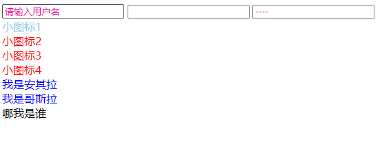

### 属性

| 选择符        | 简介                                  |
| ------------- | ------------------------------------- |
| E[att]        | 选择具有att属性的E元素                |
| E[att=”val”]  | 选择具有att属性且属性值等于val的E元素 |
| E[att^=”val”] | 匹配具有att属性且值以val开头的E元素   |
| E[att$=”val”] | 匹配具有att属性且值以val结尾的E元素   |
| E[att*=”val”] | 匹配具有att属性且值中含有val的E元素   |

~~~html
<!DOCTYPE html>
<html lang="en">

<head>
    <meta charset="UTF-8">
    <meta http-equiv="X-UA-Compatible" content="IE=edge">
    <meta name="viewport" content="width=device-width, initial-scale=1.0">
    <title>Document</title>

</head>

<body>
    <input type="text" value="请输入用户名">
    <input type="text" name="" id="">
    <input type="password" name="" id="" value="zzzz">
    <!-- 3. 属性选择器可以选择属性值开头的某些元素 -->
    
小图标1

    
小图标2

    
小图标3

    
小图标4

    <!-- 4. 属性选择器可以选择属性值结尾的某些元素 -->
    <section class="icon1-data">我是安其拉</section>
    <section class="icon2-data">我是哥斯拉</section>
    <section class="icon3-ico">哪我是谁</section>
</body>

</html>
~~~

