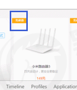
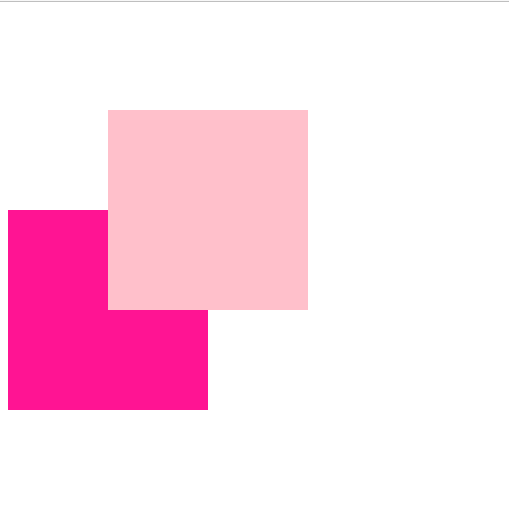
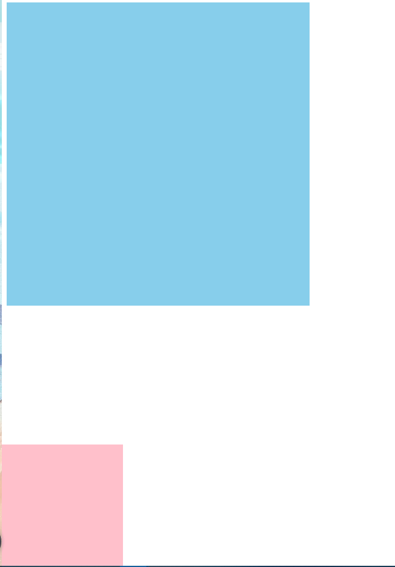
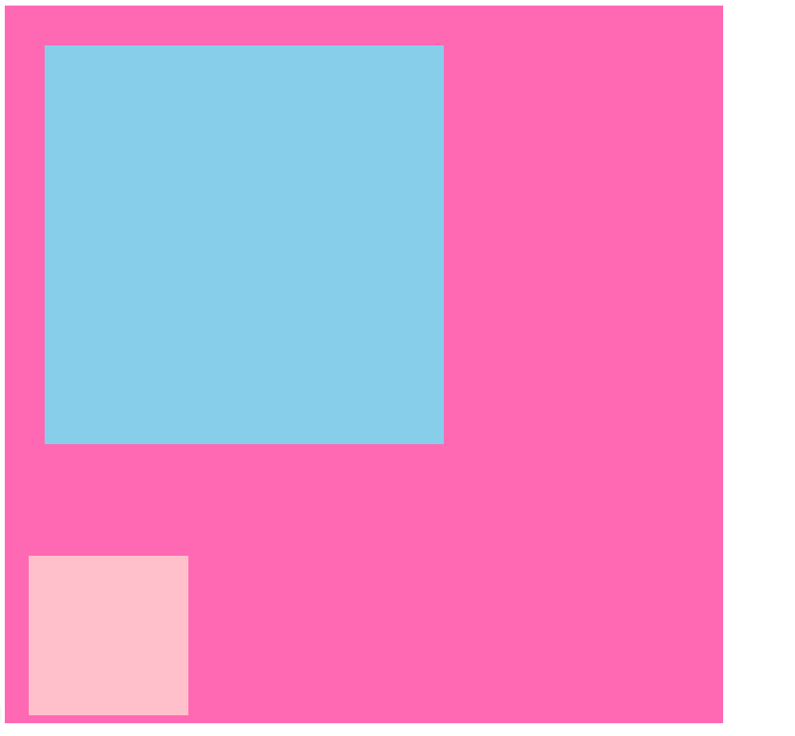
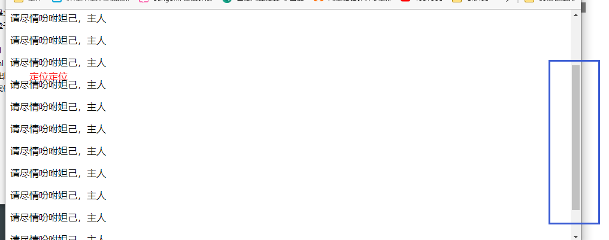
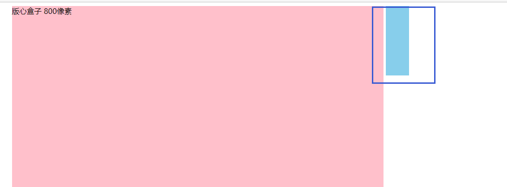
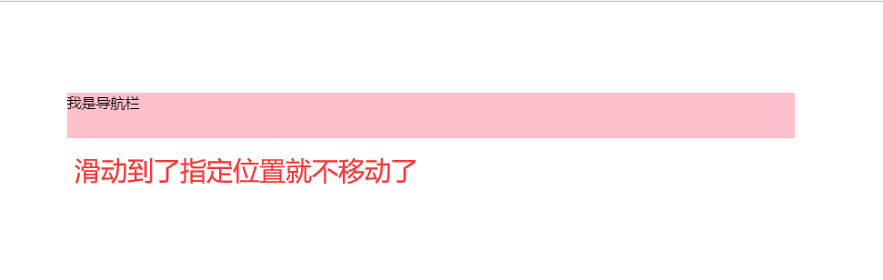
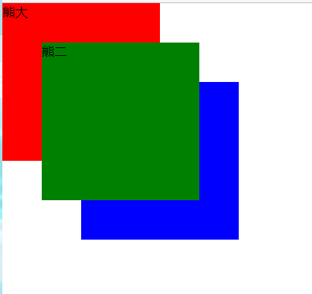

### 定位能解决什么

某个元素可以自由的在一个盒子内移动位置，并且压住其他盒子.

当我们滚动窗口的时候，盒子是固定屏幕某个位置的。

### 属性

定位 = 定位模式 + 边偏移 。

**定位模式用于指定一个元素在文档中的定位方式。边偏移则决定了该元素的最终位置。**

#### 定位模式

| 值       | 语义     |
| -------- | -------- |
| static   | 静态定位 |
| relative | 相对定位 |
| absolute | 绝对定位 |
| fixed    | 固定定位 |

#### 边偏移

| 偏移属性 | 示例        | 描述                                |
| -------- | ----------- | ----------------------------------- |
| top      | top:80px    | 顶部偏移量 相对于父亲元素上边线距离 |
| bottom   | bottom:80px | 底部偏移量 相对于父亲元素下边线距离 |
| left     | left:80px   | 左侧偏移量 相对于父亲元素左边线距离 |
| right    | right:80px  | 右侧偏移量 相对于父亲元素右边线距离 |

### 静态定位

静态定位是元素的**默认定位方式，无定位的意思**。

~~~
选择器 { position: static; }
~~~

###  相对定位

~~~
选择器 { position: static; }
~~~

它是相对于自己原来的位置来移动的

原来在标准流的位置**继续占有**，后面的盒子仍然以标准流的方式对待它。

~~~
<!DOCTYPE html>
<html lang="en">
<head>
    <meta charset="UTF-8">
    <meta name="viewport" content="width=device-width, initial-scale=1.0">
    <meta http-equiv="X-UA-Compatible" content="ie=edge">
    <title>相对定位</title>
    
</head>
<body>
    

    

    

    

    
</body>
</html>
~~~

### 绝对定位

~~~
选择器 { position: absolute; }
~~~

1. **如果没有祖先元素或者祖先元素没有定位，则以浏览器为准定位（Document 文档）。** 

2. 如果祖先元素有定位（相对、绝对、固定定位），则以最近一级的有定位祖先元素为参考点移动位置。

3. **绝对定位不再占有原先的位置**。（脱标）

   

#### 绝对定位-无父亲或者父亲无定位

~~~
<!DOCTYPE html>
<html lang="en">
<head>
    <meta charset="UTF-8">
    <meta name="viewport" content="width=device-width, initial-scale=1.0">
    <meta http-equiv="X-UA-Compatible" content="ie=edge">
    <title>绝对定位-无父亲或者父亲无定位</title>
    
</head>
<body>
    

            

    

   
</body>
</html>

~~~

#### 绝对定位-父级有定位

~~~
<!DOCTYPE html>
<html lang="en">
<head>
    <meta charset="UTF-8">
    <meta name="viewport" content="width=device-width, initial-scale=1.0">
    <meta http-equiv="X-UA-Compatible" content="ie=edge">
    <title>绝对定位-父级有定位</title>
    
</head>
<body>
    

            

                    

            

    

   
   
</body>
</html>
~~~

### 开发中 常用手段

子级是绝 对定位的话，父级要用相对定位。

① 子级绝对定位，不会占有位置，可以放到父盒子里面的任何一个地方，不会影响其他的兄弟盒子。

② 父盒子需要加定位限制子盒子在父盒子内显示。 

③ 父盒子布局时，需要占有位置，因此父亲只能是相对定位。 

这就是子绝父相的由来，所以相对定位经常用来作为绝对定位的父级。 总结： 因为父级需要占有位置，因此是相对定位， 子盒子不需要占有位置，则是绝对定位 当然，子绝父相不是永远不变的，如果父元素不需要占有位置，子绝父绝也会遇到。

### 固定定位 fixed 

~~~
选择器 { position: fixed; }
~~~

1. 以浏览器的可视窗为参照点移动元素。

   跟父元素没有任何关系 

   不随滚动条滚动。 

2. **固定定位不在占有原先的位置。** 

   固定定位也是脱标的，其实固定定位也可以看做是一种特殊的绝对定位。

~~~~
<!DOCTYPE html>
<html lang="en">

<head>
    <meta charset="UTF-8">
    <meta name="viewport" content="width=device-width, initial-scale=1.0">
    <meta http-equiv="X-UA-Compatible" content="ie=edge">
    <title>固定定位</title>
    
</head>

<body>
    

        定位定位
    

    
请尽情吩咐妲己，主人

    
请尽情吩咐妲己，主人

    
请尽情吩咐妲己，主人

    
请尽情吩咐妲己，主人

    
请尽情吩咐妲己，主人

    
请尽情吩咐妲己，主人

    
请尽情吩咐妲己，主人

    
请尽情吩咐妲己，主人

    
请尽情吩咐妲己，主人

    
请尽情吩咐妲己，主人

    
请尽情吩咐妲己，主人

    
请尽情吩咐妲己，主人

    
请尽情吩咐妲己，主人

    
请尽情吩咐妲己，主人

    
请尽情吩咐妲己，主人

</body>

</html>
~~~~

#### 固定定位小技巧

版心定位

**效果为永远贴近内容**

~~~html
<!DOCTYPE html>
<html lang="en">
<head>
    <meta charset="UTF-8">
    <meta name="viewport" content="width=device-width, initial-scale=1.0">
    <meta http-equiv="X-UA-Compatible" content="ie=edge">
    <title>固定定位小技巧-固定到版心右侧</title>
    
</head>
<body>
    

    
版心盒子 800像素

  
</body>
</html>
~~~

### 粘性定位 sticky

~~~
选择器 { position: sticky; top: 10px; }
~~~

粘性定位的特点： 

以浏览器的可视窗口为参照点移动元素（固定定位特点）

粘性定位占有原先的位置（相对定位特点）

必须添加 top 、left、right、bottom 其中一个才有效 

跟页面滚动搭配使用。 **兼容性较差，IE 不支持**。

~~~
<!DOCTYPE html>
<html lang="en">

<head>
    <meta charset="UTF-8">
    <meta name="viewport" content="width=device-width, initial-scale=1.0">
    <meta http-equiv="X-UA-Compatible" content="ie=edge">
    <title>粘性定位</title>
    
</head>

<body>
    
我是导航栏

</body>

</html>
~~~

### 定位叠放次序 z-index

~~~
选择器 { z-index: 1; }
~~~

数值可以是正整数、负整数或 0, 默认是 auto，**数值越大，盒子越靠上** 

如果属性值相同，则按照书写顺序，后来居上

数字后面不能加单位

只有定位的盒子才有 z-index 属性

~~~
<!DOCTYPE html>
<html lang="en">

<head>
    <meta charset="UTF-8">
    <meta name="viewport" content="width=device-width, initial-scale=1.0">
    <meta http-equiv="X-UA-Compatible" content="ie=edge">
    <title>定位的堆叠顺序</title>
    
</head>

<body>
    
熊大

    
熊二

    
光头强

</body>

</html>
~~~

### 使用技巧

绝对定位水平垂直居中

原理 移动到中间以后移动自己一半宽度

~~~html
<!DOCTYPE html>
<html lang="en">
<head>
    <meta charset="UTF-8">
    <meta name="viewport" content="width=device-width, initial-scale=1.0">
    <meta http-equiv="X-UA-Compatible" content="ie=edge">
    <title>绝对定位水平垂直居中</title>
    
</head>
<body>
    

</body>
</html>
~~~

### 定位特殊特性

**添加了浮动也变成行内块元素**

绝对定位和固定定位也和浮动类似。 

1. 行内元素添加绝对或者固定定位，可以直接设置高度和宽度。
2.  块级元素添加绝对或者固定定位，如果不给宽度或者高度，默认大小是内容的大小。

~~~
<!DOCTYPE html>
<html lang="en">
<head>
    <meta charset="UTF-8">
    <meta name="viewport" content="width=device-width, initial-scale=1.0">
    <meta http-equiv="X-UA-Compatible" content="ie=edge">
    <title>定位的特殊特性</title>
    
</head>
<body>
    123

    
abcd

</body>
</html>
~~~

 **脱标的盒子不会触发外边距塌陷 浮动元素、绝对定位(固定定位）元素的都不会触发外边距合并的问题。**
