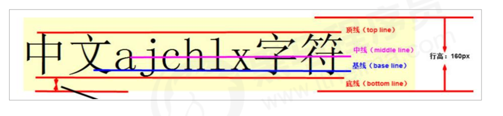
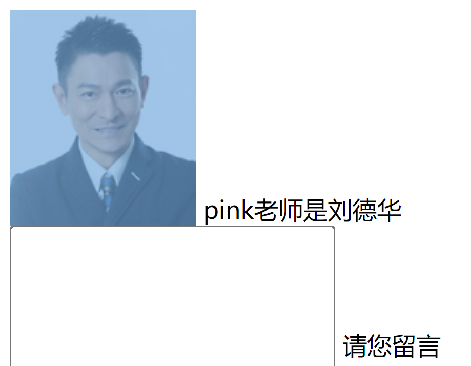
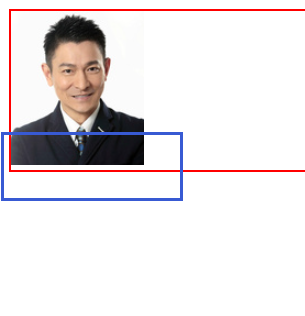

### vertical-align 属性应用

CSS 的 vertical-align 属性使用场景： 经常用于设置图片或者表单(行内块元素）和文字垂直对齐。

官方解释： 用于设置一个元素的垂直对齐方式，但是它只针对于行内元素或者行内块元素有效。

~~~
vertical-align : baseline | top | middle | bottom
~~~

|   属性   |            描述            |
| :------: | :------------------------: |
| baseline | 基线，普通小写英文字母下线 |
|   top    |       文字顶线      |
| bottom |          文字底线          |
| middle |          文字中线          |

#### 什么是文字基线等

##### 解决图片底部默认空白缝隙问题

1. 给图片添加 vertical-align:middle | top| bottom 等。 （提倡使用的）
2. 把图片转换为块级元素 display: block;

