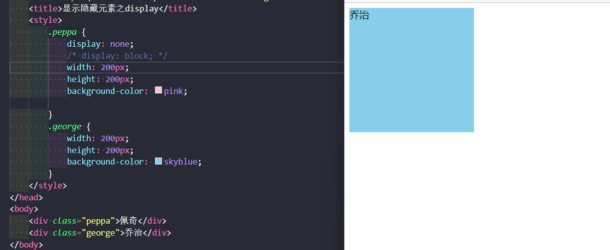
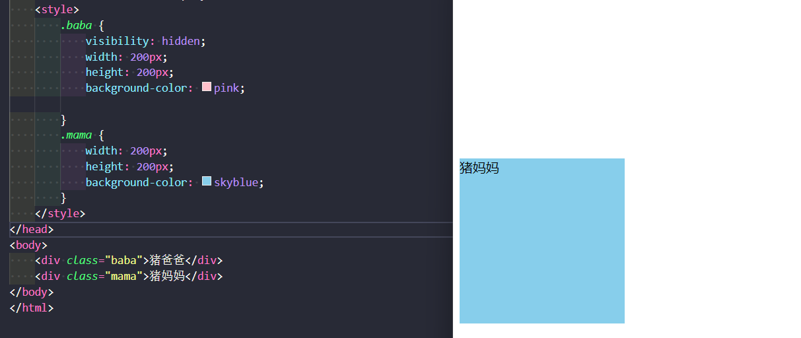

#### 元素的显示与隐藏

*display显示隐藏

> **`display`** 属性用于设置一个元素应如何显示
>
> - **`none`** ：隐藏对象
> - **`block`** ：除了转换为块级元素，同时还有显示元素的意思
>
> **`display`** 隐藏元素后，**不再占有**原来的位置
>
> 

佩奇没有了

##### visibility可见性

> **`visibility`** 属性用于指定一个元素应可见还是隐藏
>
> - **`visible`** ：元素可视
> - **`hidden`** ：元素隐藏
>
> **`visibility`** 隐藏元素后，继续**占有**原来的位置

##### overflow溢出显示与隐藏

> **`overflow`** 属性指定了如果内容溢出一个元素的框时，会发生什么
>
> - **`visible`** ：默认元素可视
> - **`hidden`** ：不显示超过对象尺寸的内容
> - **`scroll`** ：溢出的部分显示滚动条
> - **`auto`** ：此为`body`对象和`textarea`的默认值，在需要时剪切内容并添加滚动条
>
> **如果有定位的盒子，慎用`hidden`，因为它会隐藏多余部分**

~~~
<!DOCTYPE html>
<html lang="en">

<head>
    <meta charset="UTF-8">
    <meta name="viewport" content="width=device-width, initial-scale=1.0">
    <meta http-equiv="X-UA-Compatible" content="ie=edge">
    <title>显示隐藏元素之overflow</title>
    
</head>

<body>
    

        《小猪佩奇》，又名《粉红猪小妹》（台湾名为粉红猪），英文名为《Peppa
        Pig》，是由英国人阿斯特利（Astley）、贝克（Baker）、
        《小猪佩奇》，又名《粉红猪小妹》（台湾名为粉红猪），英文名为《Peppa
        Pig》，是由英国人阿斯特利（Astley）、贝克（Baker）、
        《小猪佩奇》，又名《粉红猪小妹》（台湾名为粉红猪），英文名为《Peppa
        Pig》，是由英国人阿斯特利（Astley）、贝克（Baker）、
        《小猪佩奇》，又名《粉红猪小妹》（台湾名为粉红猪），英文名为《Peppa
        Pig》，是由英国人阿斯特利（Astley）、贝克（Baker）、
        《小猪佩奇》，又名《粉红猪小妹》（台湾名为粉红猪），英文名为《Peppa
        Pig》，是由英国人阿斯特利（Astley）、贝克（Baker）、
        《小猪佩奇》，又名《粉红猪小妹》（台湾名为粉红猪），英文名为《Peppa
        Pig》，是由英国人阿斯特利（Astley）、贝克（Baker）、

</body>

</html>
~~~

