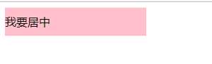
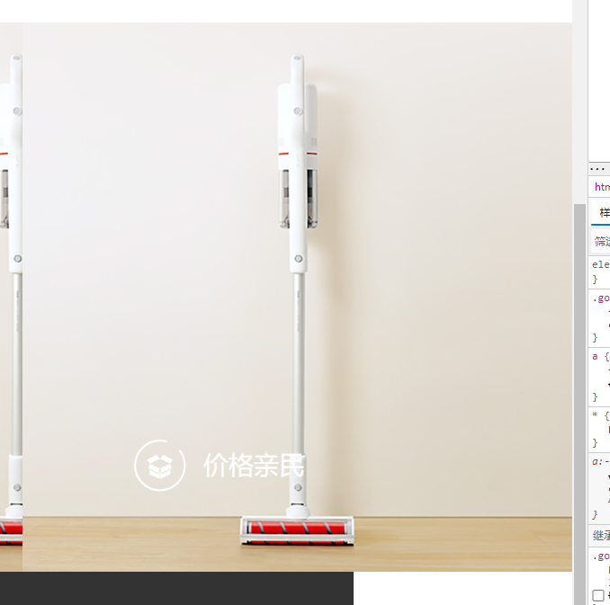
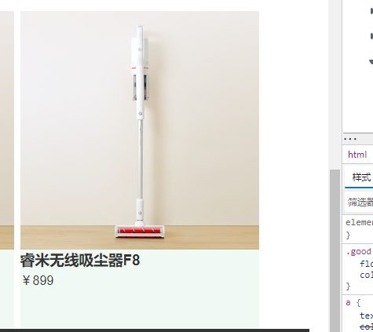

###  单行文字垂直居中的代码

让文字的行高等于盒子的高度 就可以让文字在当前盒子内垂直居中

~~~
<!DOCTYPE html>
<html lang="en">

<head>
    <meta charset="UTF-8">
    <meta name="viewport" content="width=device-width, initial-scale=1.0">
    <meta http-equiv="X-UA-Compatible" content="ie=edge">
    <title>单行文字垂直居中</title>
    
</head>

<body>
    
我要居中

</body>

</html>
~~~

### 书写习惯

~~~
1布局定位属性：display / position / float / clear / visibility / overflow
2自身属性：width / height / margin / padding / border / background
3文本属性：color / font / text-decoration / text-align / vettical-align / white-space / break-word
4其他属性(CSS3)：content / cursor / border-radius / box-shadow / text-shadow
~~~

### Cale

需求我们的子盒子宽度永远比父盒子小30像素

 width: calc(100% - 30px);

括号里面可以 加减乘除 

~~~html
<!DOCTYPE html>
<html lang="en">

<head>
    <meta charset="UTF-8">
    <meta name="viewport" content="width=device-width, initial-scale=1.0">
    <meta http-equiv="X-UA-Compatible" content="ie=edge">
    <title>CSS3 过渡效果</title>
    
</head>

<body>
    <!-- 需求我们的子盒子宽度永远比父盒子小30像素 -->
    

        

    

</body>

</html>
~~~

### 浏览器私有前缀
-moz-：代表 firefox 浏览器私有属性
-ms-：代表 ie 浏览器私有属性
-webkit-：代表 safari、chrome 私有属性
-o-：代表 Opera 私有属性

### 背景缩放background-size
~~~
background-size: 背景图片宽度 背景图片高度;
~~~
cover把背景图像扩展至足够大，以使背景图像完全覆盖背景区域。

contain把图像图像扩展至最大尺寸，以使其宽度和高度完全适应内容区域

~~~
<!DOCTYPE html>
<html lang="en">

<head>
    <meta charset="UTF-8">
    <meta name="viewport" content="width=device-width, initial-scale=1.0">
    <meta http-equiv="X-UA-Compatible" content="ie=edge">
    <title>Document</title>
    
</head>

<body>
    

    

</body>

</html>
~~~

### 图片img标签缩小直接给宽度即可

~~~
.good .bd li img {
    width: 304px;
}
~~~

