### flex布局原理

+ flex 是 flexible Box 的缩写，意为"弹性布局"，用来为盒状模型提供最大的灵活性，任何一个容器都可以指定为 flex 布局。
+ 当我们为父盒子设为 flex 布局以后，子元素的 float、clear 和 vertical-align 属性将失效。
+ flex布局又叫伸缩布局 、弹性布局 、伸缩盒布局 、弹性盒布局 
+ 采用 Flex 布局的元素，称为 Flex 容器（flex

container），简称"容器"。它的所有子元素自动成为容器成员，称为 Flex 项目（flex
item），简称"项目"。

**总结**：就是通过给父盒子添加flex属性，来控制子盒子的位置和排列方式

### 父项常见属性

+ flex-direction：设置主轴的方向
+ justify-content：设置主轴上的子元素排列方式
+ flex-wrap：设置子元素是否换行  
+ align-content：设置侧轴上的子元素的排列方式（多行）
+ align-items：设置侧轴上的子元素排列方式（单行）
+ flex-flow：复合属性，相当于同时设置了 flex-direction 和 flex-wrap

#### flex-direction设置主轴的方向

~~~
<!DOCTYPE html>
<html lang="en">

<head>
    <meta charset="UTF-8">
    <meta name="viewport" content="width=device-width, initial-scale=1.0">
    <meta http-equiv="X-UA-Compatible" content="ie=edge">
    <title>Document</title>
    
</head>

<body>
    

        1
        2
        3
    

</body>

</html>
~~~

默认row

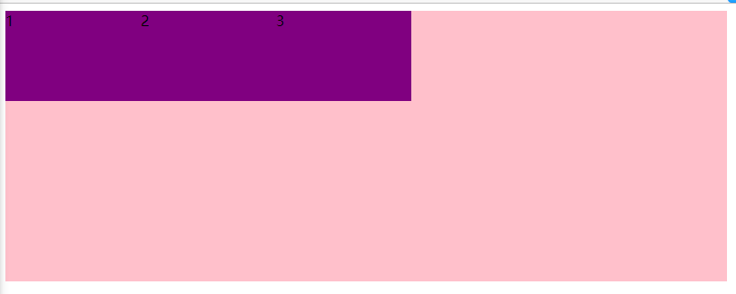

flex-direction: column;

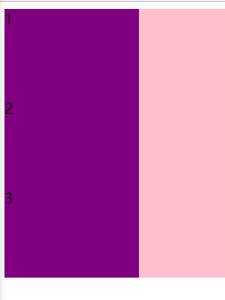

###  justify-content 设置主轴上的子元素排列方式

~~~
justify-content: flex-end;
~~~

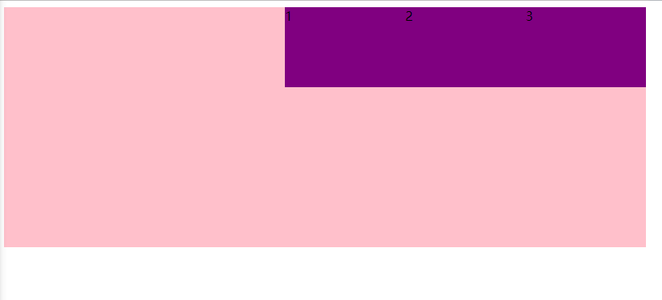

~~~
justify-content: center;
~~~

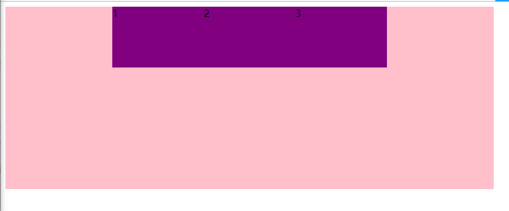

~~~
justify-content: space-around;
~~~

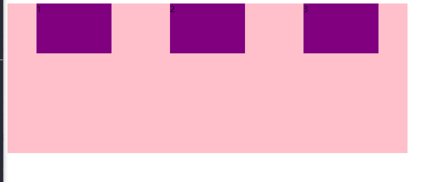

~~~
justify-content: space-between;
~~~

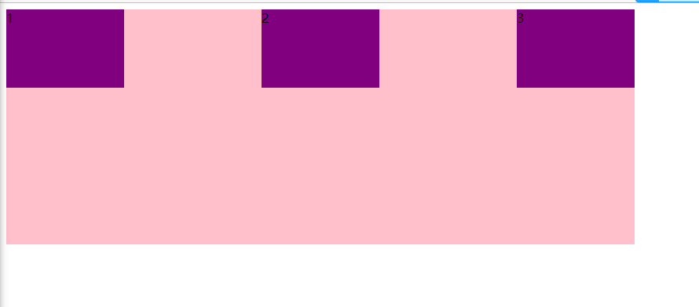

#### flex-wrap设置是否换行

+ 默认情况下，项目都排在一条线（又称”轴线”）上。flex-wrap属性定义，flex布局中默认是不换行的。

+ nowrap 不换行

  flex布局中，默认的子元素是不换行的， 如果装不开，会缩小子元素的宽度，放到父元素里面

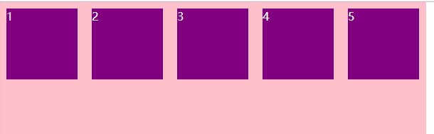

+ wrap 换行

  

~~~
<!DOCTYPE html>
<html lang="en">

<head>
    <meta charset="UTF-8">
    <meta name="viewport" content="width=device-width, initial-scale=1.0">
    <meta http-equiv="X-UA-Compatible" content="ie=edge">
    <title>Document</title>
    
</head>

<body>
    

        1
        2
        3
        4
        5
    

</body>

</html>
~~~

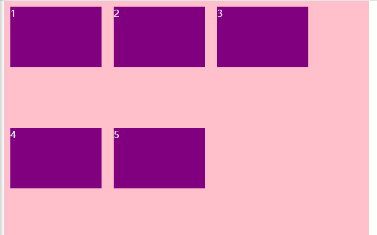

#### align-items 设置侧轴上的子元素排列方式（单行 ）

以上学习现在需要个这个能在中心处

~~~
justify-content: center;
~~~

+ flex-start 从头部开始
+ flex-end 从尾部开始
+ center 居中显示
+ stretch 拉伸

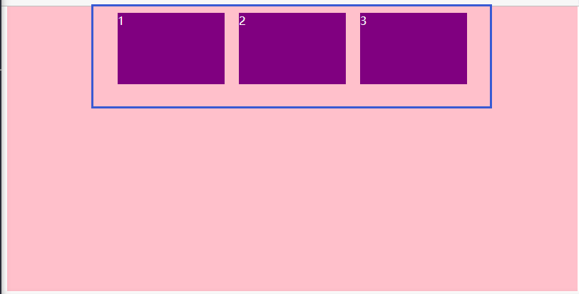

现在加上

~~~
justify-content: center;
align-items: center;
~~~

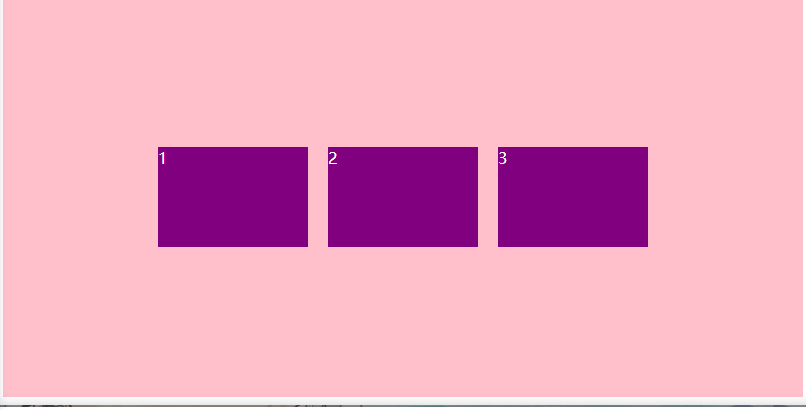

注意拉伸需要不设置儿子物体宽度他会对父亲对齐

~~~
<!DOCTYPE html>
<html lang="en">

<head>
    <meta charset="UTF-8">
    <meta name="viewport" content="width=device-width, initial-scale=1.0">
    <meta http-equiv="X-UA-Compatible" content="ie=edge">
    <title>Document</title>
    
</head>

<body>
    

        1
        2
        3
    

</body>

</html>
~~~

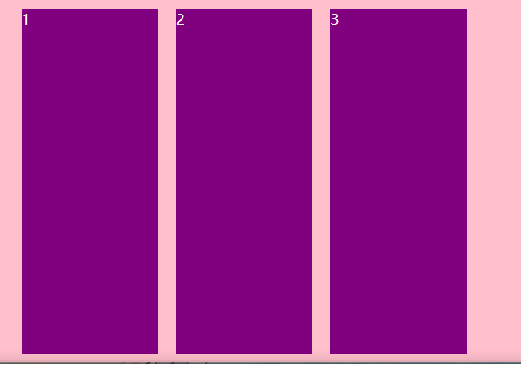

#### align-content  设置侧轴上的子元素的排列方式（多行）

设置子项在侧轴上的排列方式 并且只能用于子项出现 换行 的情况（多行），在单行下是没有效果的。

~~~
<!DOCTYPE html>
<html lang="en">

<head>
    <meta charset="UTF-8">
    <meta name="viewport" content="width=device-width, initial-scale=1.0">
    <meta http-equiv="X-UA-Compatible" content="ie=edge">
    <title>Document</title>
    
</head>

<body>
    

        1
        2
        3
        4
        5
        6
    

</body>

</html>
~~~

####  align-content 和align-items区别

+ align-items  适用于单行情况下， 只有上对齐、下对齐、居中和 拉伸
+ align-content适应于换行（多行）的情况下（单行情况下无效）， 可以设置 上对齐、下对齐、居中、拉伸以及平均分配剩余空间等属性值。 
+ **总结就是单行找align-items  多行找 align-content**

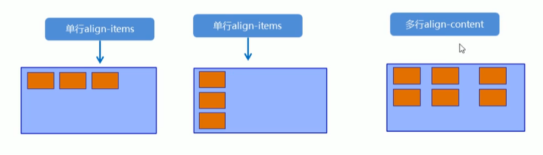

#### 简写

~~~
flex-flow:row wrap;

等于
flex-direction:row;
flex-wrap:wrap
~~~

### flex 属性

flex 属性定义子项目分配剩余空间，用flex来表示占多少份数。

~~~
.item {
    flex: <number>; /* 默认值 0 */
}
~~~

~~~
<!DOCTYPE html>
<html lang="en">

<head>
    <meta charset="UTF-8">
    <meta name="viewport" content="width=device-width, initial-scale=1.0">
    <meta http-equiv="X-UA-Compatible" content="ie=edge">
    <title>Document</title>
    
</head>

<body>
    <section>
        
我给了对应宽高

        
我就是你们剩下的全部

        
我给了对应宽高

    </section>
    

        1份
        2份
        3份
    

</body>

</html>
~~~

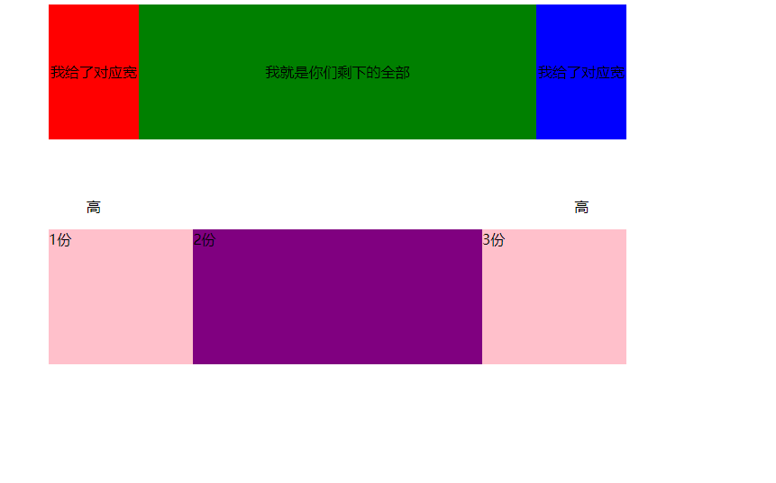

#### align-self控制子项自己在侧轴上的排列方式

align-self 属性允许单个项目有与其他项目不一样的对齐方式，可覆盖 align-items 属性。

默认值为 auto，表示继承父元素的 align-items 属性，如果没有父元素，则等同于 stretch。

~~~
span:nth-child(2) {
      /* 设置自己在侧轴上的排列方式 */
      align-self: flex-end;
}
~~~

~~~
<!DOCTYPE html>
<html lang="en">

<head>
    <meta charset="UTF-8">
    <meta name="viewport" content="width=device-width, initial-scale=1.0">
    <meta http-equiv="X-UA-Compatible" content="ie=edge">
    <title>Document</title>
    
</head>

<body>
    

        1
        2
        3
    

</body>

</html>
~~~

