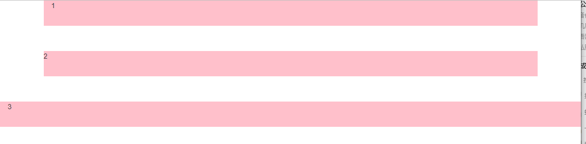
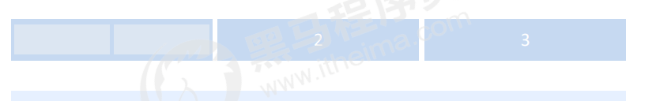
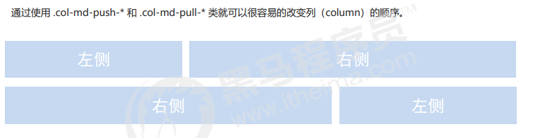
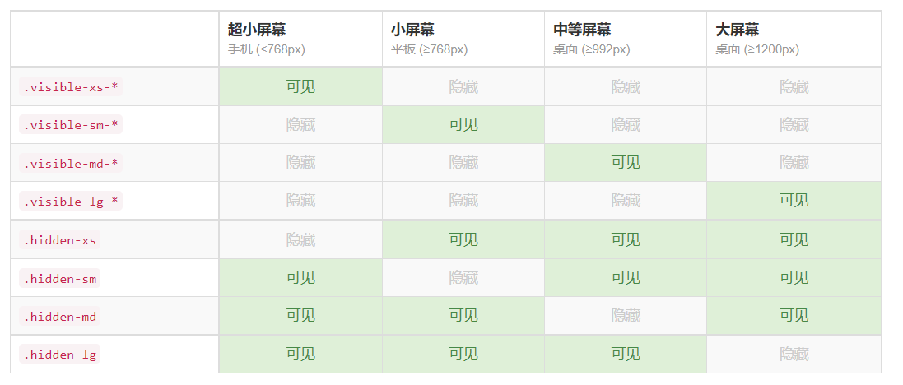
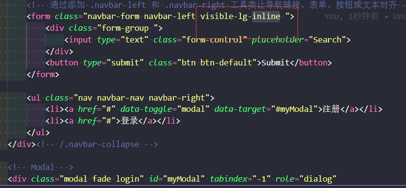

###  Bootstrap 使用

Bootstrap 使用四步曲： 

- 创建文件夹结构 
- 创建 html 骨架结构 
- 引入相关样式文件
- 书写内容

~~~
<!DOCTYPE html>
<html lang="en">

<head>
    <meta charset="UTF-8">
    <meta http-equiv="X-UA-Compatible" content="IE=edge">
    <meta name="viewport" content="width=device-width, initial-scale=1.0">
    <title>Document</title>
    <link rel="stylesheet" href="https://stackpath.bootstrapcdn.com/bootstrap/3.4.1/css/bootstrap.min.css"
        integrity="sha384-HSMxcRTRxnN+Bdg0JdbxYKrThecOKuH5zCYotlSAcp1+c8xmyTe9GYg1l9a69psu" crossorigin="anonymous">
</head>

<body>
    <!-- 成功 -->
    <button type="button" class="btn btn-default btn-lg">
         Star
    </button>
</body>

</html>
~~~

### . container 类

响应式布局的容器 固定宽度

- 大屏 ( >=1200px) 宽度定为 1170px 
- 中屏 ( >=992px) 宽度定为 970px
- 小屏 ( >=768px) 宽度定为 750px 
- 超小屏 (100%) 

### . container-fluid 类

- 流式布局容器 百分百宽度
- 占据全部视口（viewport）的容器。
- 适合单独得网页端手机开发

### . container-row

row类作用就是抵消container类的15px的内边距, row有-15px的外边距

~~~html
<!DOCTYPE html>
<html lang="en">
<head>
    <meta charset="UTF-8">
    <meta http-equiv="X-UA-Compatible" content="IE=edge">
    <meta name="viewport" content="width=device-width, initial-scale=1.0">
    <title>栅格系统-类</title>
    <link rel="stylesheet" href="./bootstrap-3.4.1-dist/css/bootstrap.min.css">
    
</head>
<body>
    <!-- 版心样式:自带左右各15px的padding -->
    
1

    <!-- row类作用就是抵消container类的15px的内边距, row有-15px的外边距 -->
    

        
2

    

    <!-- 宽度100%:自带左右各15px的padding -->
    
3

</body>
</html>
~~~

### Bootstrap 栅格系统

|                    | 手机<768px | 平板>=768px | 中等屏幕>=992px | 宽屏设备>=1200px |
| ------------------ | ---------- | ----------- | --------------- | ---------------- |
| .container最大宽度 | 自动100%   | 750px       | 970px           | 1170px           |
| 类前缀             | .col-xs-   | .col-sm-    | .col-md-        | .col-lg-         |
| 列数               | 12         | 12          | 12              | 12               |

按照不同屏幕划分为1~12 等份

行（row） 可以去除父容器作用15px的边距

xs-extra small：超小； sm-small：小；  md-medium：中等； lg-large：大；

列（column）大于 12，多余的另起一行排列，少于12的空着

每一列默认有左右15像素的 padding

可以同时为一列指定多个设备的类名，class="col-md-4 col-sm-6"

~~~
<!DOCTYPE html>
<html lang="en">

<head>
    <meta charset="UTF-8">
    <meta http-equiv="X-UA-Compatible" content="IE=edge">
    <meta name="viewport" content="width=device-width, initial-scale=1.0">
    <title>Document</title>
    <link rel="stylesheet" href="https://stackpath.bootstrapcdn.com/bootstrap/3.4.1/css/bootstrap.min.css"
        integrity="sha384-HSMxcRTRxnN+Bdg0JdbxYKrThecOKuH5zCYotlSAcp1+c8xmyTe9GYg1l9a69psu" crossorigin="anonymous">
    

</head>

<body>
    

        <ul>
            <li class="col-lg-3">1</li>
            <li class="col-lg-3">2</li>
            <li class="col-lg-3">3</li>
            <li class="col-lg-3">4</li>
        </ul>
        <ul>
            <li class="col-lg-6">11</li>
            <li class="col-lg-2">21</li>
            <li class="col-lg-2">31</li>
            <li class="col-lg-2">41</li>
        </ul>
        <!-- 如果孩子的份数相加 小于 12 则会？ 则占不满整个container 的宽度 会有空白 -->
        

            
1

            
2

            
3

            
4

        

        <!-- 如果孩子的份数相加 大于 12 则会？多于的那一列会 另起一行显示  -->

        

            
1

            
2

            
3

            
4

        

    

</body>

</html>
~~~

#### 列嵌套

栅格系统内置的栅格系统将内容再次嵌套。简单理解就是一个列内再分成若干份小列。我们可以通过添加一个新的 .row 元素 和一系列 .col-sm-* 元素到已经存在的 .col-sm-* 元素内。

~~~html
<!DOCTYPE html>
<html lang="en">

<head>
    <meta charset="UTF-8">
    <meta http-equiv="X-UA-Compatible" content="IE=edge">
    <meta name="viewport" content="width=device-width, initial-scale=1.0">
    <title>Document</title>
    <link rel="stylesheet" href="https://stackpath.bootstrapcdn.com/bootstrap/3.4.1/css/bootstrap.min.css"
        integrity="sha384-HSMxcRTRxnN+Bdg0JdbxYKrThecOKuH5zCYotlSAcp1+c8xmyTe9GYg1l9a69psu" crossorigin="anonymous">
    

</head>

<body>
    

        

            
1

            
2

            
3

            
4

        

        <!-- 如果孩子的份数相加等于12 则孩子能占满整个 的container 的宽度 -->
        

            
1

            
2

            
3

            
4

        

        <!-- 如果孩子的份数相加 小于 12 则会？ 则占不满整个container 的宽度 会有空白 -->
        

            
1

            
2

            
3

            
4

        

        <!-- 如果孩子的份数相加 大于 12 则会？多于的那一列会 另起一行显示  -->

        

            
1

            
2

            
3

            
4

        

    

</body>

</html>
~~~

####  列排序

~~~html
<!DOCTYPE html>
<html lang="en">

<head>
    <meta charset="UTF-8">
    <meta name="viewport" content="width=device-width, initial-scale=1.0">
    <meta http-equiv="X-UA-Compatible" content="ie=edge">
    <!--[if lt IE 9]>
      
      
    <![endif]-->
    <!-- 一定不要忘记引入bootstrap 的样式文件 -->
    <link rel="stylesheet" href="bootstrap/css/bootstrap.min.css">
    <title>Document</title>
    
</head>

<body>
    

        

            
左侧

            
右侧

        

    

</body>

</html>
~~~

#### 响应式工具

| 类名       | xs超小屏 | sm小屏 | md中屏 | lg大屏 |
| ---------- | -------- | ------ | ------ | ------ |
| .hidden-xs | 隐藏     | 可见   | 可见   | 可见   |
| .hidden-sm | 可见     | 隐藏   | 可见   | 可见   |
| .hidden-md | 可见     | 可见   | 隐藏   | 可见   |
| .hidden-lg | 可见     | 可见   | 可见   | 隐藏   |
| .visible-xs-* | 可见 | 隐藏 | 隐藏 | 隐藏 |
| .visible-sm-* | 隐藏 | 可见 | 隐藏 | 隐藏 |
| .visible-md-* | 隐藏 | 隐藏 | 可见 | 隐藏 |
| .visible-lg-* | 隐藏 | 隐藏 | 隐藏 | 可见 |

~~~html
div class="container" style="padding: 40px;">
    

        

            特别小型
            ✔ 在特别小型设备上可见
        

        

            小型
            ✔ 在小型设备上可见
        

        

        

            中型
            ✔ 在中型设备上可见
        

        

            大型
            ✔ 在大型设备上可见
        

    

~~~

从 v3.2.0 版本起，形如 .visible-*-* 的类针对每种屏幕大小都有了三种变体，每个针对 CSS 中不同的 display 属性，列表如下：

| 类组                    | CSS display            |
| :---------------------- | :--------------------- |
| .visible-*-block        | display: block;        |
| .visible-*-inline       | display: inline;       |
| .visible-*-inline-block | display: inline-block; |

因此，以超小屏幕（xs）为例，可用的 .visible-*-* 类是：.visible-xs-block、.visible-xs-inline 和 .visible-xs-inline-block。

.visible-xs、.visible-sm、.visible-md 和 .visible-lg 类也同时存在。但是从 v3.2.0 版本开始不再建议使用。除了 <table> 相关的元素的特殊情况外，它们与 .visible-*-block 大体相同。

