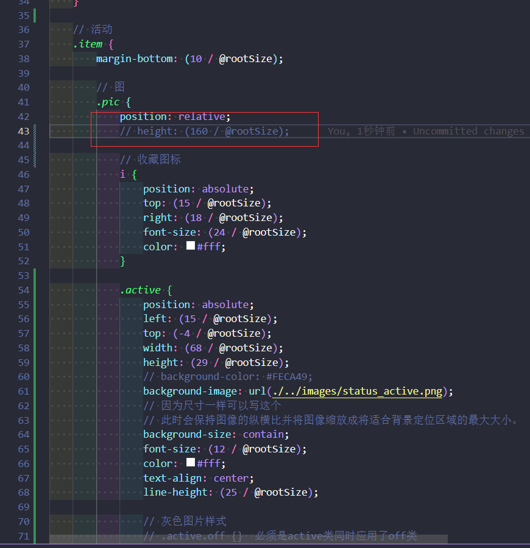
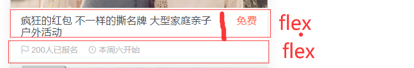
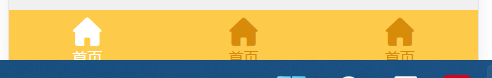

### 为啥写高度 定位防止塌陷

### 活动的写法

~~~html
            .active {
                position: absolute;
                left: (15 / @rootSize);
                top: (-4 / @rootSize);
                width: (68 / @rootSize);
                height: (29 / @rootSize);
                // background-color: #FECA49;
                background-image: url(./../images/status_active.png);
                // 因为尺寸一样可以写这个
                // 此时会保持图像的纵横比并将图像缩放成将适合背景定位区域的最大大小。
                background-size: contain;
                font-size: (12 / @rootSize);
                color: #fff;
                text-align: center;
                line-height: (25 / @rootSize);

                // 灰色图片样式
                // .active.off {}  必须是active类同时应用了off类
                // div.off {}  交集选择器
                &.off {
                    background-image: url(../images/status_default.png);
                }
            }
~~~

~~~
class=active
~~~

~~~
class=active off
~~~

### flex布局

