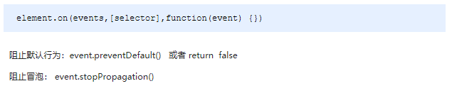

### jQuery事件注册

**语法**


**演示代码**

~~~
<body>
    <div></div>
    <script>
        $(function() {
            // 1. 单个事件注册
            $("div").click(function() {
                $(this).css("background", "purple");
            });
            $("div").mouseenter(function() {
                $(this).css("background", "skyblue");
            });
        })
    </script>
</body>
~~~

###  jQuery 事件处理

​	因为普通注册事件方法的不足，jQuery又开发了多个处理方法，重点讲解如下：

- on(): 用于事件绑定，目前最好用的事件绑定方法
- off(): 事件解绑
- trigger() / triggerHandler(): 事件触发


### 事件处理 on() 绑定事件

​	因为普通注册事件方法的不足，jQuery又创建了多个新的事件绑定方法bind() / live() / delegate() / on()等，其中最好用的是: on()

**语法**


~~~
<body>
    <div></div>
    <ul>
        <li>我们都是好孩子</li>
        <li>我们都是好孩子</li>
        <li>我们都是好孩子</li>
    </ul>
    <ol></ol>

    <script>
        $(function() {
            // (1) on可以绑定1个或者多个事件处理程序
            // $("div").on({
            //     mouseenter: function() {
            //         $(this).css("background", "skyblue");
            //     },
            //     click: function() {
            //         $(this).css("background", "purple");
            //     }
            // });
            $("div").on("mouseenter mouseleave", function() {
                $(this).toggleClass("current");
            });
  
            // (2) on可以实现事件委托（委派）
            // click 是绑定在ul 身上的，但是 触发的对象是 ul 里面的小li
            // $("ul li").click();
            $("ul").on("click", "li", function() {
                alert(11);
            });

            // (3) on可以给未来动态创建的元素绑定事件
            $("ol").on("click", "li", function() {
                alert(11);
            })
            var li = $("<li>我是后来创建的</li>");
            $("ol").append(li);
        })
    </script>
</body>

~~~

### 事件处理 off() 解绑事件

​	当某个事件上面的逻辑，在特定需求下不需要的时候，可以把该事件上的逻辑移除，这个过程我们称为事件解绑。jQuery 为我们提供 了多种事件解绑方法：die() / undelegate() / off() 等，甚至还有只触发一次的事件绑定方法 one()，在这里我们重点讲解一下 off() ;

**语法**


**演示代码**


~~~
<body>
    <div></div>
    <ul>
        <li>我们都是好孩子</li>
        <li>我们都是好孩子</li>
        <li>我们都是好孩子</li>
    </ul>
    <p>我是一个P标签</p>
	<script>
        $(function() {
  			// 事件绑定
            $("div").on({
                click: function() {
                    console.log("我点击了");
                },
                mouseover: function() {
                    console.log('我鼠标经过了');
                }
            });
            $("ul").on("click", "li", function() {
                alert(11);
            });
  
            // 1. 事件解绑 off 
            // $("div").off();  // 这个是解除了div身上的所有事件
            $("div").off("click"); // 这个是解除了div身上的点击事件
            $("ul").off("click", "li");
  
            // 2. one() 但是它只能触发事件一次
            $("p").one("click", function() {
                alert(11);
            })
        })
    </script>
</body>
~~~

### 事件处理 trigger() 自动触发事件

​	有些时候，在某些特定的条件下，我们希望某些事件能够自动触发, 比如轮播图自动播放功能跟点击右侧按钮一致。可以利用定时器自动触发右侧按钮点击事件，不必鼠标点击触发。由此 jQuery 为我们提供了两个自动触发事件 trigger() 和 triggerHandler() ; 

**语法**


~~~
<body>
    <div></div>
    <input type="text">
      
    <script>
    $(function() {
      // 绑定事件
      $("div").on("click", function() {
        alert(11);
      });

      // 自动触发事件
      // 1. 元素.事件()
      // $("div").click();会触发元素的默认行为
      
      // 2. 元素.trigger("事件")
      // $("div").trigger("click");会触发元素的默认行为
      $("input").trigger("focus");
      
      // 3. 元素.triggerHandler("事件") 就是不会触发元素的默认行为
      $("input").on("focus", function() {
        $(this).val("你好吗");
      });
      // 一个会获取焦点，一个不会
      $("div").triggerHandler("click");
      // $("input").triggerHandler("focus");
    });
    </script>
</body>
~~~

##  jQuery 事件对象

​	jQuery 对DOM中的事件对象 event 进行了封装，兼容性更好，获取更方便，使用变化不大。事件被触发，就会有事件对象的产生。

**语法**



**演示代码**

```javascript
<body>
    <div></div>

	<script>
        $(function() {
            $(document).on("click", function() {
                console.log("点击了document");
            })
            $("div").on("click", function(event) {
                // console.log(event);
                console.log("点击了div");
                event.stopPropagation();
            })
        })
    </script>
</body>
```

注意：jQuery中的 event 对象使用，可以借鉴 API 和 DOM 中的 event 。