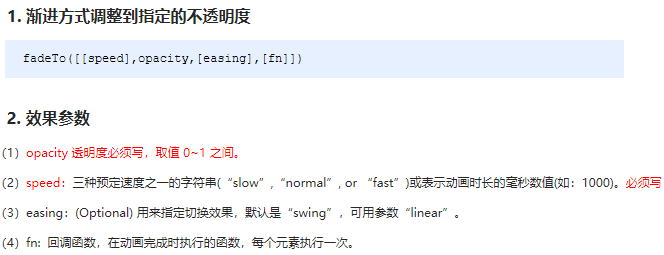

##  jQuery 效果

​	jQuery 给我们封装了很多动画效果，最为常见的如下：

- 显示隐藏：show() / hide() / toggle() ;
- 划入画出：slideDown() / slideUp() / slideToggle() ; 
- 淡入淡出：fadeIn() / fadeOut() / fadeToggle() / fadeTo() ; 
- 自定义动画：animate() ;

> 注意：
>
> 动画或者效果一旦触发就会执行，如果多次触发，就造成多个动画或者效果排队执行。
>
> jQuery为我们提供另一个方法，可以停止动画排队：stop() ;


### 显示隐藏


显示隐藏动画，常见有三个方法：show() / hide() / toggle() （显示就隐藏 隐藏就显示）;

​	语法规范如下:


**代码演示**

~~~
<body>
    <button>显示</button>
    <button>隐藏</button>
    <button>切换</button>
    <div></div>
    <script>
        $(function() {
            $("button").eq(0).click(function() {
                $("div").show(1000, function() {
                    alert(1);
                });
            })
            $("button").eq(1).click(function() {
                $("div").hide(1000, function() {
                    alert(1);
                });
            })
            $("button").eq(2).click(function() {
              $("div").toggle(1000);
            })
            // 一般情况下，我们都不加参数直接显示隐藏就可以了
        });
    </script>
</body>
~~~

### 滑入滑出

​	滑入滑出动画，常见有三个方法：slideDown() / slideUp() / slideToggle() ; 

​	语法规范如下:


**代码演示**

```javascript
<!DOCTYPE html>
<html lang="en">

<head>
    <meta charset="UTF-8">
    <meta http-equiv="X-UA-Compatible" content="IE=edge">
    <meta name="viewport" content="width=device-width, initial-scale=1.0">
    <title>Document</title>
    <style>
        div {
            width: 200px;
            height: 200px;
            background-color: bisque;
        }
    </style>
</head>

<body>

    <body>
        <button>下拉滑动</button>
        <button>上拉滑动</button>
        <button>切换滑动</button>
        <div></div>

        <script src="https://cdnjs.cloudflare.com/ajax/libs/jquery/3.6.0/jquery.js"
            integrity="sha512-n/4gHW3atM3QqRcbCn6ewmpxcLAHGaDjpEBu4xZd47N0W2oQ+6q7oc3PXstrJYXcbNU1OHdQ1T7pAP+gi5Yu8g=="
            crossorigin="anonymous" referrerpolicy="no-referrer"></script>
        <script>
            $(function () {
                $("button").eq(0).click(function () {
                    // 下滑动 slideDown()
                    $("div").slideDown();
                })
                $("button").eq(1).click(function () {
                    // 上滑动 slideUp()
                    $("div").slideUp(500);
                })
                $("button").eq(2).click(function () {
                    // 滑动切换 slideToggle()
                    $("div").slideToggle(500);
                });
            });
        </script>


    </body>

</html>
```

> 小案例：下拉菜单略（详情参看源码）。

### 渐变

淡入淡出动画，常见有四个方法：fadeIn() / fadeOut() / fadeToggle() / fadeTo() ; 

​	语法规范如下:




**代码演示**

```javascript
<body>
    <button>淡入效果</button>
    <button>淡出效果</button>
    <button>淡入淡出切换</button>
    <button>修改透明度</button>
    <div></div>
    <script>
        $(function() {
            $("button").eq(0).click(function() {
                // 淡入 fadeIn()
                $("div").fadeIn(1000);
            })
            $("button").eq(1).click(function() {
                // 淡出 fadeOut()
                $("div").fadeOut(1000);
            })
            $("button").eq(2).click(function() {
                // 淡入淡出切换 fadeToggle()
                $("div").fadeToggle(1000);
            });
            $("button").eq(3).click(function() {
                //  修改透明度 fadeTo() 这个速度和透明度要必须写
                $("div").fadeTo(1000, 0.5);
            });
        });
    </script>
</body>
```

### 自定义动画！！！

自定义动画非常强大，通过参数的传递可以模拟以上所有动画，方法为：animate() ;

​	语法规范如下:


~~~

~~~

### 停止动画排队

​	动画或者效果一旦触发就会执行，如果多次触发，就造成多个动画或者效果排队执行。

​	停止动画排队的方法为：stop() ; 

- stop() 方法用于停止动画或效果。
- stop() 写到动画或者效果的前面， 相当于停止结束上一次的动画。

​        总结: 每次使用动画之前，先调用 stop() ,在调用动画。

#### .stop( [clearQueue ] [, jumpToEnd ] )

- **clearQueue**

  类型: [Boolean](https://www.jquery123.com/Types/#Boolean)

  一个布尔值，指示是否取消以列队动画。默认 `false`.

- **jumpToEnd**

  类型: [Boolean](https://www.jquery123.com/Types/#Boolean)

  一个布尔值指示是否当前动画立即完成。默认`false`.

  

###  事件切换

jQuery中为我们添加了一个新事件 hover() ; 功能类似 css 中的伪类 :hover 。介绍如下

**语法**

```javascript
hover([over,]out)     // 其中over和out为两个函数
```

- over:鼠标移到元素上要触发的函数（相当于mouseenter）
- out:鼠标移出元素要触发的函数（相当于mouseleave）
- 如果只写一个函数，则鼠标经过和离开都会触发它

**hover事件和停止动画排列案例**

~~~
<body>
    <ul class="nav">
        <li>
            <a href="#">微博</a>
            <ul><li><a href="">私信</a></li><li><a href="">评论</a></li><li><a href="">@我</a></li></ul>
        </li>
        <li>
            <a href="#">微博</a>
            <ul><li><a href="">私信</a></li><li><a href="">评论</a></li><li><a href="">@我</a></li></ul>
        </li>
    </ul>
    <script>
        $(function() {
            // 鼠标经过
            // $(".nav>li").mouseover(function() {
            //     // $(this) jQuery 当前元素  this不要加引号
            //     // show() 显示元素  hide() 隐藏元素
            //     $(this).children("ul").slideDown(200);
            // });
            // // 鼠标离开
            // $(".nav>li").mouseout(function() {
            //     $(this).children("ul").slideUp(200);
            // });
            // 1. 事件切换 hover 就是鼠标经过和离开的复合写法
            // $(".nav>li").hover(function() {
            //     $(this).children("ul").slideDown(200);
            // }, function() {
            //     $(this).children("ul").slideUp(200);
            // });
            // 2. 事件切换 hover  如果只写一个函数，那么鼠标经过和鼠标离开都会触发这个函数
            $(".nav>li").hover(function() {
                // stop 方法必须写到动画的前面
                $(this).children("ul").stop().slideToggle();
            });
        })
    </script>
</body>
~~~

