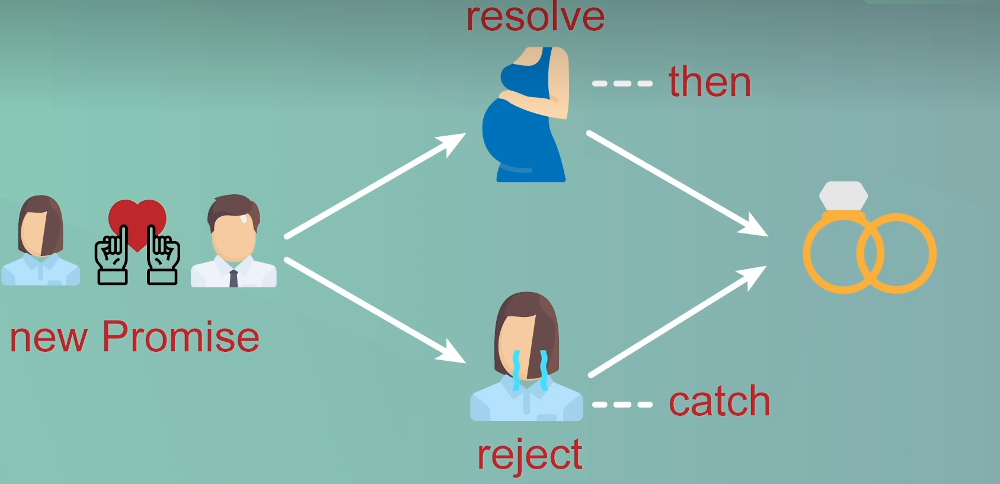
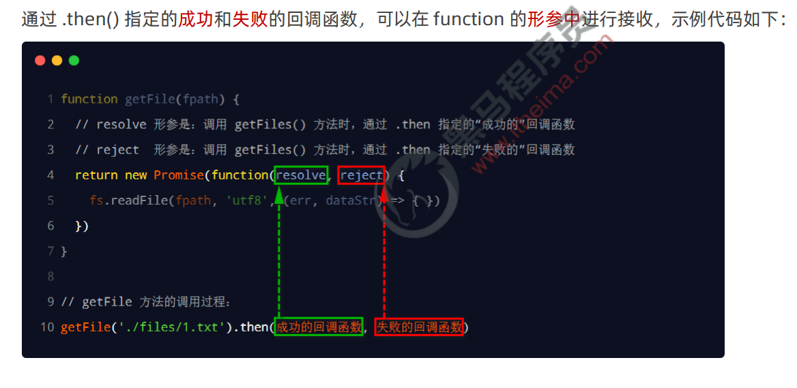
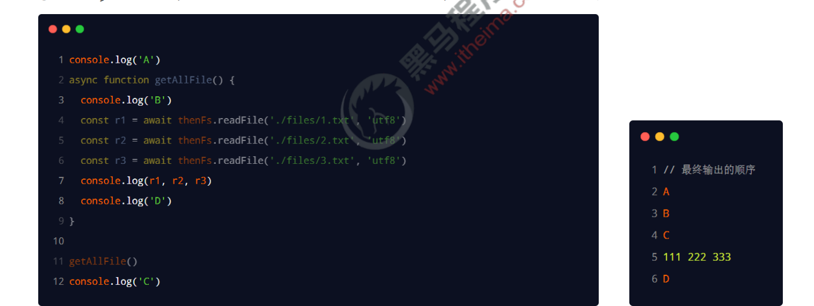

### 为啥用promise

在处理一些需要花费长时间任务时候 使用promise就可以执行异步结果

① Promise 是一个构造函数 

⚫ 我们可以创建 Promise 的实例 const p = new Promise() 

⚫ new 出来的 Promise 实例对象，代表一个异步操作 

② Promise.prototype 上包含一个 .then() 方法 

⚫ 每一次 new Promise() 构造函数得到的实例对象， 

⚫ 都可以通过原型链的方式访问到 .then() 方法，例如 p.then() 

③ .then() 方法用来预先指定成功和失败的回调函数 

⚫ p.then(成功的回调函数，失败的回调函数) 

⚫ p.then(result => { }, error => { }) 

⚫ 调用 .then() 方法时，成功的回调函数是必选的、失败的回调函数是可选的

传递参数

~~~
const isPregnant = true

//给成功失败传递值
const promise = new Promise((resolve, reject) => {
    if (isPregnant) {
        resolve("孩子他爹")
    } else {
        reject("老公")
    }
})

promise.then(name => {
    console.log('男人成为了${name}!')
}).catch(name => {
    console.log("男人成为了${name}!")
}).finally(() => {
    console.log("男人结婚了")
})
~~~

### Promise.all与Promise.race

Promise.all() 方法会发起并行的 Promise 异步操作，**等所有的异步操作全部结束后才会执行下一步**的 .then  操作（等待机制）

然后把拿回的数据进行排序

Promise.race() 方法会发起并行的 Promise 异步操作，只要任何一个异步操作完成，就立即执行下一步的 .then 操作（赛跑机制）。

~~~
import thenFs from 'then-fs'

const promiseArr = [
    thenFs.readFile('./files/3.txt', 'utf8'),
    thenFs.readFile('./files/2.txt', 'utf8'),
    thenFs.readFile('./files/1.txt', 'utf8'),
]

Promise.all(promiseArr).then(result => {
    console.log(result)
})

Promise.race(promiseArr).then(result => {
    console.log(result)
})
~~~

### async/await 的使用注意事项

用了干嘛 保证执行顺序

① 如果在 function 中使用了 await，则 function 必须被 async 修饰

 ② 在 async 方法中，第一个 await 之前的代码会同步执行，await 之后的代码会异步执行

