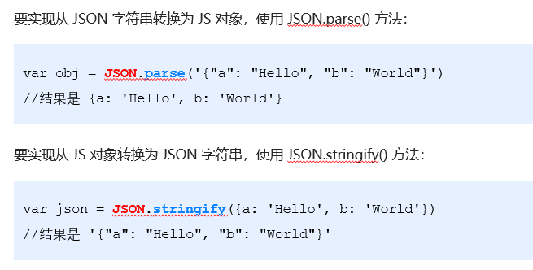

### **什么是数据交换格式**

数据交换格式，就是服务器端与客户端之间进行数据传输与交换的格式。

前端领域，经常提及的两种数据交换格式分别是 XML 和 JSON。其中 XML 用的非常少，所以，我们重点要学习的数据交换格式就是 JSON。

**JSON****的两种结构**

**对象结构**：对象结构在 JSON 中表示为 { } 括起来的内容。数据结构为 { key: value, key: value, … } 的键值对结构。其中，key 必须是使用英文的双引号包裹的字符串，value 的数据类型可以是数字、字符串、布尔值、null、数组、对象6种类型。

~~~
{
    name: "zs",
    'age': 20,
    "gender": '男',
    "address": undefined,
    "hobby": ["吃饭", "睡觉", '打豆豆']
    say: function() {}
}

~~~

**数组结构**：数组结构在 JSON 中表示为 [ ] 括起来的内容。数据结构为 [ "java", "javascript", 30, true … ] 。数组中数据的类型可以是数字、字符串、布尔值、null、数组、对象6种类型。

~~~
[ "java", "python", "php" ]
[ 100, 200, 300.5 ]
[ true, false, null ]
[ { "name": "zs", "age": 20}, { "name": "ls", "age": 30} ]
[ [ "苹果", "榴莲", "椰子" ], [ 4, 50, 5 ] ]

~~~

### JSON和JS对象的互转

**序列化和反序列化**

把数据对象转换为字符串的过程，叫做**序列化**，例如：调用 JSON.stringify() 函数的操作，叫做 JSON 序列化。

把字符串转换为数据对象的过程，叫做**反序列化**，例如：调用 JSON.parse() 函数的操作，叫做 JSON 反序列化。