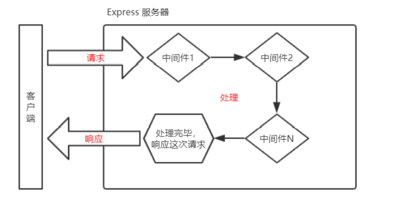

### 中间件的概念

中间件（Middleware ），特指业务流程的中间处理环节。

~~~~
// // 定义一个最简单的中间件函数
// const mw = function (req, res, next) {
//   console.log('这是最简单的中间件函数')
//   // 把流转关系，转交给下一个中间件或路由
//   next()
// }

// // 将 mw 注册为全局生效的中间件
// app.use(mw)

// 这是定义全局中间件的简化形式
~~~~

### Express 中间件的调用流程

当一个请求到达 Express 的服务器之后，可以连续调用多个中间件，从而对这次请求进行预处理

