##  Web 开发模式 

目前主流的 Web 开发模式有两种，分别是：

 ① 基于服务端渲染的传统 Web 开发模式

 ② 基于前后端分离的新型 Web 开发模式

#### 服务端渲染的 Web 开发模式 

服务端渲染的概念：服务器发送给客户端的 HTML 页面，是在服务器通过字符串的拼接，动态生成的。

优点：

 ① 前端耗时少。因为服务器端负责动态生成 HTML 内容，浏览器只需要直接渲染页面即可。尤其是移动端，更省电。 

② 有利于SEO。因为服务器端响应的是完整的 HTML 页面内容，所以爬虫更容易爬取获得信息，更有利于 SEO。（网页排名）

 缺点：

 ① 占用服务器端资源。即服务器端完成 HTML 页面内容的拼接，如果请求较多，会对服务器造成一定的访问压力。

 ② 不利于前后端分离，开发效率低。使用服务器端渲染，则无法进行分工合作，尤其对于前端复杂度高的项目，不利于 项目高效开发。

####  前后端分离的 Web 开发模式 前后端分离的概念：

前后端分离的开发模式，依赖于 Ajax 技术的广泛应用。简而言之，前后端分离的 Web 开发模式， 就是后端只负责提供 API 接口，前端使用 Ajax 调用接口的开发模式

优点： 

① 开发体验好。前端专注于 UI 页面的开发，后端专注于api 的开发，且前端有更多的选择性。

② 用户体验好。Ajax 技术的广泛应用，极大的提高了用户的体验，可以轻松实现页面的局部刷新。   

③ 减轻了服务器端的渲染压力。因为页面最终是在每个用户的浏览器中生成的。 

 缺点： 

① 不利于 SEO。因为完整的 HTML 页面需要在客户端动态拼接完成，所以爬虫对无法爬取页面的有效信息。（解决方 案：利用 Vue、React 等前端框架的 SSR （server side render）技术能够很好的解决 SEO 问题！）

## 身份认证

身份认证的目的，是为了确认当前所声称为某种身份的用户，确实是所声称的用户。

对于服务端渲染和前后端分离这两种开发模式来说，分别有着不同的身份认证方案：

 ① 服务端渲染推荐使用 Session 认证机制 

 ② 前后端分离推荐使用 JWT 认证机制

### cookie 认证机制

####  HTTP 协议的无状态性

HTTP 协议的无状态性，指的是客户端的每次 HTTP 请求都是独立的，连续多个请求之间没有直接的关系，服务器不会 主动保留每次 HTTP 请求的状态。

如何突破 HTTP 无状态的限制

对于超市来说，为了方便收银员在进行结算时给 VIP 用户打折，超市可以为每个 VIP 用户发放会员卡。

.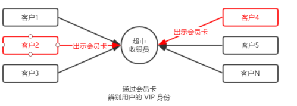

注意：现实生活中的会员卡身份认证方式，在 Web 开发中的专业术语叫做 Cookie。

#### 什么是 Cookie Cookie 

是存储在用户浏览器中的一段不超过 4 KB 的字符串。它由一个名称（Name）、一个值（Value）和其它几个用 于控制 Cookie 有效期、安全性、使用范围的可选属性组成。 不同域名下的 Cookie 各自独立，每当客户端发起请求时，会自动把当前域名下所有未过期的 Cookie 一同发送到服务器。 

Cookie的几大特性： 

① 自动发送 

② 域名独立 

③ 过期时限

 ④ 4KB 限制

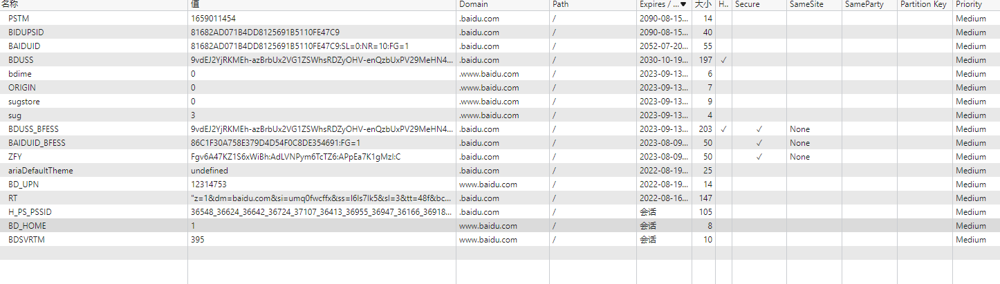

~~~
cookie: {
  // Cookie Options
  // 默认为{ path: '/', httpOnly: true, secure: false, maxAge: null }
   /** maxAge: 设置给定过期时间的毫秒数（date）
  * expires: 设定一个utc过期时间，默认不设置，http>=1.1的时代请使用maxAge代替之（string）
  * path: cookie的路径（默认为/）（string）
  * domain: 设置域名，默认为当前域（String）
  * sameSite: 是否为同一站点的cookie（默认为false）（可以设置为['lax', 'none', 'none']或 true）
  * secure: 是否以https的形式发送cookie（false以http的形式。true以https的形式）true 是默认选项。 但是，它需要启用 https 的网站。 如果通过 HTTP 访问您的站点，则不会设置 cookie。 如果使用的是 secure: true，则需要在 express 中设置“trust proxy”。
  * httpOnly: 是否只以http(s)的形式发送cookie，对客户端js不可用（默认为true，也就是客户端不能以document.cookie查看cookie）
  * signed: 是否对cookie包含签名（默认为true）
  * overwrite: 是否可以覆盖先前的同名cookie（默认为true）*/
  }
~~~

####  Cookie 在身份认证中的作用

客户端第一次请求服务器的时候，服务器通过响应头的形式，向客户端发送一个身份认证的 Cookie，客户端会自动 将 Cookie 保存在浏览器中。

 随后，当客户端浏览器每次请求服务器的时候，浏览器会自动将身份认证相关的 Cookie，通过请求头的形式发送给 服务器，服务器即可验明客户端的身份。

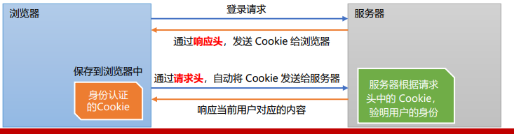

#### Cookie 不具有安全性

由于 Cookie 是存储在浏览器中的，而且浏览器也提供了读写 Cookie 的 API，因此 Cookie 很容易被伪造，不具有安全 性。因此不建议服务器将重要的隐私数据，通过 Cookie 的形式发送给浏览器。

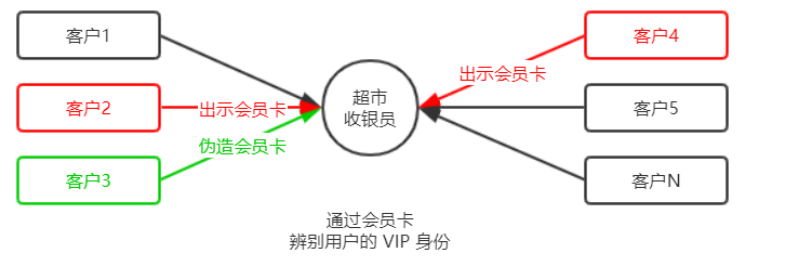

### Session 认证机制

#### 原理

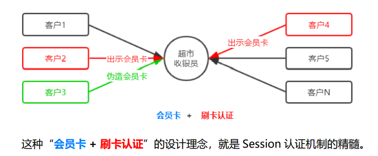

为了防止客户伪造会员卡，收银员在拿到客户出示的会员卡之后，可以在收银机上进行刷卡认证。只有收银机确认存在的 会员卡，才能被正常使用。

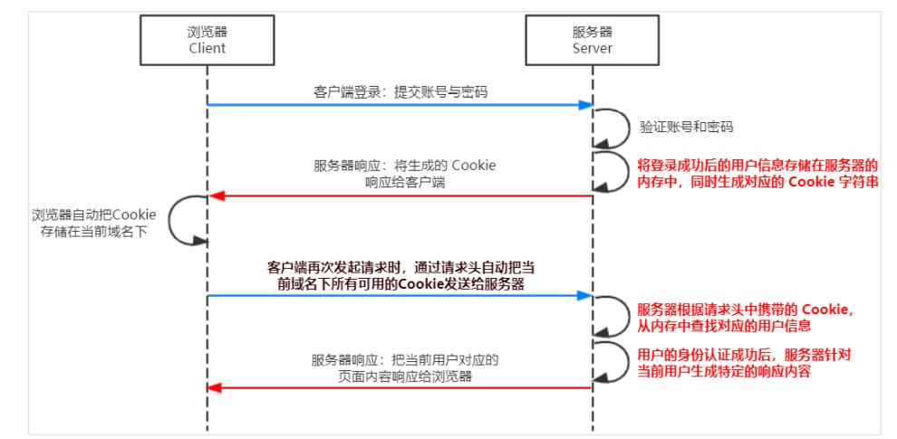

####  安装 express-session 中间件

~~~
install express-session
~~~

express-session 中间件安装成功后，需要通过 app.use() 来注册 session 中间件

~~~
// 1．导入 session中间件
var session = require( 'express-session ' )
7/ 2．配置Session中间件
app.use( session( {
		secret: 'keyboard cat', // secret属性的值可以为任意字符串
		resave: false,//固定写法
		saveUninitialized: true //固定写法
	}))

~~~

~~~

    
  // 默认使用uid-safe这个库自动生成id
  genid: req => genuuid(),  
    
  // 设置会话的名字，默认为connect.sid
  name: 'value',  
  
  // 设置安全 cookies 时信任反向代理（通过在请求头中设置“X-Forwarded-Proto”）。默认未定义（boolean）
  proxy: undefined,
    
  // 是否强制保存会话，即使未被修改也要保存。默认为true
  resave: true, 
    
  // 强制在每个响应上设置会话标识符 cookie。 到期重置为原来的maxAge，重置到期倒计时。默认值为false。
  rolling: false,
    
  // 强制将“未初始化”的会话保存到存储中。 当会话是新的但未被修改时，它是未初始化的。 选择 false 对于实现登录会话、减少服务器存储使用或遵守在设置 cookie 之前需要许可的法律很有用。 选择 false 还有助于解决客户端在没有会话的情况下发出多个并行请求的竞争条件。默认值为 true。
  saveUninitialized: true,
    
  // 用于生成会话签名的密钥,必须项  
  secret: 'secret',
  
  // 会话存储实例，默认为new MemoryStore 实例。
  store: new MemoryStore(),
  
  // 设置是否保存会话，默认为keep。如果选择不保存可以设置'destory'
  unset: 'keep'
~~~

###  JWT 认证机制

#### 原理

了解 Session 认证的局限性 Session 认证机制需要配合 Cookie 才能实现。由于 Cookie 默认不支持跨域访问，所以，当涉及到前端跨域请求后端接 口的时候，需要做很多额外的配置，才能实现跨域 Session 认证。 

注意：

⚫ 当前端请求后端接口不存在跨域问题的时候，推荐使用 Session 身份认证机制。 

⚫ 当前端需要跨域请求后端接口的时候，不推荐使用 Session 身份认证机制，推荐使用 JWT 认证机制。

JWT（英文全称：JSON Web Token）**是目前最流行的跨域认证解决方案**。

总结：用户的信息通过 Token 字符串的形式，保存在客户端浏览器中。服务器通过还原 Token 字符串的形式来认证用户的身份

#### JWT 的组成部分 

JWT 通常由三部分组成，分别是 Header（头部）、Payload（有效荷载）、Signature（签名）。 三者之间使用英文的“.”分隔，格式如下：

**Payload 部分才是真正的用户信息，它是用户信息经过加密之后生成的字符串**。 

Header 和 Signature 是安全性相关的部分，只是为了保证 Token 的安全性

#### JWT 的使用方式

客户端收到服务器返回的 JWT 之后，通常会将它储存在 localStorage 或 sessionStorage 中。 此后，客户端每次与服务器通信，都要带上这个 JWT 的字符串，从而进行身份认证。推荐的做法是把 JWT 放在 HTTP  请求头的 Authorization 字段中，格式如下

### 在 Express 中使用 JWT

#### 安装JWT

~~~
npm install jsonwebtoken express-jwt
~~~

⚫ jsonwebtoken 用于生成 JWT 字符串 

⚫ express-jwt 用于将 JWT 字符串解析还原成 JSON 对象

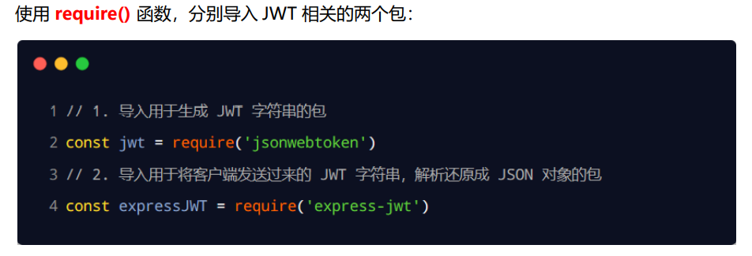

####   定义 secret 密钥

为了保证 JWT 字符串的安全性，防止 JWT 字符串在网络传输过程中被别人破解，我们需要专门定义一个用于加密和解密 的 secret 密钥：

① 当生成 JWT 字符串的时候，需要使用 secret 密钥对用户的信息进行加密，最终得到加密好的 JWT 字符串 

② 当把 JWT 字符串解析还原成 JSON 对象的时候，需要使用 secret 密钥进行解密

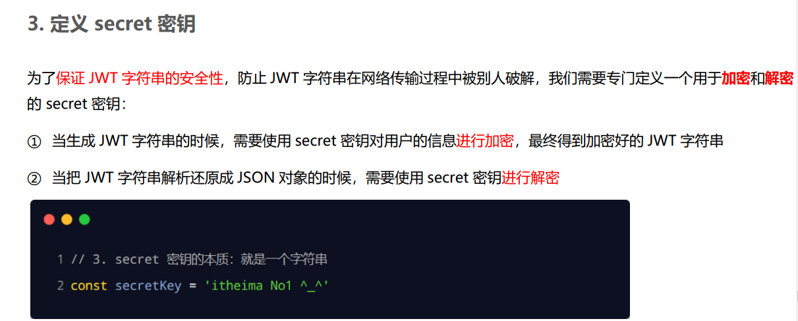

#### 在登录成功后生成 JWT 字符串

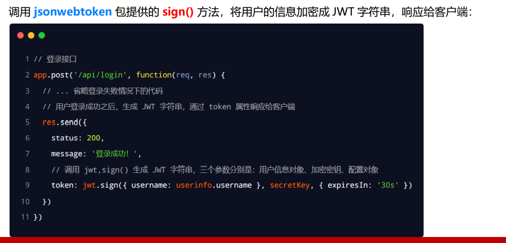

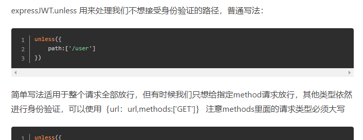

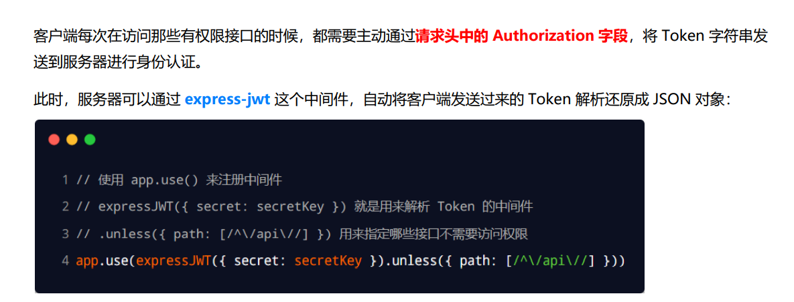

