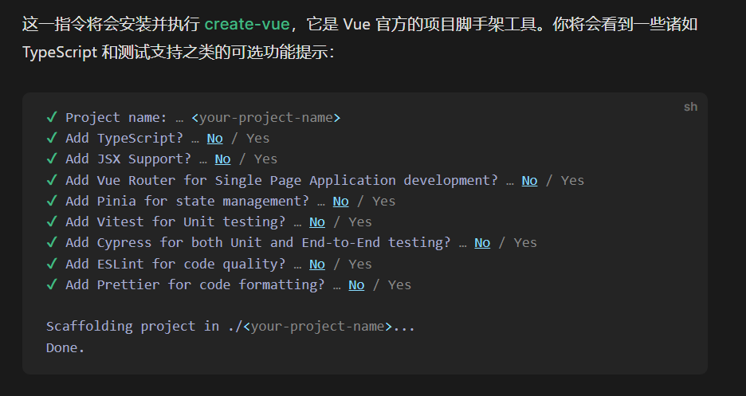
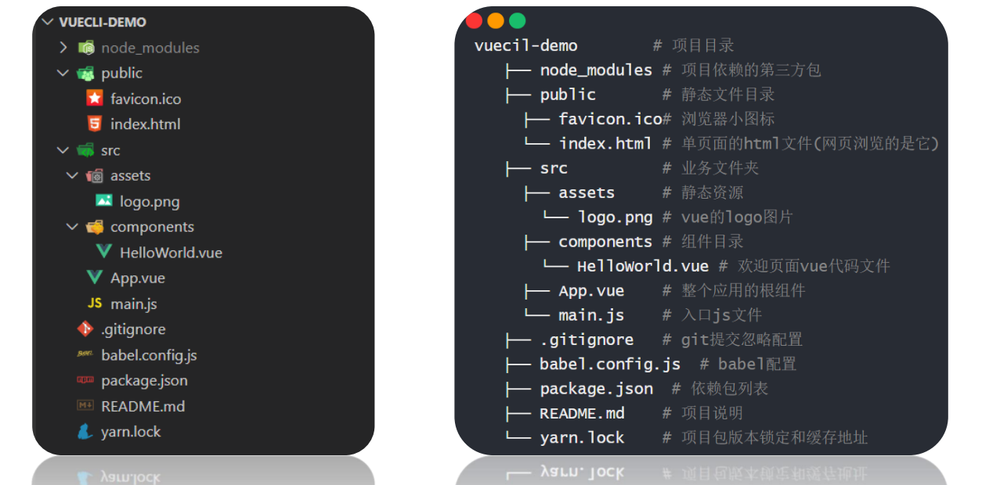
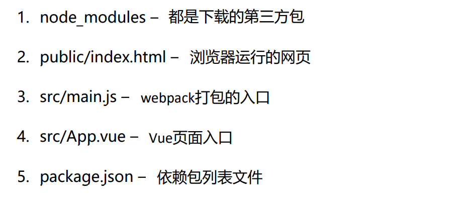
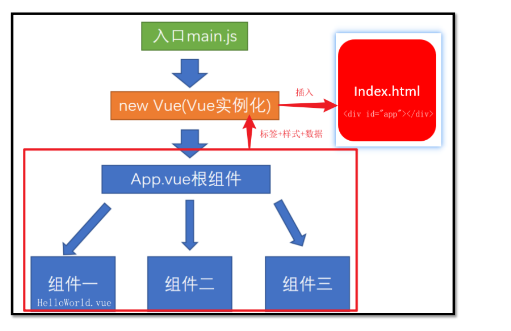

### 安装加启动

可以使用下列任一命令安装这个新的包：

```
npm install -g @vue/cli
#OR
yarn global add @vue/cli
```

安装之后，你就可以在命令行中访问 `vue` 命令。你可以通过简单运行 `vue`，看看是否展示出了一份所有可用命令的帮助信息，来验证它是否安装成功。

你还可以用这个命令来检查其版本是否正确：

```
vue --version
```


```
npm init vue@latest
```



```
> cd <your-project-name>
> npm install
> npm run dev
```


### 件夹和文件含义, 关键文件里代码意思






### 项目架构




