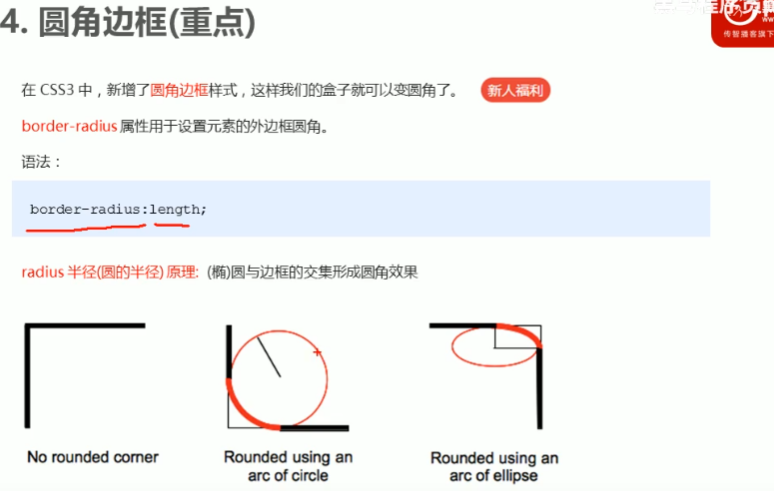
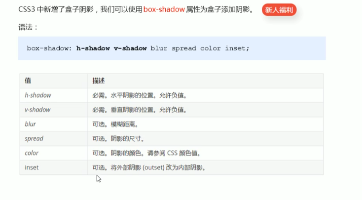
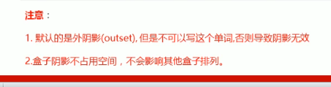

```html
<!DOCTYPE html>
<html lang="en">

<head>
    <meta charset="UTF-8">
    <meta name="viewport" content="width=device-width, initial-scale=1.0">
    <meta http-equiv="X-UA-Compatible" content="ie=edge">
    <title>圆角边框常用写法</title>
    <style>
        .yuanxing {
            width: 200px;
            height: 200px;
            background-color: pink;
            /* border-radius: 100px; */
            /* 50% 就是宽度和高度的一半  等价于 100px */
            border-radius: 50%;
        }

        .juxing {
            width: 300px;
            height: 100px;
            background-color: pink;
            /* 圆角矩形设置为高度的一半 */
            border-radius: 50px;
        }

        .radius {
            width: 200px;
            height: 200px;
            /* border-radius: 10px 20px 30px 40px; */
            /* border-radius: 10px 40px; */
            border-top-left-radius: 20px;
            background-color: pink;
        }
    </style>
</head>

<body>
    1. 圆形的做法:
    <div class="yuanxing"></div>
    2. 圆角矩形的做法:
    <div class="juxing"></div>
    3. 可以设置不同的圆角:
    <div class="radius"></div>
</body>

</html>
```



```
<!DOCTYPE html>
<html lang="en">

<head>
    <meta charset="UTF-8">
    <meta name="viewport" content="width=device-width, initial-scale=1.0">
    <meta http-equiv="X-UA-Compatible" content="ie=edge">
    <title>盒子阴影</title>
    <style>
        div {
            width: 200px;
            height: 200px;
            background-color: pink;
            margin: 100px auto;

            /* box-shadow: 10px 10px; */
        }

        div:hover {
            box-shadow: 10px 10px 10px -4px rgba(0, 0, 0, .3);
        }

        /* 原先盒子没有影子,当我们鼠标经过盒子就添加阴影效果 */
    </style>
</head>

<body>
    <div></div>
</body>

</html>
```

