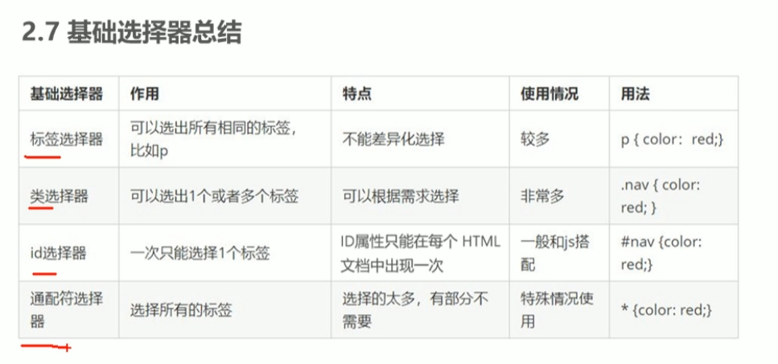
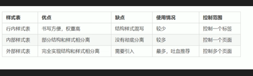
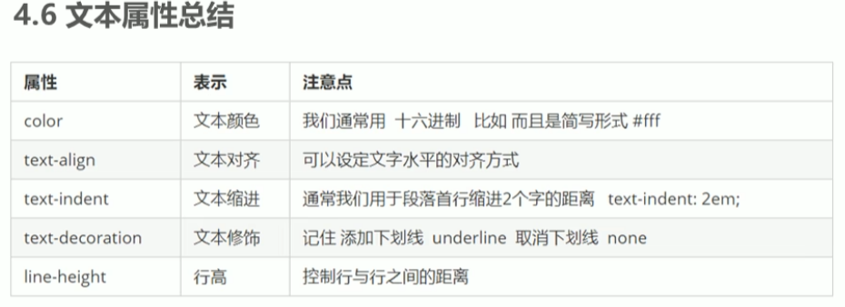

### CSS 基础选择器 



### css样式表配置





```html
 外部样式表
 <link rel="stylesheet" href="styles.css">
 内部样式表
  <style>
	body {background-color: powderblue;}
	h1   {color: blue;}
	p    {color: red;}
  </style>
  内链样式表
  <h1 style="color:blue;">A Blue Heading</h1>
```

文本的属性



```html
<!DOCTYPE html>
<html lang="en">
<head>
    <meta charset="UTF-8">
    <meta name="viewport" content="width=device-width, initial-scale=1.0">
    <meta http-equiv="X-UA-Compatible" content="ie=edge">
    <title>CSS字体属性之字体大小</title>
    <style>
       .bold {
           /* font-weight: bold; */
           /* 这个700 的后面不要跟单位  等价于 bold 都是加粗的效果 */
           /* 实际开发中,我们跟提倡使用数字 表示加粗或者变细 */
           font-weight: 700;    
       }
       h2 {
           font-weight: 400;   
           /* font-weight: normal;    */
           /* 标题标签比较特殊,需要单独指定文字大小 */
            font-size: 16px;
       }
    </style>
</head>
<body>
    <h2>pink的秘密</h2>
    <p>那一抹众人中最漂亮的颜色,</p>
    <p>优雅,淡然,又那么心中清澈.</p>
    <p>前端总是伴随着困难和犯错,</p>
    <p>静心,坦然,攻克一个又一个.</p>
    <p class="bold">拼死也要克服它,</p>
    <p>这是pink的秘密也是老师最终的嘱托.</p>
</body>
</html>
```

居中对齐的标题

```HTML
<!DOCTYPE html>
<html lang="en">
<head>
    <meta charset="UTF-8">
    <meta name="viewport" content="width=device-width, initial-scale=1.0">
    <meta http-equiv="X-UA-Compatible" content="ie=edge">
    <title>CSS文本外观之文字对齐</title>
    <style>
        h1 {
            /* 本质是让h1盒子里面的文字水平居中对齐 */
            /* text-align: center; */
            text-align: right;
        }
    </style>
</head>
<body>
    <h1>居中对齐的标题</h1>
</body>
</html>
```

文本缩进

```html

<!DOCTYPE html>
<html lang="en">
<head>
    <meta charset="UTF-8">
    <meta name="viewport" content="width=device-width, initial-scale=1.0">
    <meta http-equiv="X-UA-Compatible" content="ie=edge">
    <title>CSS文本外观之文本缩进</title>
    <style>
        p {
            font-size: 24px;
            /* 文本的第一行首行缩进 多少距离  */
            /* text-indent: 20px; */
            /* 如果此时写了2em 则是缩进当前元素 2个文字大小的距离  */
            text-indent: 2em;  
        }
    </style>
</head>
<body>
        <p>打开北京、上海与广州的地铁地图，你会看见三张纵横交错的线路网络，这代表了中国最成熟的三套城市轨道交通系统。</p>

       <p> 可即使这样，在北上广生活的人依然少不了对地铁的抱怨，其中谈及最多的问题便是拥挤——对很多人而言，每次挤地铁的过程，都像是一场硬仗。更何况，还都是败仗居多。</p>
        
       <p> 那么，当越来越多的二线甚至三线城市迎接来了自己的地铁，中国哪里的地铁是最拥挤的呢？</p>
</body>
</html>
```

### 


### ~=, |=, ^=, $=, *= 的区别

**先上总结:**

**"value 是完整单词"** 类型的比较符号: **~=**, **|=**

**"拼接字符串**" 类型的比较符号: ***=**, **^=**, **$=**

**1.attribute 属性中包含 value:**　

[attribute~=value] 属性中包含独立的单词为 value，例如：

```
[title~=flower]  -->  
```

[attribute*=value] 属性中做字符串拆分，只要能拆出来 value 这个词就行，例如：

```
[title*=flower]   -->  
```

**2.attribute 属性以 value 开头:**

[attribute|=value] 属性中必须是完整且唯一的单词，或者以 **-** 分隔开：，例如：

```
[lang|=en]     -->  <p lang="en">  <p lang="en-us">
```

[attribute^=value] 属性的前几个字母是 value 就可以，例如：

```
[lang^=en]    -->  <p lang="ennn">
```

**3.attribute 属性以 value 结尾:**

``` 
[attribute$=value] 属性的后几个字母是 value 就可以，例如：
a[src$=".pdf"]
```