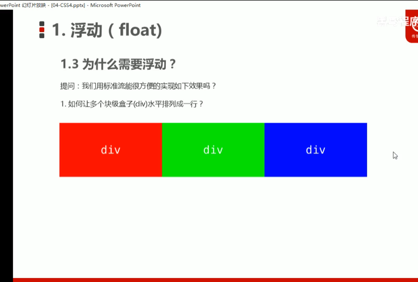
~~~
<!DOCTYPE html>
<html lang="en">

<head>
    <meta charset="UTF-8">
    <meta name="viewport" content="width=device-width, initial-scale=1.0">
    <meta http-equiv="X-UA-Compatible" content="ie=edge">
    <title>行内块中间有缝隙</title>
    <style>
        div {
            float: left;
            width: 150px;
            height: 200px;
            background-color: pink;
            /*这个可以实现但是有空隙*/
            /* display: inline-block; */
        }
    </style>
</head>

<body>
    <div>1</div>
    <div>2</div>
    <div>3</div>
</body>

</html>
~~~

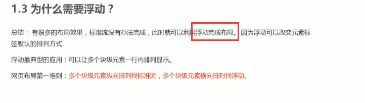

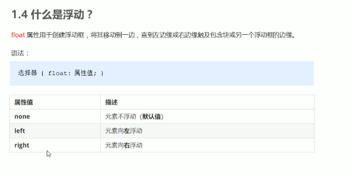

~~~html
<!DOCTYPE html>
<html lang="en">

<head>
    <meta charset="UTF-8">
    <meta name="viewport" content="width=device-width, initial-scale=1.0">
    <meta http-equiv="X-UA-Compatible" content="ie=edge">
    <title>什么是浮动</title>
    <style>
        .left,
        .right {
            float: left;
            width: 200px;
            height: 200px;
            background-color: pink;
        }

        .right {
            float: right;
        }
    </style>
</head>

<body>
    <div class="left">左青龙</div>
    <div class="right">右白虎</div>
</body>

</html>
~~~

浮动的特性

脱离标准普通控制


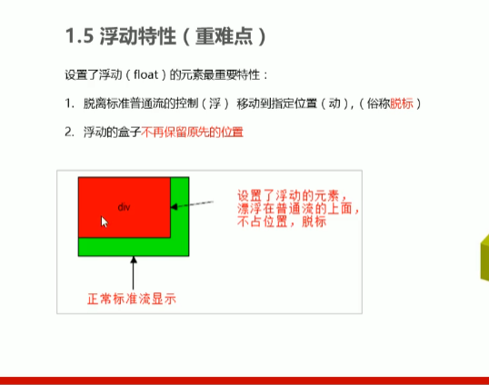

```html
<!DOCTYPE html>
<html lang="en">

<head>
    <meta charset="UTF-8">
    <meta name="viewport" content="width=device-width, initial-scale=1.0">
    <meta http-equiv="X-UA-Compatible" content="ie=edge">
    <title>浮动特性1</title>
    <style>
        /* 设置了浮动（float）的元素会：
        1. 脱离标准普通流的控制（浮）移动到指定位置（动）。
        2.浮动的盒子不在保留原先的位置 */
        .box1 {
            float: left;
            width: 200px;
            height: 200px;
            background-color: pink;
        }

        .box2 {
            width: 300px;
            height: 300px;
            background-color: rgb(0, 153, 255);
        }
    </style>
</head>

<body>
    <div class="box1">浮动的盒子</div>
    <div class="box2">标准流的盒子</div>
</body>

</html>
```

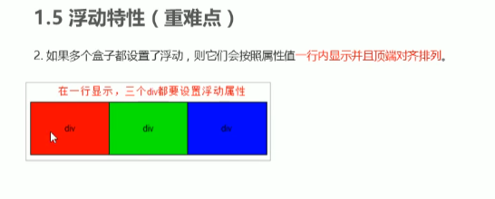

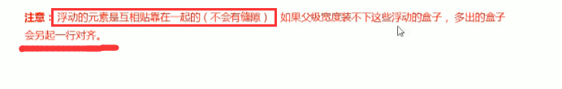

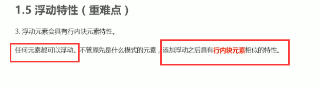

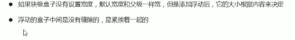

```
<!DOCTYPE html>
<html lang="en">

<head>
    <meta charset="UTF-8">
    <meta name="viewport" content="width=device-width, initial-scale=1.0">
    <meta http-equiv="X-UA-Compatible" content="ie=edge">
    <title>浮动的元素具有行内块元素特点</title>
    <style>
        /* 任何元素都可以浮动。不管原先是什么模式的元素，添加浮动之后具有行内块元素相似的特性。 */
        span,
        div {
            float: left;
            width: 200px;
            height: 100px;
            background-color: pink;
        }

        /* 如果行内元素有了浮动,则不需要转换块级\行内块元素就可以直接给高度和宽度 */
        p {
            float: right;
            height: 200px;
            background-color: purple;
        }
    </style>
</head>

<body>
    <span>1</span>
    <span>2</span>

    <div>div</div>
    <p>ppppppp</p>
</body>

</html>
```

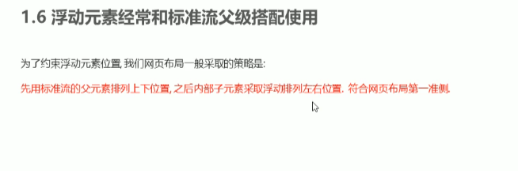

浮动需要用父元素来约束下

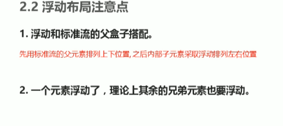

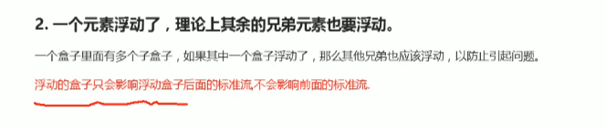