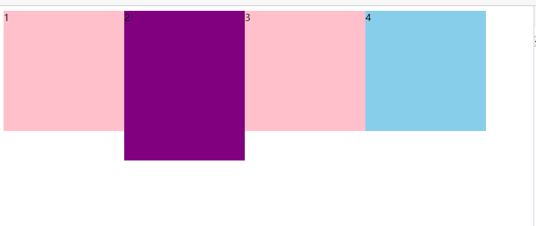
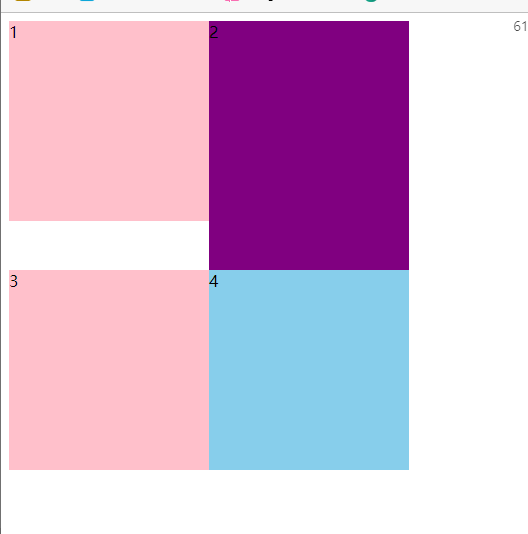
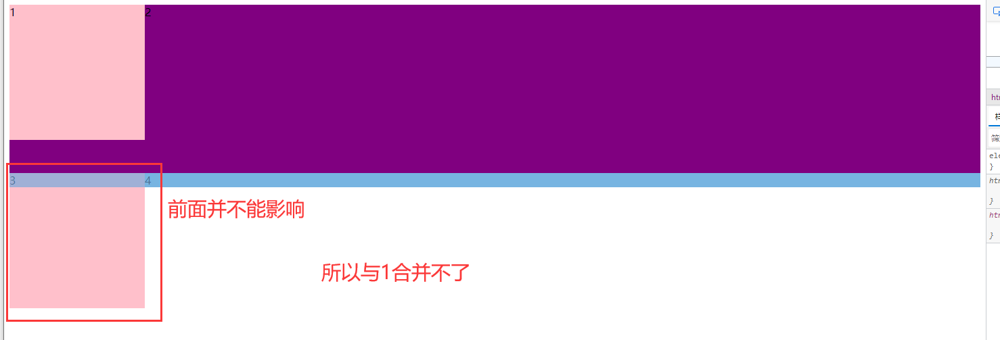
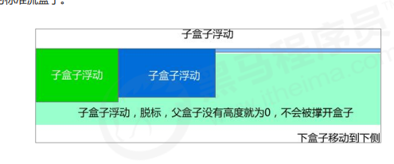
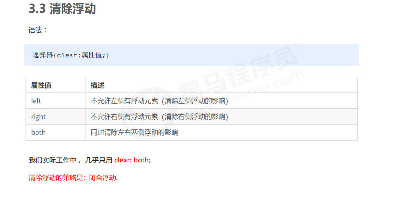
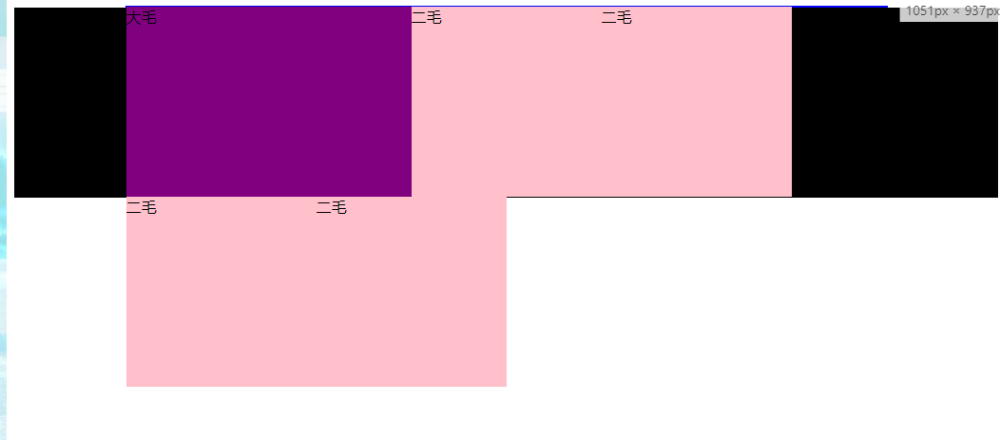
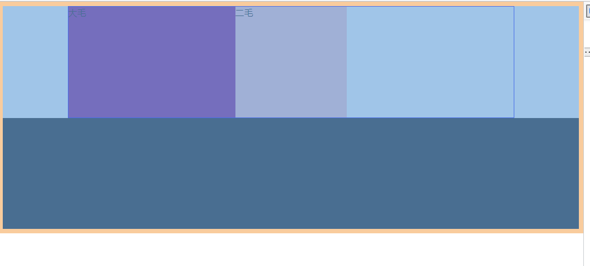
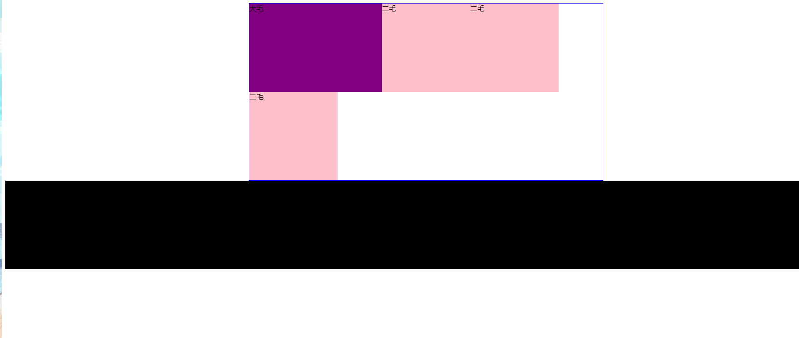
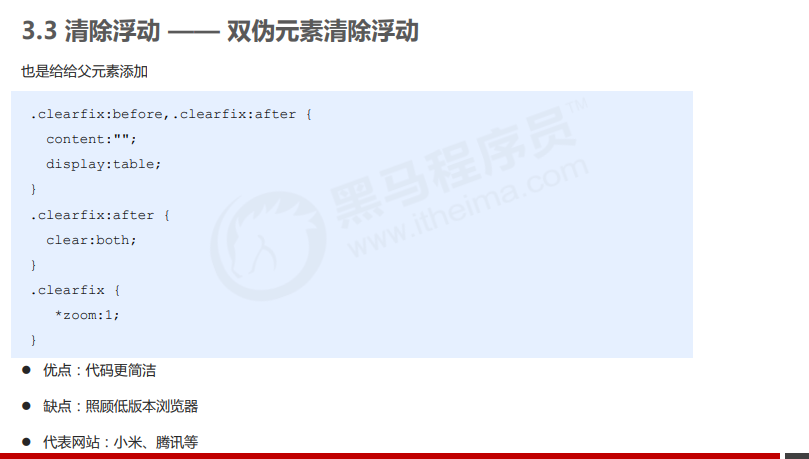
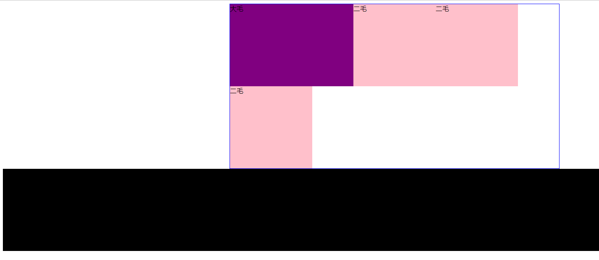

~~~
<!DOCTYPE html>
<html lang="en">

<head>
    <meta charset="UTF-8">
    <meta name="viewport" content="width=device-width, initial-scale=1.0">
    <meta http-equiv="X-UA-Compatible" content="ie=edge">
    <title>行内块中间有缝隙</title>
    <style>
        div {
            float: left;
            width: 150px;
            height: 200px;
            background-color: pink;
            /*这个可以实现但是有空隙*/
            /* display: inline-block; */
        }
    </style>
</head>

<body>
    <div>1</div>
    <div>2</div>
    <div>3</div>
</body>

</html>
~~~


~~~html
<!DOCTYPE html>
<html lang="en">

<head>
    <meta charset="UTF-8">
    <meta name="viewport" content="width=device-width, initial-scale=1.0">
    <meta http-equiv="X-UA-Compatible" content="ie=edge">
    <title>什么是浮动</title>
    <style>
        .left,
        .right {
            float: left;
            width: 200px;
            height: 200px;
            background-color: pink;
        }

        .right {
            float: right;
        }
    </style>
</head>

<body>
    <div class="left">左青龙</div>
    <div class="right">右白虎</div>
</body>

</html>
~~~

浮动的特性

脱离标准普通控制


```html
<!DOCTYPE html>
<html lang="en">

<head>
    <meta charset="UTF-8">
    <meta name="viewport" content="width=device-width, initial-scale=1.0">
    <meta http-equiv="X-UA-Compatible" content="ie=edge">
    <title>浮动特性1</title>
    <style>
        /* 设置了浮动（float）的元素会：
        1. 脱离标准普通流的控制（浮）移动到指定位置（动）。
        2.浮动的盒子不在保留原先的位置 */
        .box1 {
            float: left;
            width: 200px;
            height: 200px;
            background-color: pink;
        }

        .box2 {
            width: 300px;
            height: 300px;
            background-color: rgb(0, 153, 255);
        }
    </style>
</head>

<body>
    <div class="box1">浮动的盒子</div>
    <div class="box2">标准流的盒子</div>
</body>

</html>
```


就可以设置宽度与高度


```
<!DOCTYPE html>
<html lang="en">

<head>
    <meta charset="UTF-8">
    <meta name="viewport" content="width=device-width, initial-scale=1.0">
    <meta http-equiv="X-UA-Compatible" content="ie=edge">
    <title>浮动的元素具有行内块元素特点</title>
    <style>
        /* 任何元素都可以浮动。不管原先是什么模式的元素，添加浮动之后具有行内块元素相似的特性。 */
        span,
        div {
            float: left;
            width: 200px;
            height: 100px;
            background-color: pink;
        }

        /* 如果行内元素有了浮动,则不需要转换块级\行内块元素就可以直接给高度和宽度 */
        p {
            float: right;
            height: 200px;
            background-color: purple;
        }
    </style>
</head>

<body>
    <span>1</span>
    <span>2</span>

    <div>div</div>
    <p>ppppppp</p>
</body>

</html>
```


浮动需要用父元素来约束下


~~~
<!DOCTYPE html>
<html lang="en">

<head>
    <meta charset="UTF-8">
    <meta name="viewport" content="width=device-width, initial-scale=1.0">
    <meta http-equiv="X-UA-Compatible" content="ie=edge">
    <title>浮动元素特性-浮动元素一行显示</title>
    <style>
        div {
            float: left;
            width: 200px;
            height: 200px;
            background-color: pink;
        }

        .two {
            background-color: purple;
            height: 249px;
        }

        .four {
            background-color: skyblue;
        }
    </style>
</head>

<body>
    <div>1</div>
    <div class="two">2</div>
    <div>3</div>
    <div class="four">4</div>
</body>

</html>
~~~

会显示



缩小分辨率



浮动的盒子只会影响浮动盒子后面的标准流不会影响前面的标准流。

~~~html
<!DOCTYPE html>
<html lang="en">

<head>
    <meta charset="UTF-8">
    <meta name="viewport" content="width=device-width, initial-scale=1.0">
    <meta http-equiv="X-UA-Compatible" content="ie=edge">
    <title>浮动元素特性-浮动元素一行显示</title>
    <style>
        div {
            float: left;
            width: 200px;
            height: 200px;
            background-color: pink;
        }

        .two {
            background-color: purple;
            height: 249px;
        }

        .four {
            background-color: skyblue;
        }
    </style>
</head>

<body>
    <div>1</div>
    <nav class="two">2</nav>
    <div>3</div>
    <nav class="four">4</nav>
</body>

</html>
~~~



父亲物体使用盒子

```html
<!DOCTYPE html>
<html lang="en">

<head>
    <meta charset="UTF-8">
    <meta name="viewport" content="width=device-width, initial-scale=1.0">
    <meta http-equiv="X-UA-Compatible" content="ie=edge">
    <title>浮动元素搭配标准流父盒子1</title>
    <style>
        .box {
            width: 1200px;
            height: 460px;
            background-color: pink;
            margin: 0 auto;
        }

        .left {
            float: left;
            width: 230px;
            height: 460px;
            background-color: purple;
        }

        .right {
            float: left;
            width: 970px;
            height: 460px;
            background-color: skyblue;
        }
    </style>
</head>

<body>
    <div class="box">
        <div class="left">左侧</div>
        <div class="right">右侧</div>
    </div>
</body>

</html>
```

想要子元素 撑开父亲元素



```
<!DOCTYPE html>
<html lang="en">

<head>
    <meta charset="UTF-8">
    <meta name="viewport" content="width=device-width, initial-scale=1.0">
    <meta http-equiv="X-UA-Compatible" content="ie=edge">
    <title>为什么需要清除浮动</title>
    <style>
        .box {
            width: 800px;
            border: 1px solid blue;
            margin: 0 auto;
        }

        .damao {
            float: left;
            width: 300px;
            height: 200px;
            background-color: purple;
        }

        .ermao {
            float: left;
            width: 200px;
            height: 200px;
            background-color: pink;
        }

        .footer {
            height: 200px;
            background-color: black;
        }
    </style>
</head>

<body>
    <div class="box">
        <div class="damao">大毛</div>
        <div class="ermao">二毛</div>
    </div>
    <div class="footer"></div>

</body>

</html>
```

清除浮动

 清除浮动的本质是清除浮动元素造成的影响

 如果父盒子本身有高度，则不需要清除浮动 

 清除浮动之后，父级就会根据浮动的子盒子自动检测高度。父级有了高度，就不会影响下面的标准流了



~~~
<!DOCTYPE html>
<html lang="en">

<head>
    <meta charset="UTF-8">
    <meta name="viewport" content="width=device-width, initial-scale=1.0">
    <meta http-equiv="X-UA-Compatible" content="ie=edge">
    <title>清除浮动之额外标签法</title>
    <style>
        .box {
            width: 800px;
            border: 1px solid blue;
            margin: 0 auto;
        }

        .damao {
            float: left;
            width: 300px;
            height: 200px;
            background-color: purple;
        }

        .ermao {
            float: left;
            width: 200px;
            height: 200px;
            background-color: pink;
        }

        .footer {
            height: 200px;
            background-color: black;
        }

        .clear {
            clear: both;
        }
    </style>
</head>

<body>
    <div class="box">
        <div class="damao">大毛</div>
        <div class="ermao">二毛</div>
        <div class="ermao">二毛</div>
        <div class="ermao">二毛</div>
        <div class="ermao">二毛</div>
        <!-- <div class="clear"></div> -->
        <!-- 这个新增的盒子要求必须是块级元素不能是行内元素 -->
        <span class="clear"></span>
    </div>
    <div class="footer"></div>

</body>

</html>
~~~



### overflow清理浮动

 优点：代码简洁

  缺点：无法显示溢出的部分

```
<!DOCTYPE html>
<html lang="en">

<head>
    <meta charset="UTF-8">
    <meta name="viewport" content="width=device-width, initial-scale=1.0">
    <meta http-equiv="X-UA-Compatible" content="ie=edge">
    <title>为什么需要清除浮动</title>
    <style>
        .box {
            /* 清除浮动 */
            overflow: hidden;
            width: 800px;
            border: 1px solid blue;
            margin: 0 auto;
        }

        .damao {
            float: left;
            width: 300px;
            height: 200px;
            background-color: purple;
        }

        .ermao {
            float: left;
            width: 200px;
            height: 200px;
            background-color: pink;
        }

        .footer {
            height: 200px;
            background-color: black;
        }
    </style>
</head>

<body>
    <div class="box">
        <div class="damao">大毛</div>
        <div class="ermao">二毛</div>
    </div>
    <div class="footer"></div>

</body>

</html>
```



伪元素清除浮动

```html
<!DOCTYPE html>
<html lang="en">

<head>
    <meta charset="UTF-8">
    <meta name="viewport" content="width=device-width, initial-scale=1.0">
    <meta http-equiv="X-UA-Compatible" content="ie=edge">
    <title>伪元素清除浮动</title>
    <style>
        .clearfix:after {
            content: "";
            display: block;
            height: 0;
            clear: both;
            visibility: hidden;
        }

        .clearfix {
            /* IE6、7 专有 */
            *zoom: 1;
        }

        .box {
            width: 800px;
            border: 1px solid blue;
            margin: 0 auto;
        }

        .damao {
            float: left;
            width: 300px;
            height: 200px;
            background-color: purple;
        }

        .ermao {
            float: left;
            width: 200px;
            height: 200px;
            background-color: pink;
        }

        .footer {
            height: 200px;
            background-color: black;
        }
    </style>
</head>

<body>
    <div class="box clearfix">
        <div class="damao">大毛</div>
        <div class="ermao">二毛</div>
        <div class="ermao">二毛</div>
        <div class="ermao">二毛</div>
    </div>
    <div class="footer"></div>

</body>

</html>
```





~~~
<!DOCTYPE html>
<html lang="en">

<head>
    <meta charset="UTF-8">
    <meta name="viewport" content="width=device-width, initial-scale=1.0">
    <meta http-equiv="X-UA-Compatible" content="ie=edge">
    <title>伪元素清除浮动</title>
    <style>
        .clearfix:before,
        .clearfix:after {
            content: "";
            display: table;
        }

        .clearfix:after {
            clear: both;
        }

        .clearfix {
            *zoom: 1;
        }

        .box {
            width: 800px;
            border: 1px solid blue;
            margin: 0 auto;
        }

        .damao {
            float: left;
            width: 300px;
            height: 200px;
            background-color: purple;
        }

        .ermao {
            float: left;
            width: 200px;
            height: 200px;
            background-color: pink;
        }

        .footer {
            height: 200px;
            background-color: black;
        }
    </style>
</head>

<body>
    <div class="box clearfix">
        <div class="damao">大毛</div>
        <div class="ermao">二毛</div>
        <div class="ermao">二毛</div>
        <div class="ermao">二毛</div>
    </div>
    <div class="footer"></div>

</body>

</html>
~~~


