什么是定位

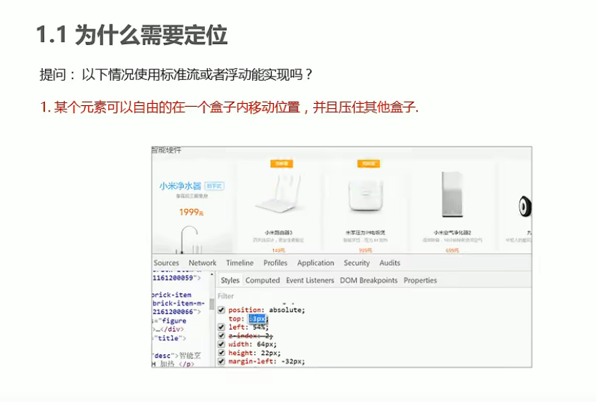


永远在网页上显示

以上效果,标准流或浮动都无法快速实现,此时需要定位来实现。
所以:
1.浮动可以让多个块级盒子行没有缝隙排列显示 ,经常用于横向排列子。
2.定位则是可以让盒子自由的在某个盒子内移动位置或者固定屏幕中某个位置,并且可以压住其他盒子。

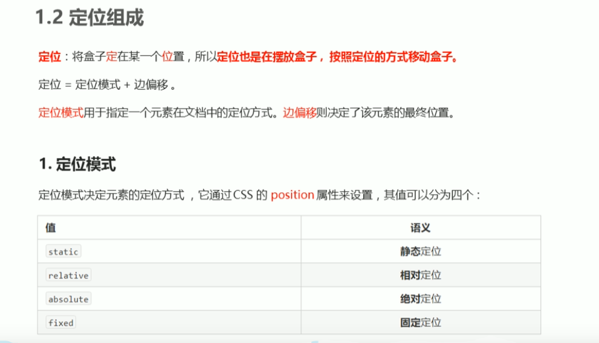

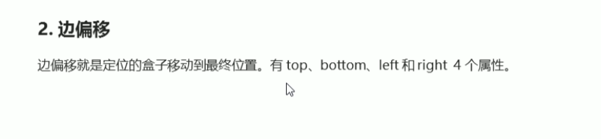

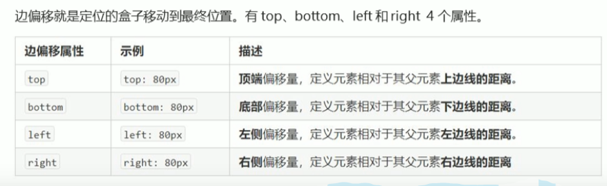

#### 静态定位

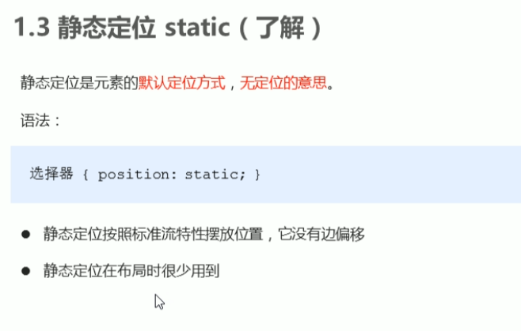

默认就是的

#### 相对定位

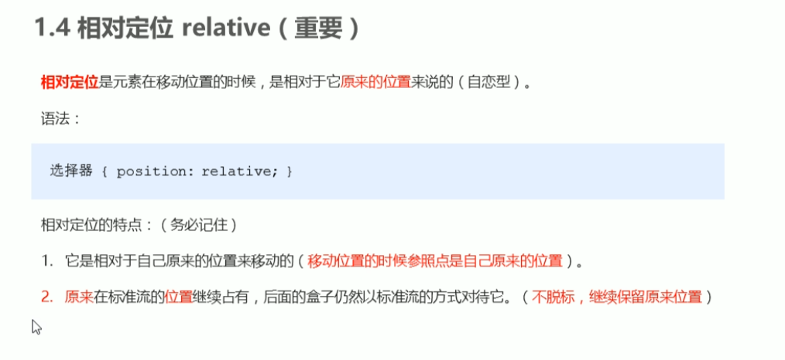

```html
<!DOCTYPE html>
<html lang="en">
<head>
    <meta charset="UTF-8">
    <meta name="viewport" content="width=device-width, initial-scale=1.0">
    <meta http-equiv="X-UA-Compatible" content="ie=edge">
    <title>相对定位</title>
    <style>
        .box1 {
            position: relative;
            top: 100px;
            left: 100px;
            width: 200px;
            height: 200px;
            background-color: pink;
        }
        .box2 {
            width: 200px;
            height: 200px;
            background-color: deeppink;
        }
    </style>
</head>
<body>
    <div class="box1">

    </div>
    <div class="box2">

    </div>
    
</body>
</html>
```

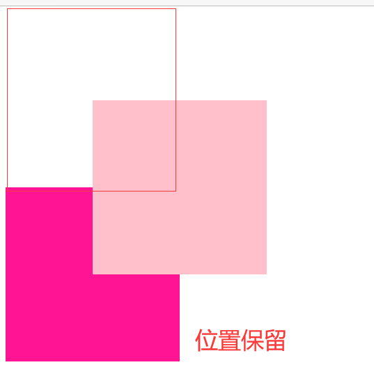

#### 绝对定位

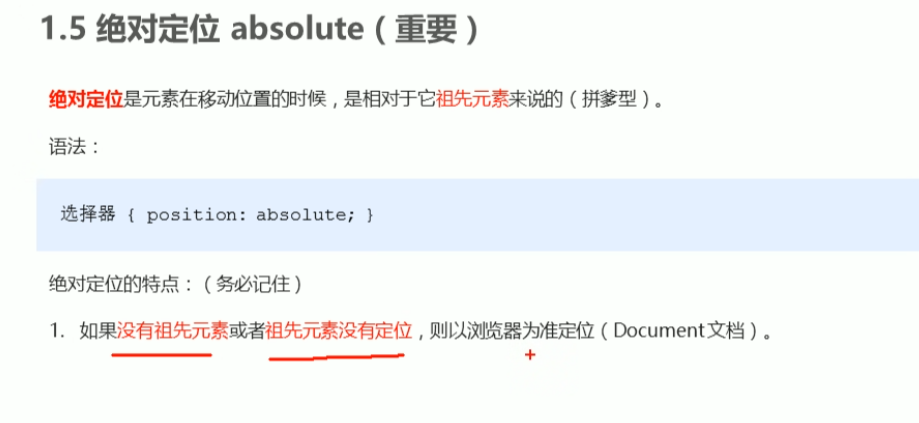


绝对定位-无父亲或者父亲无定位

~~~html
<!DOCTYPE html>
<html lang="en">
<head>
    <meta charset="UTF-8">
    <meta name="viewport" content="width=device-width, initial-scale=1.0">
    <meta http-equiv="X-UA-Compatible" content="ie=edge">
    <title>绝对定位-无父亲或者父亲无定位</title>
    <style>
        .father {
            width: 500px;
            height: 500px;
            background-color: skyblue;
        }
        .son {
            position: absolute;
            /* top: 10px;
            left: 10px; */
            /* top: 100px;
            right: 200px; */
            /*这里给的是左下角定位始终如一 
            不是和父亲动*/
            left: 0;
            bottom: 0;
            width: 200px;
            height: 200px;
            background-color: pink;
        }
    </style>
</head>
<body>
    <div class="father">
            <div class="son"></div>
    </div>
   
</body>
</html>
~~~

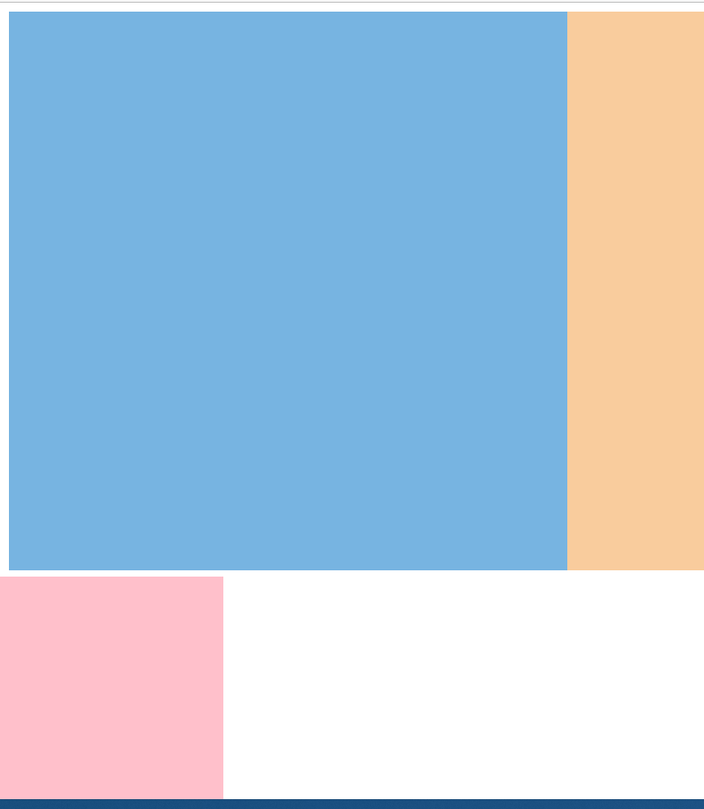

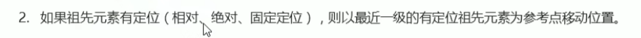

**最近一级有定位的参考**

~~~
<!DOCTYPE html>
<html lang="en">
<head>
    <meta charset="UTF-8">
    <meta name="viewport" content="width=device-width, initial-scale=1.0">
    <meta http-equiv="X-UA-Compatible" content="ie=edge">
    <title>绝对定位-父级有定位</title>
    <style>
        .yeye {
            position: relative;
            width: 800px;
            height: 800px;
            background-color: hotpink;
            padding: 50px;
        }
        .father {
          
            width: 500px;
            height: 500px;
            background-color: skyblue;
        }
        .son {
            position: absolute;
            left: 30px;
            bottom: 10px;
            width: 200px;
            height: 200px;
            background-color: pink;
        }
    </style>
</head>
<body>
    <div class="yeye">
            <div class="father">
                    <div class="son"></div>
            </div>
    </div>
   
   
</body>
</html>
~~~

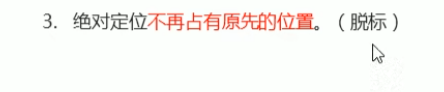

所以要父亲相对定位 儿子绝对定位

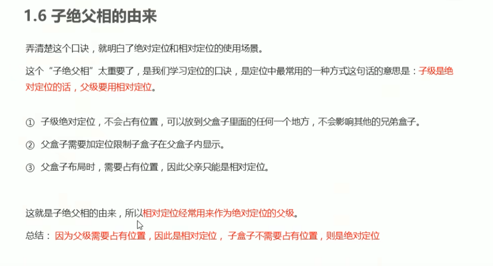

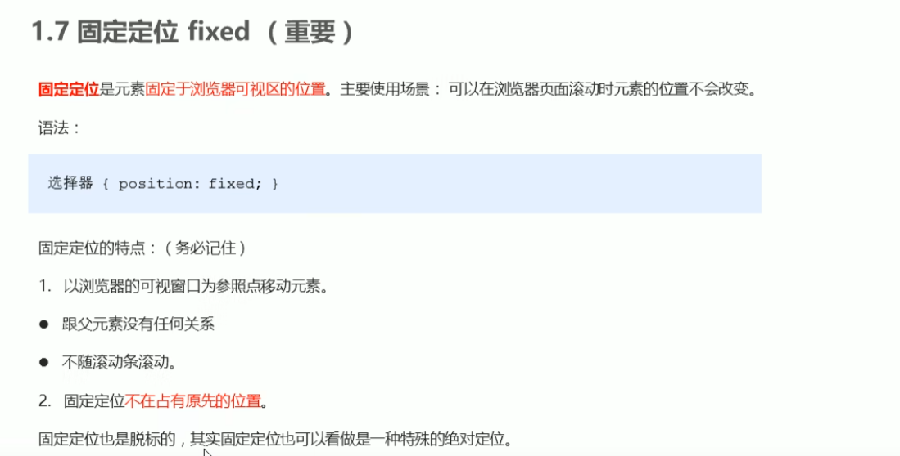

版心对其

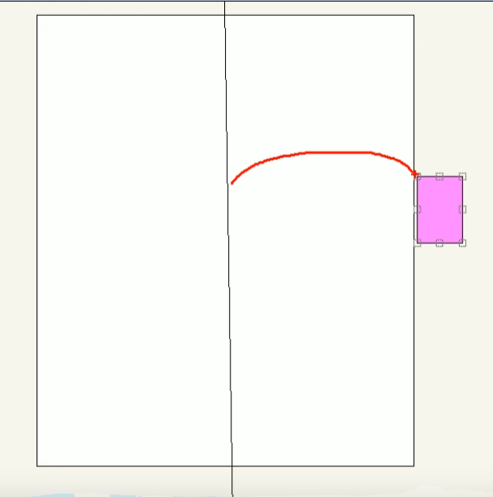

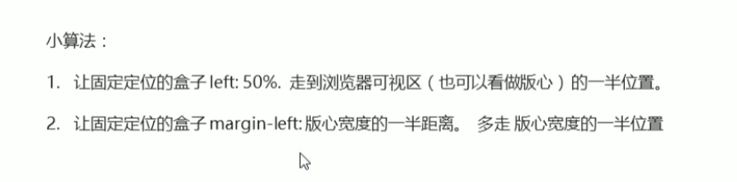

~~~html
<!DOCTYPE html>
<html lang="en">
<head>
    <meta charset="UTF-8">
    <meta name="viewport" content="width=device-width, initial-scale=1.0">
    <meta http-equiv="X-UA-Compatible" content="ie=edge">
    <title>固定定位小技巧-固定到版心右侧</title>
    <style>
        .w {
            width: 800px;
            height: 1400px;
            background-color: pink;
            margin: 0 auto;
        }
        .fixed {
            position: fixed;
            /* 1. 走浏览器宽度的一半 */
            left: 50%;
            /* 2. 利用margin 走版心盒子宽度的一半距离 */
            margin-left: 405px;
            width: 50px;
            height: 150px;
            background-color: skyblue;
        }
    </style>
</head>
<body>
    <div class="fixed"></div>
    <div class="w">版心盒子 800像素</div>
  
</body>
</html>
~~~

#### 粘性定位

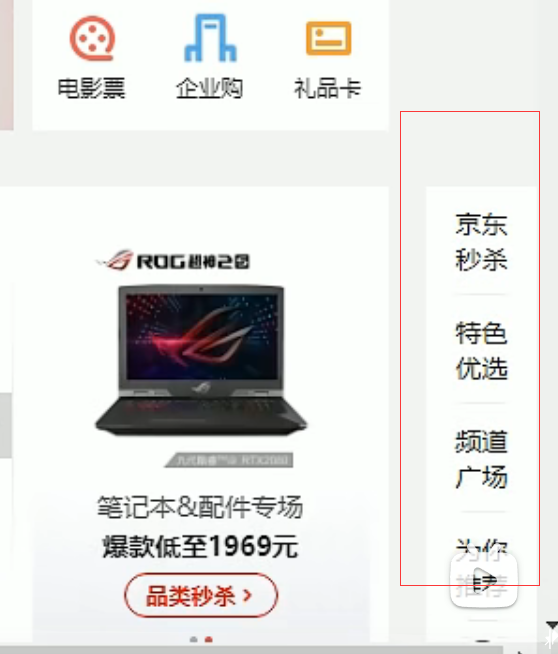

![image-20220627224150218](img/css中的定位/image-20220627224150218.png

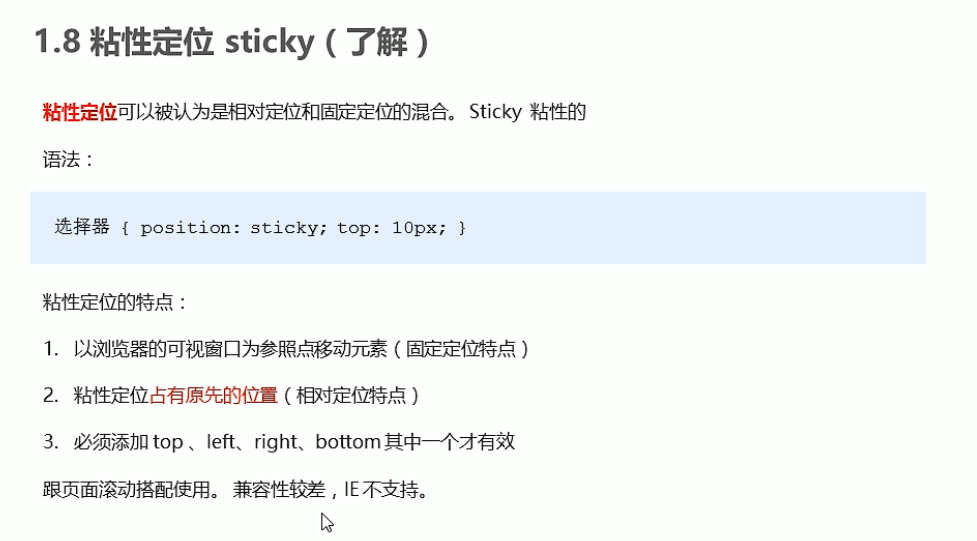

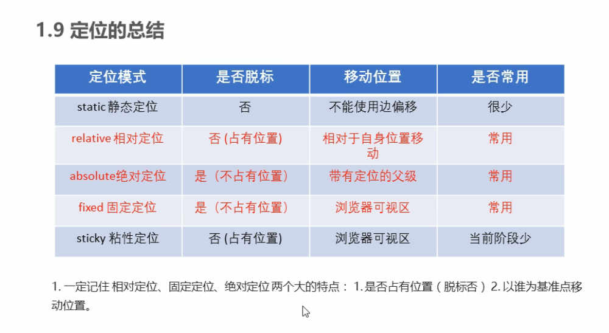

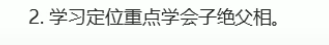

#### z-index

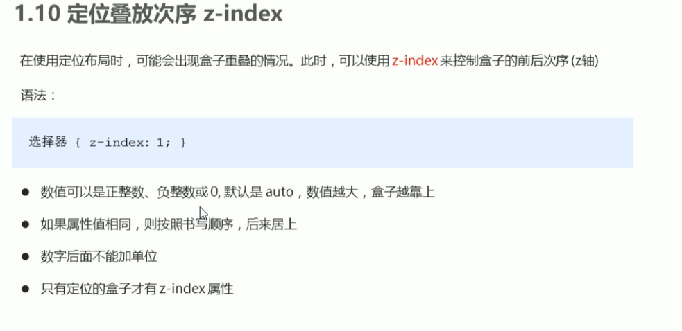

~~~
<!DOCTYPE html>
<html lang="en">
<head>
    <meta charset="UTF-8">
    <meta name="viewport" content="width=device-width, initial-scale=1.0">
    <meta http-equiv="X-UA-Compatible" content="ie=edge">
    <title>定位的堆叠顺序</title>
    <style>
        .box {
            position: absolute;
            top: 0;
            left: 0;
            width: 200px;
            height: 200px;
        }
        .xiongda {
            background-color: red;
            z-index: 1;
        }
        .xionger {
            background-color: green;
            left: 50px;
            top: 50px;
            z-index: 2;
        }
        .qiangge {
            background-color:blue;
            left: 100px;
            top: 100px;
        }
    </style>
</head>
<body>
    <div class="box xiongda">熊大</div>
    <div class="box xionger">熊二</div>
    <div class="box qiangge">光头强</div>
</body>
</html>
~~~


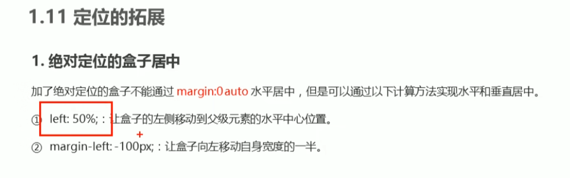

~~~
<!DOCTYPE html>
<html lang="en">
<head>
    <meta charset="UTF-8">
    <meta name="viewport" content="width=device-width, initial-scale=1.0">
    <meta http-equiv="X-UA-Compatible" content="ie=edge">
    <title>绝对定位水平垂直居中</title>
    <style>
        .box {
            position: absolute;
            /* 1. left 走 50%  父容器宽度的一半 */
            left: 50%;
            /* 2. margin 负值 往左边走 自己盒子宽度的一半 */
            margin-left: -100px;
            top: 50%;
            margin-top: -100px;
            width: 200px;
            height: 200px;
            background-color: pink;
            /* margin: auto; */
        }
    </style>
</head>
<body>
    <div class="box"></div>
</body>
</html>
~~~


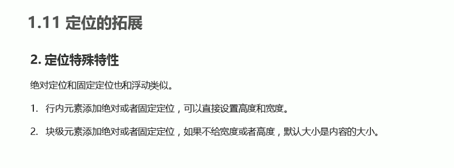

~~~
<!DOCTYPE html>
<html lang="en">
<head>
    <meta charset="UTF-8">
    <meta name="viewport" content="width=device-width, initial-scale=1.0">
    <meta http-equiv="X-UA-Compatible" content="ie=edge">
    <title>定位的特殊特性</title>
    <style>
        span {
            position: absolute;
            top: 300px;
            width: 200px;
            height: 150px;
            background-color: pink;
        }
        div {
            position: absolute;
            background-color: skyblue;
        }
    </style>
</head>
<body>
    <span>123</span>

    <div>abcd</div>
</body>
</html>
~~~

