### css盒子模型

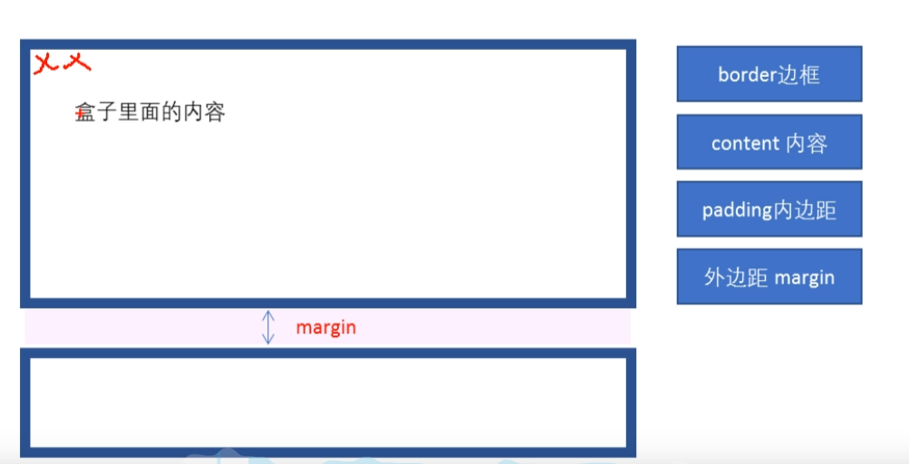

解析盒子模型的内部

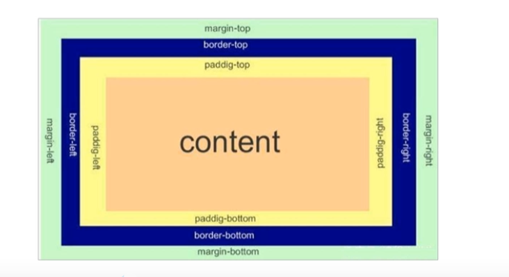


#### 边框

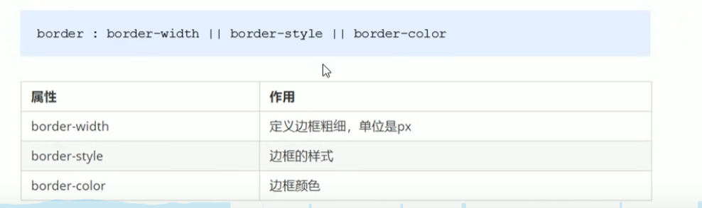


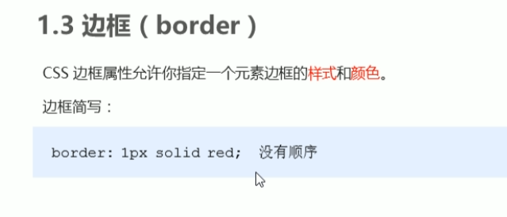

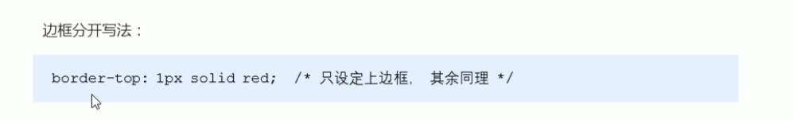


### 内容边距

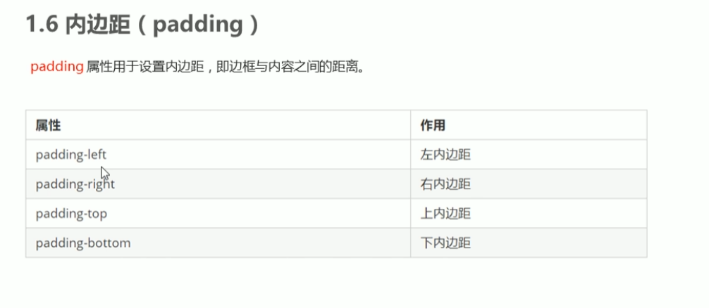

padding快速写法

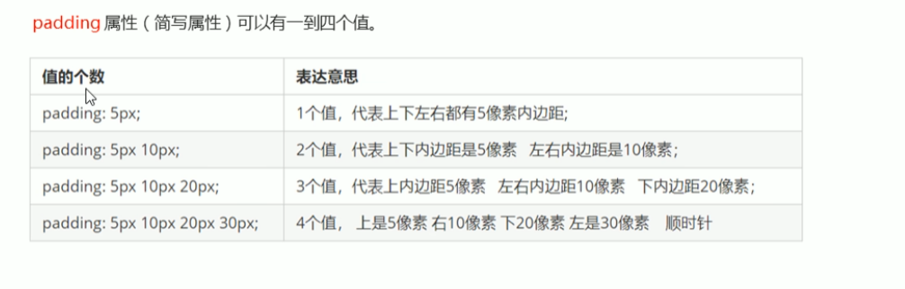

边框  内容边距 都会撑大盒子

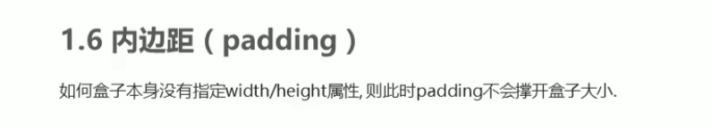

```html
<!DOCTYPE html>
<html lang="en">
<head>
    <meta charset="UTF-8">
    <meta name="viewport" content="width=device-width, initial-scale=1.0">
    <meta http-equiv="X-UA-Compatible" content="ie=edge">
    <title>padding不会影响盒子大小的情况</title>
    <style>   
       h1 {
           /* width: 100%; */
           height: 200px;
           background-color: pink;
           padding: 30px;
       }
       div {
           width: 300px;
           height: 100px;
           background-color: purple;
       }
       div p {
           padding: 30px;
           background-color: skyblue;
       }
    </style>
</head>
<body>
   <h1></h1>
   <div>
       <p></p>
   </div>
</body>
</html>
```

### 外边距

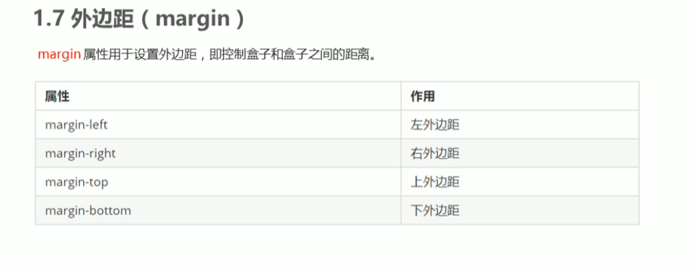

### 块盒子水平居中显示

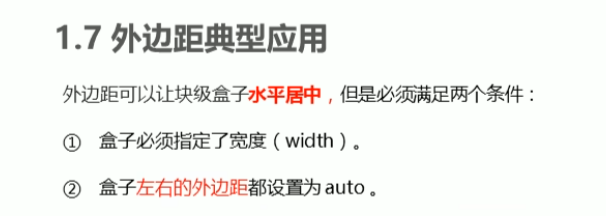

```
.header{
width:960px;
margin:0 auto;
}
```

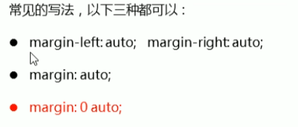

### 盒子的塌陷

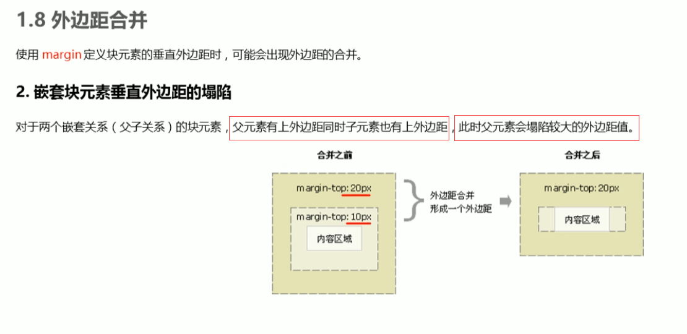

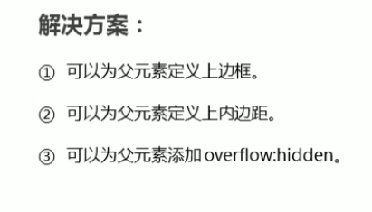

```
<!DOCTYPE html>
<html lang="en">
<head>
    <meta charset="UTF-8">
    <meta name="viewport" content="width=device-width, initial-scale=1.0">
    <meta http-equiv="X-UA-Compatible" content="ie=edge">
    <title>外边距合并-嵌套块级元素垂直外边距塌陷</title>
    <style>
        .father {
            width: 400px;
            height: 400px;
            background-color: purple;
            /* 父亲有边距 */
            margin-top: 50px;
            /* border: 1px solid red;  添加边框*/ 
            /* border: 1px solid transparent;  透明边框*/
            /* padding: 1px; 指定类边距*/
            
            overflow: hidden;
        }
        .son {
            width: 200px;
            height: 200px;
            background-color: pink;
             /* 儿子也有边距 */
            margin-top: 100px;
        }
    </style>
</head>
<body>
    <div class="father">
        <div class="son"></div>
    </div>
</body>
</html>
```

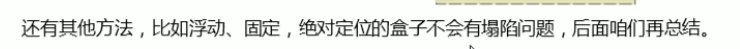

### 清除浏览器默认的边距

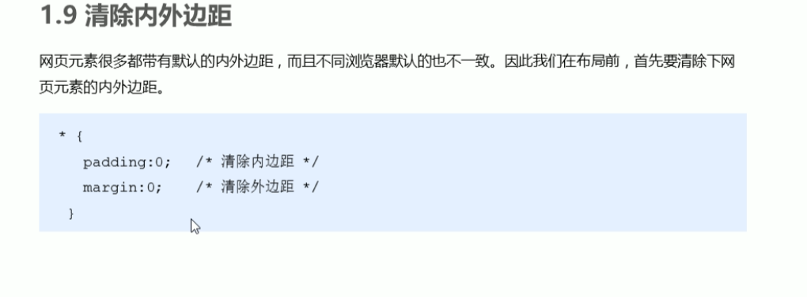

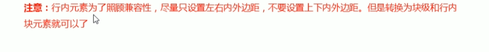

```
<span style={ margin 20px;}>行内元素只能设置左右内边距</span> 只生效左右
```

