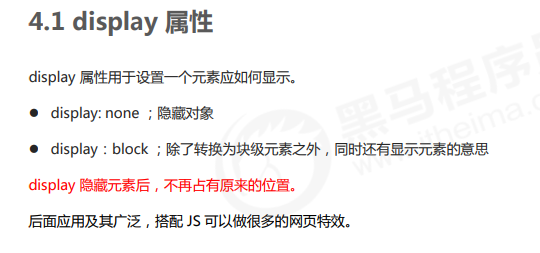
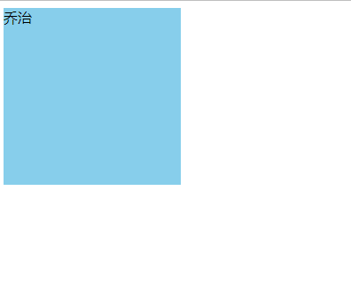
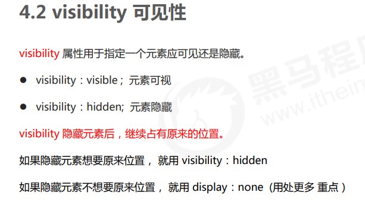

元素的显示与隐藏

1. display 显示隐藏
2. visibility 显示隐藏 
3. overflow 溢出显示隐藏

~~~html
<!DOCTYPE html>
<html lang="en">
<head>
    <meta charset="UTF-8">
    <meta name="viewport" content="width=device-width, initial-scale=1.0">
    <meta http-equiv="X-UA-Compatible" content="ie=edge">
    <title>显示隐藏元素之display</title>
    
</head>
<body>
    
佩奇

    
乔治

</body>
</html>
~~~

佩奇被隐藏了

和上面对比不占用原来的属性

~~~
<!DOCTYPE html>
<html lang="en">

<head>
    <meta charset="UTF-8">
    <meta name="viewport" content="width=device-width, initial-scale=1.0">
    <meta http-equiv="X-UA-Compatible" content="ie=edge">
    <title>显示隐藏元素之display</title>
    
</head>

<body>
    
猪爸爸

    
猪妈妈

</body>

</html>
~~~

