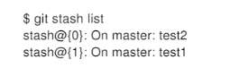

当正在dev分支上开发某个项目，这时项目中出现一个bug,需要紧急修复,但是正在开发的内容只是完成-半,还不想提交，这时可以用git stash命令将修改的内容保存至堆栈区，然后顺利切换到hotfix分支进行bug修复，修复完成后，再次切回到dev分支，从堆栈中恢复刚刚
保存的内容。

#### git stash 

能够将所有未提交的修改（⼯作区和暂存区）保存⾄堆栈中，⽤于后续恢复当前⼯作⽬录

#### git stash save

作⽤等同于git stash，区别是可以加⼀些注释，如下：
git stash的效果：
stash@{0}: WIP on master: b2f489c second

git stash save “test1”的效果：

stash@{0}: On master: test1

#### git stash list

查看当前stash中的内容

#### git stash pop

将当前stash中的内容弹出，并应用到当前分支对应的工作目录上。
注:该命令将堆栈中最近保存的内容删除(栈是 先进后出)
顺序执行git stash save“test1 "和git stash save“test2"命令，效果如下:

执行pop

#### git stash apply
将堆栈中的内容应用到当前目录,不同于git stash pop，该命令不会将内容从堆栈中删除，也就说该命令能够将堆栈的内容多次应用到工作
目录中，适应于多个分支的情况。

#### gitstashdrop+名称

从堆栈中移除某个指定的stash

####  git stash clear

清除堆栈中的所有内容

#### git stash show

查看堆栈中最新保存的stash和当前目录的差异。

#### 常用命令

git stash list  查看stash列表
git stash ( pop | apply ) [<stash>]  从stash栈中的某一个stash应用到当前工作区中（注：pop在应用完后会删除这个stash，apply则仍然保留）例:git stash apply stash@{0}
git stash drop [<stash>] 删除指定索引的stash 例:git stash drop stash@{0}
git stash clear 清空所有保存的stash列表
git stash save [<message>]] 将当前工作区、暂存区的改动保存到stash栈中
git stash show [<stash>] 查看某一个stash的文件