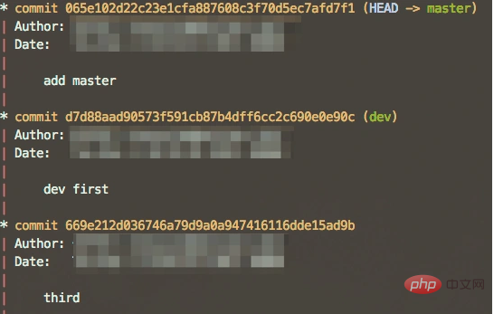
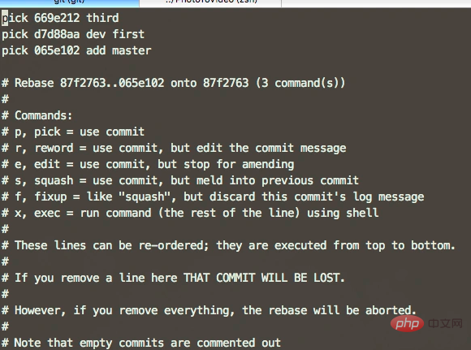

# git怎样修改历史记录

方法：1、用“git commit --amend”命令修改一次历史记录；2、用“git rebase -i 指定提交号”命令修改多条历史记录；3、用“git filter-branch --filer 命令 修改的范围”命令重写历史记录。


## 初级选手 git amend

如果仅仅是在提交之后发现自己手残了，用git commit --amend就可以修改刚才的那一次提交。该命令在执行以后，会将刚刚的那一次提交从当前分支移除，把工作空间恢复到上次准备提交的状态（同时混合了上次提交之后的更改），然后显示出一个 vim 的界面让你去修改上次的提交信息。在vim 中保存后，就会把当前的所有修改一并用新的提交信息提交了。

该命令仅仅可以修改最后一次提交，一个命令相当于执行了如下一系列动作：

```
$ORIG_HEAD=`git show`#保存当前的这次提交的 commit 号

$git reset --soft HEAD^#回到最后一次提交准备提交前的状态

$...#做一些操作和修改

$git commit -c $ORIG_HEAD#表示用最后一次提交的提交信息来做为提交信息，不过会调出编辑器界面
```

### 中级选手 git rebase

**前面的git commit --amend仅仅可以修改最后一次提交**，但是当自己一时兴起，手残了一路时，这个命令就无法拯救我们了，这个时候我们就要祭出git rebase -i 这个大杀器来帮我们修改那些不堪回首的往事。

实际上，git rebase -i并不是一个专门用来修改历史记录的命令，而是一个让我们可以交互式（就是一个个来） 进行衍合操作的命令，不过我们可以用这个命令来实现对于提交历史的修改。

该命令的使用方法是git rebase -i <指定提交号>,比如可以用git rebase -i HEAD~3来修改本次提交、上次提交、上上次提交共三次提交。



如图，我如果向修改这三次提交，输入git rebase -i HEAD~3，就会出现如下的界面：

这是一个 vim 编辑器的界面，这里是让我们编辑这一段脚本，可以使用的命令有下方注释中的六个命令。当退出当前编辑其的页面后，git 就会根据这个脚本一个个的针对提交执行对应的操作（从最早的那次提交开始执行）。

如果仅仅是想修改提交信息，就把所有的 pick 改成 r ，然后:wq保存，接下来 git 就会让你一个个的从最早的提交信息开始修改。

剩余的命令中， e 是会在修改对应提交时跳出 vim 编辑器，此时 HEAD 指针指向这次提交，此时可以用git commit --amend对这次提交进行各种修改，然后执行 git rebase --continue就会继续下一次操作；s 则是会在修改对应提交的时候把这次的提交和其父提交合并为一次提交；f 是和s类似但是会忽略当前提交的信息，直接采用父提交的信息；x 是需要在 x 之后输入命令然后在 HEAD 指向这次提交的时候执行。利用这些命令还可以完成重排提交、拆分提交的动作。

### 终极杀手 git filter-branch

[git filter-branch - [ Git中文开发手册 \] - 在线原生手册 - php中文网](https://www.php.cn/manual/view/34955.html)

假如说我们提交了 N 多次以后，突然发现我们这些提交的邮箱都写错了(╯°□°）╯︵ ┻━┻，这个时候如果使用之前提到的命令，估计还没改完就要累死了。这个时候我们就可以使用git filter-branch来重写分支，其可以批量的对每个提交执行我们预设的操作。

git filter-branch命令使用的基本使用格式是git filter-branch --<各种filer> '命令' <修改的范围> ，不同的 filter 会提供给命令不同的输入和输出。
比如，

--env-filter <command>

如果您只需要修改提交将执行的环境，则可以使用此过滤器。具体来说，您可能需要重写作者/提交者名称/电子邮件/时间环境变量

--msg-filter表示修改提交信息，原提交信息从标准输入读入，新提交信息输出到标准输出

--tree-filter表示修改文件列表等等。最后会有一个重写的范围。

--prune-empty表示如果修改后的提交为空则扔掉不要。在一次试运行中我发现虽然文件被删除了，但是还剩下个空的提交，就查了下 man 文档，找到了这个选项。

-f是忽略备份。不加这个选项第二次运行这个命令时会出错，意思是 git 上次做了备份，现在再要运行的话得处理掉上次的备份。

--all是针对所有的分支。

--index-filter 'git rm -rf --cached --ignore-unmatch <file>使⽤带有git rm的index-filter会产⽣明显更快的版本。与使⽤rm⽂件名⼀样，如果⽂件不在提交树中，则git rm --cached filename将失败。如果你想“完全忘记”⼀个⽂件，它在输⼊历史记录时⽆关紧要，所以我们还添加了--ignore-unmatch


比如，
git filter-branch --env-filter 'GIT_AUTHOR_EMAIL=john@example.com export GIT_AUTHOR_EMAIL' HEAD
就可以用来重写邮箱。建议在调用命令之前先啦出一个分支做尝试再在自己要修改的分支上执行操作。