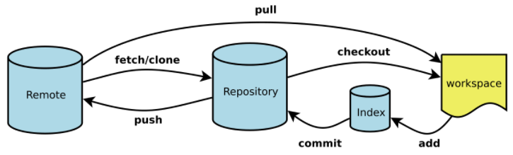
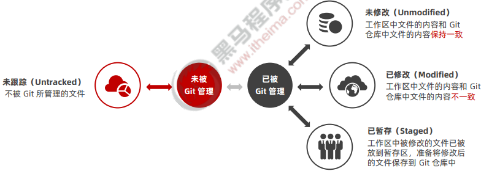
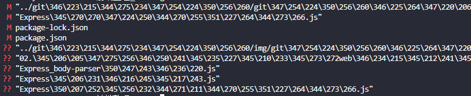
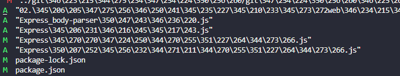
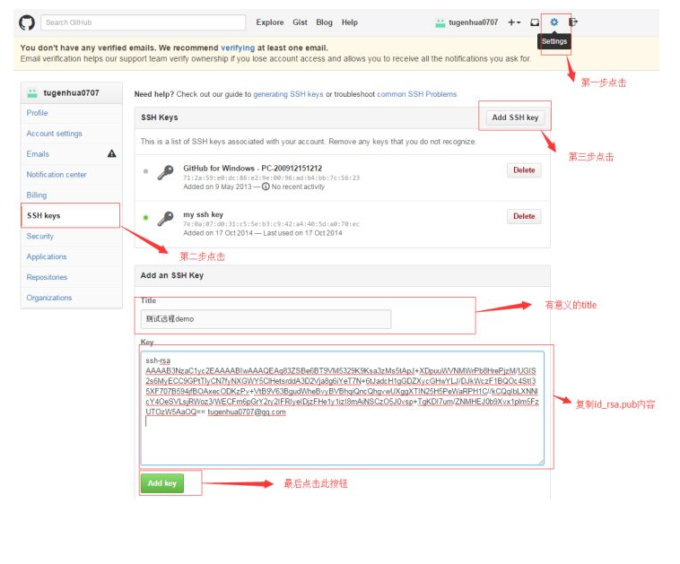
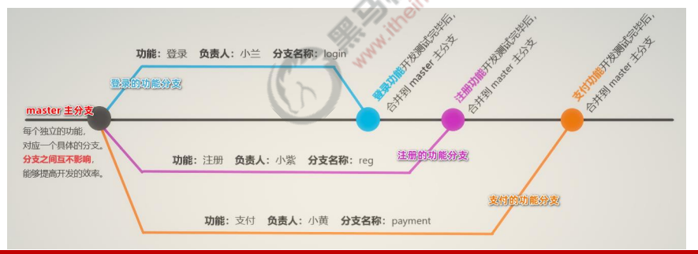

## 原理

Workspace：工作区
Index / Stage：暂存区
Repository：仓库区（或本地仓库）
Remote：远程仓库

## 初级篇

### git

安装git 没啥好说的下一步点击即可

git init 初始化 仓库 本地部分搭建完毕

/.git就是储存信息的文件

####  工作区中文件的 4 种状态

##### 查看状态

可以使用 git status 命令查看文件处于什么状态

git status -short

未跟踪文件前面有红色的 ?? 标记

修改过的、没有放入暂存区的文件前面有红色的 M 标记

##### 跟踪新文件

git add 开始跟踪一个文件

以精简的方式显示文件的状态： 新添加到暂存区中的文件前面有绿色的 A 标记

git add .

将新增和修改过后的文件加入暂存区

##### 提交更新

git commit 命令进行提交, 其中 -m 选项后面是本次的提交消息

##### 取消暂存的文件

如果需要从暂存区中移除对应的文件

git reset HEAD要移除的文件名称

##### 跳过使用暂存区域

Git 提供了一个跳过使用暂存区域的方式， 只要在提交的时候，给 git commit 加上 -a 选项，Git 就会自动把 所有已经跟踪过的文件暂存起来一并提交，从而跳过 git add 步骤：

~~~
git commit -a -m "描述消息"
~~~

##### 移除文件

从 Git 仓库中移除文件的方式有两种： 

① 从 Git 仓库和工作区中同时移除对应的文件

~~~
git rm -f index.js
~~~

② 只从 Git 仓库中移除指定的文件，但保留工作区中对应的文件

~~~
git rm --cached index.js
~~~

##### 查看提交历史

~~~
#按时间先后顺序列出所有的提交历史，最近的提交排在最上面
git log
#只展示最新的两条提交历史，数字可以按需进行填写
git log -2
#在一行上展示最近两条提交历史的信息
git log -2 --pretty=oneline

#在一行上展示最近两条提交历史的信息，并自定义输出的格式
#h提交的简写哈希值‰an作者名字―‰ar作者修订日期，按多久以前的方式显示――‰s提交说明
git log -2 --pretty=format : "%h | %an | %ar |%s"

~~~

##### 回退到指定的版

~~~
#在一行上展示所有的提交历史
git log --pretty=oneline
#使用git reset --hard命令，根据指定的提交ID回退到指定版本
git reset --hard <CommitID>
#在旧版本中使用git reflog --pretty=oneline命令，查看命令操作的历史
git reflog --pretty=oneline
#再次根据最新的提交ID，跳转到最新的版本
git reset --hard <CommitID>

~~~

#### .gitconfig Git 的全局配置文件

~~~
通过 git config --global user.name 和 git config --global user.email 配置的用户名和邮箱地址，会被写
入到 
C:/Users/用户名文件夹/.gitconfig 文件中。这个文件是 Git 的全局配置文件，配置一次即可永久生效。
~~~

#### .gitignore 忽略文件

① 以 # 开头的是注释

 ② 以 / 结尾的是目录 

③ 以 / 开头防止递归 

④ 以 ! 开头表示取反 

⑤ 可以使用 glob 模式进行文件和文件夹的匹配（glob 指简化了的正则表达式）

所谓的 glob 模式是指简化了的正则表达式：

① 星号 * 匹配零个或多个任意字符 

② [abc] 匹配任何一个列在方括号中的字符 （此案例匹配一个 a 或匹配一个 b 或匹配一个 c）

③ 问号 ? 只匹配一个任意字符

④ 在方括号中使用短划线分隔两个字符， 表示所有在这两个字符范围内的都可以匹配（比如 [0-9] 表示匹配 所有 0 到 9 的数字） ⑤ 两个星号 ** 表示匹配任意中间目录（比如 a/**/z 可以匹配 a/z 、 a/b/z 或 a/b/c/z 等）

### github

####  常见的 5 种开源许可协议

① BSD（Berkeley Software Distribution） 

② Apache Licence 2.0

③ GPL（GNU General Public License） ⚫ 具有传染性的一种开源协议，不允许修改后和衍生的代码做为闭源的商业软件发布和销售 ⚫ 使用 GPL 的最著名的软件项目是：Linux 

④ LGPL（GNU Lesser General Public License） 

⑤ MIT（Massachusetts Institute of Technology, MIT） ⚫ 是目前限制最少的协议，唯一的条件：在修改后的代码或者发行包中，必须包含原作者的许可信息 ⚫ 使用 MIT 的软件项目有：jquery、Node.js

#### 开源项目托管平台

下载ssh生成计算机密钥

ssh-keygen -t rsa –C “邮箱”

id_rsa是私钥，不能泄露出去，id_rsa.pub是公钥，可以放心地告诉任何人

登录github,打开” settings”中的SSH Keys页面，然后点击“Add SSH Key”,填上任意title，

在Key文本框里黏贴**id_rsa.pub**文件的内容。

创建一个仓库

然后本地与远程仓库关联

git remote add origin https://github.com/z291384521/zzzzzzzzzzzzzzz.git

git push -u origin master

我们第一次推送master分支时，加上了 –u参数，Git不但会把本地的master分支内容推送的远程新的master分支，还会把本地的master分支和远程的master分支关联起来，在以后的推送或者拉取时就可以简化命令。

#### 如何摆脱关联删除远程仓库命令

1、先输⼊$ git remote rm origin(删除关联的origin的远程库)
2、再输⼊$ git remote add origin **************:(github名)/(git项⽬名).git 就不会报错了！
3、如果输⼊$ git remote rm origin 还是报错的话，error: Could not remove config section 'remote.origin'. 我们需要修改gitconfig⽂
件的内容
4、找到你的github的安装路径，我的是找到⼀个名为gitconfig的⽂件，打开它把⾥⾯的[remote "origin"]那⼀⾏删掉就好了！

## 中级Git 分支

###  master 主分支

在初始化本地 Git 仓库的时候，Git 默认已经帮我们创建了一个名字叫做 master 的分支。通常我们把这个 master 分支叫做主分支。

 在实际工作中，master 主分支的作用是：**用来保存和记录整个项目已完成的功能代码**。 因此，不允许程序员直接在 master 分支上修改代码，因为这样做的风险太高，容易导致整个项目崩溃

###  功能分支

由于程序员不能直接在 master 分支上进行功能的开发，所以就有了功能分支的概念。

功能分支指的是专门用来开发新功能的分支，它是临时从 master 主分支上分叉出来的，当新功能开发且测试 完毕后，最终需要合并到 master 主分支上，如图所示

### 查看分支列表

~~~
git branch 
~~~

分支名字前面的 * 号表示当前**所处的分支**

### 创建新分支

~~~
git branch 分支名称
~~~

### 切换分支

~~~
git checkout 分支名称
~~~

### 分支的快速创建和切换

~~~
git checkout -b 分支名称"  越等越 创建加切换
~~~

### 合并分支

功能分支的代码开发测试完毕之后，可以使用如下的命令，将完成后的代码合并到 master 主分支上：

~~~
#1．切换到master 分支git checkout master
#2、在 master分支上运行 git merge命令，
将 login 分支的代码合并到master分支git merge login
~~~

### 删除分支

~~~
git branch -d “分支名称”
~~~

### 遇到冲突时的分支合并 

如果在两个不同的分支中，对同一个文件进行了不同的修改，Git 就没法干净的合并它们。 此时，我们需要打开 这些包含冲突的文件然后手动解决冲突
