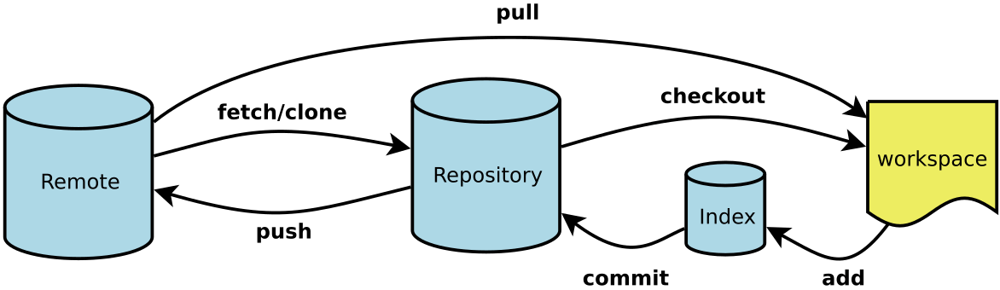
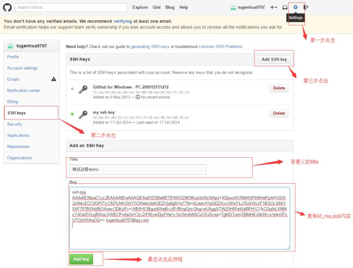

原理

Workspace：工作区
Index / Stage：暂存区
Repository：仓库区（或本地仓库）
Remote：远程仓库

1 初始化

ssh-keygen -t rsa –C “291384521@qq.com”

id_rsa是私钥，不能泄露出去，id_rsa.pub是公钥，可以放心地告诉任何人

登录github,打开” settings”中的SSH Keys页面，然后点击“Add SSH Key”,填上任意title，在Key文本框里黏贴id_rsa.pub文件的内容。

git remote add origin https://github.com/z291384521/Python-notebook.git

git push -u origin master

我们第一次推送master分支时，加上了 –u参数，Git不但会把本地的master分支内容推送的远程新的master分支，还会把本地的master分支和远程的master分支关联起来，在以后的推送或者拉取时就可以简化命令。

删除远程仓库命令 
解决办法如下：
1、先输⼊$ git remote rm origin(删除关联的origin的远程库)
2、再输⼊$ git remote add origin **************:(github名)/(git项⽬名).git 就不会报错了！
3、如果输⼊$ git remote rm origin 还是报错的话，error: Could not remove config section 'remote.origin'. 我们需要修改gitconfig⽂
件的内容
4、找到你的github的安装路径，我的是
C:\Users\ASUS\AppData\Local\GitHub\PortableGit_ca477551eeb4aea0e4ae9fcd3358bd96720bb5c8\etc
5、找到⼀个名为gitconfig的⽂件，打开它把⾥⾯的[remote "origin"]那⼀⾏删掉就好了！
记⼀次我关联远程库遇到的错误
⽤了上⾯的办法我就解决了( 希望能对看到的⼈有所帮助 )
