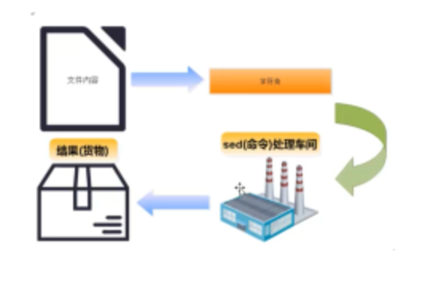

### 1.批量查找某个目下文件的包含的内容

```
cd etc
grep -rn "查找的内容" ./
```

### 2.批量替换某个目下所有包含的文件的内容

```
cd etc
sed -i "s/查找的内容/替换后的内容/g" `grep -rl "查找的内容" ./`


192.168.200.128
```

### 3.批量查找并替换任意文件夹下的文件内容

```
sed -i "s/要找查找的文本/替换后的文本/g" `grep -rl "要找查找的文本" /任意文件夹`

sed -i "s/192.168.200.128/zrqtest.zjmww.com/g" `grep -rl "192.168.200.128" /www/wwwroot/GameApp2`
sed -i "s/192.168.200.128/140.210.16.98/g" `grep -rl "192.168.200.128" /data`
```


解释

sed先读取（从输入中读取某一行），再执行（在某一行上执行sed命令），再再显示（把结果显示在输出中）；默认是显示修改后内容，不会修改原文件，除非使用-i 参数。



命令格式：

`sed [options] [sed -commands][input -file]`
`sed [选项]  【sed命令】 【输入文件】`

### 4，命令执行流程

Sed软件从文件或管道中读取一行，处理一行，输出一行；再读取一行，再处理一行，再输出一行....

#### 详细流程

现有一个文件person.txt,共有五行文本，sed命令读入文件person.txt的第一行“101，chensiqi,CEO”,并将这行文本存入模式空间（sed软件在内存中的一个临时缓存，用于存放读取到的内容，比喻为工厂流水线的传送带。）

#### 文件person.txt在模式空间的完整处理流程

1. 判断第1行是否是需要处理的行，如果不是要处理的行就重新从文件读取下一行，如果是要处理的行，则接着往下走。
2. 对模式空间的内容执行sed命令，比如a（追加），i（插入），s（替换）...
3. 将模式空间中经过sed命令处理后的内容输出到屏幕上，然后清空模式空间
4. 读取下一行文本，然后重新执行上面的流程，直到文件结束


**Sed软件有两个内置的存储空间：**

- 模式空间（pattern space）：是sed软件从文本读取一行文本然后存入的缓冲区（这个缓冲区是在内存中的），然后使用sed命令操作模式空间的内容。
- 保持空间（hold space）：是sed软件另外一个缓冲区，用来存放临时数据，也是在内存中，但是模式空间和保持空间的用途是不一样的。Sed可以交换保持空间和模式空间的数据，但是不能在保持空间上执行普通的sed命令，也就是说我们可以在保持空间存储数据。