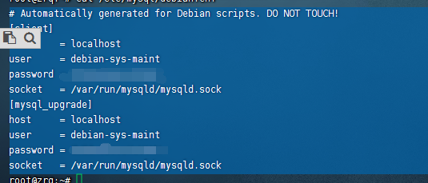
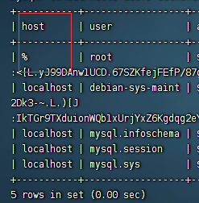

1 在ubuntu中apt安装mysql服务确实简单但是

第一个问题就来了他用户以及密码是多少

查阅资料以后发现他会写在配置文件里面

/etc/mysql/debian.cnf

~~~
mysql -udebian-sys-maint -p
~~~

输入密码登录

然后就是创建root用户以及修改密码

注意localhost如果查询

~~~
select host, user, authentication_string, plugin from user;
~~~

@后面就是啥

~~~
alter user'root'@'%' identified by 'root';
~~~

远程登录

~~~sql
update user set host='%' where user='root';
这一步很重要关系远程链接
update user set plugin='mysql_native_password' where user ='root';
给root所有权限
grant all on *.* to 'root'@'%';
flush privileges;
~~~

发现 还是链接不上 需要将配置文件注释掉

~~~
#bind-address		= 127.0.0.1
#mysqlx-bind-address	= 127.0.0.1
~~~

删除创建用户

~~~
delete from user where user='root' and host='%';
create user 'root'@'%' identified by 'root';
flush privileges;
~~~

ALTER USER 'root'@'%' IDENTIFIED WITH mysql_native_password BY 'root';

手打不易，转载注明出处：https://zhangxiaofan.blog.csdn.net/article/details/84555847

mysql连数据库的时候报错:

1251 client does not support authentication protocol requested by server;consider upgrading Mysql client

ERROR 1396 (HY000): Operation ALTER USER failed for 'root'@'localhost'

先登录mysql

mysql -u root -p
输入密码

mysql> use mysql;
mysql> select user,host from user;
+------------------+-----------+
| user             | host      |
+------------------+-----------+
| root             | %         |
| admin            | localhost |
| mysql.infoschema | localhost |
| mysql.session    | localhost |
| mysql.sys        | localhost |
| zhangj           | localhost |
+------------------+-----------+
注意我的 root，host是'%'

你可能执行的是:

ALTER USER 'root'@'localhost' IDENTIFIED WITH mysql_native_password BY '123';
改成:

ALTER USER 'root'@'%' IDENTIFIED WITH mysql_native_password BY '123';
如果还是不行：

尝试一：重置密码为空

先登录MySQL，重置密码为空，并刷新

update user set authentication_string='' where user='root';

flush privileges;
再用上面的方法修改密码
————————————————
版权声明：本文为CSDN博主「Mr.Java.」的原创文章，遵循CC 4.0 BY-SA版权协议，转载请附上原文出处链接及本声明。
原文链接：https://blog.csdn.net/q258523454/article/details/84555847