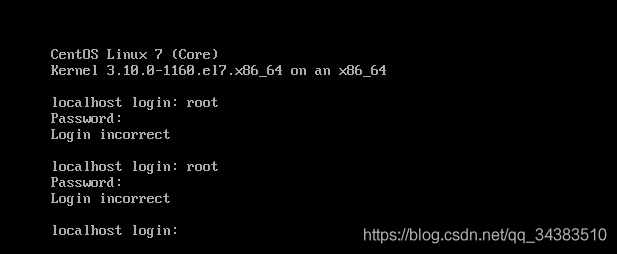
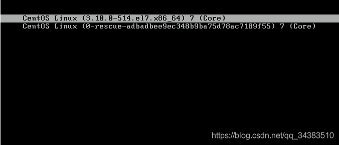
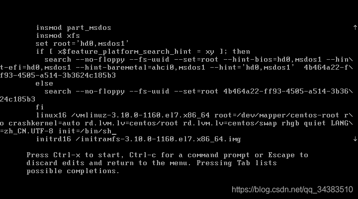
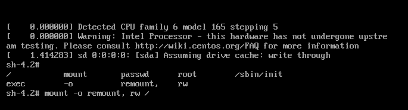
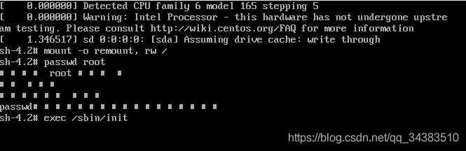
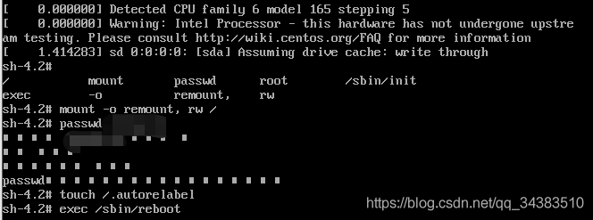

问题描述：
启动虚拟机，忘记用户密码。

 解决方案：
直接修改用户密码

1、重启系统，在开机过程中，在启动界面**按e键**

2、在接下来的界面中找到以linux16开始的行，将光标一直移动到 LANG=en_US.UTF-8 后面，空格，再追加**init=/bin/sh**

3、按**Ctrl+X**进入“单用户模式”，输入**mount -o remount, rw /**挂载根目录

4、输入 **passwd 用户名** 进入密码修改（需要输入两次）

 
5、更新系统信息和启动系统：依次输入**touch /.autorelabel 和 exec /sbin/init**

 6、进入登录界面，输入修改后的密码，登录成功

