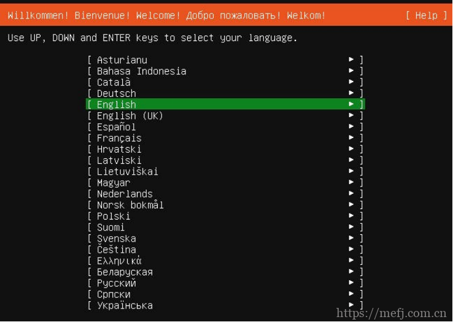
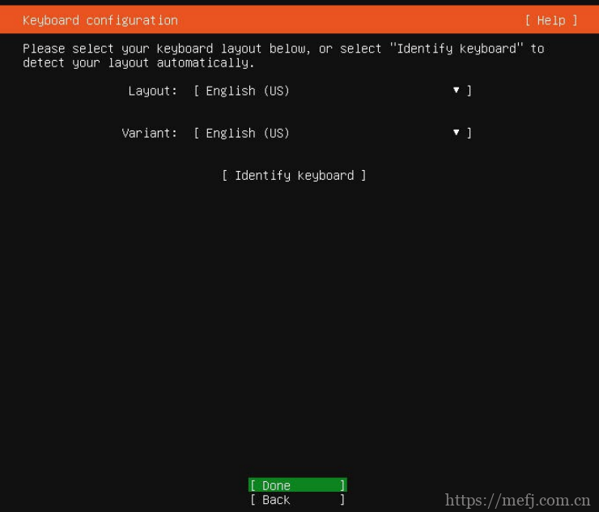
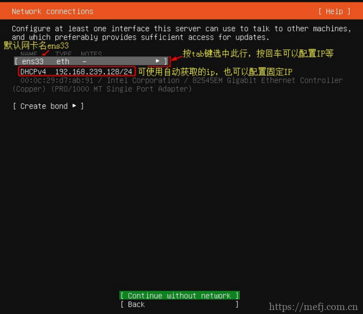
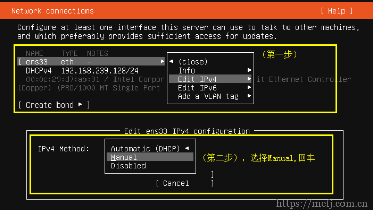
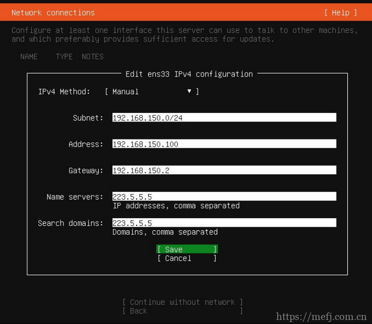
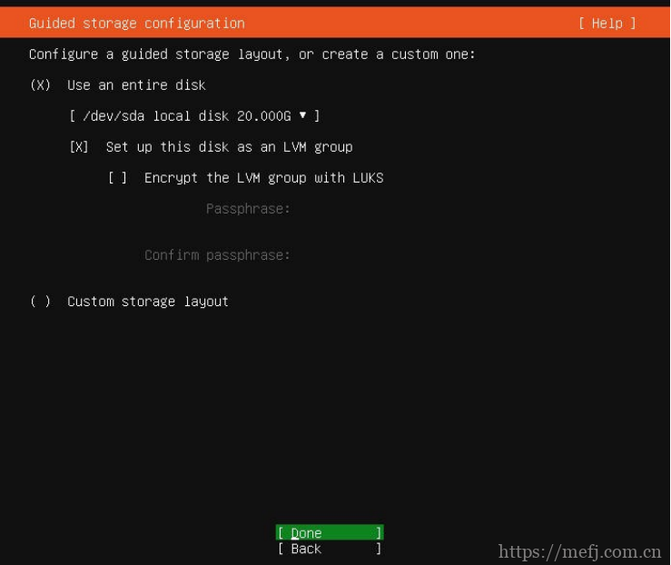
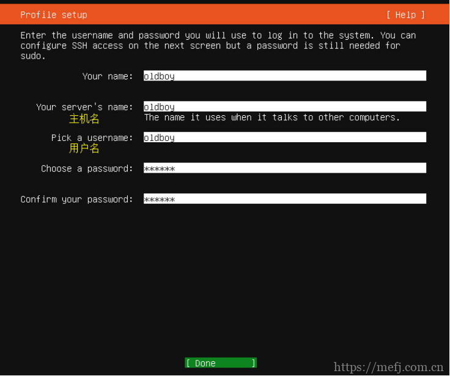
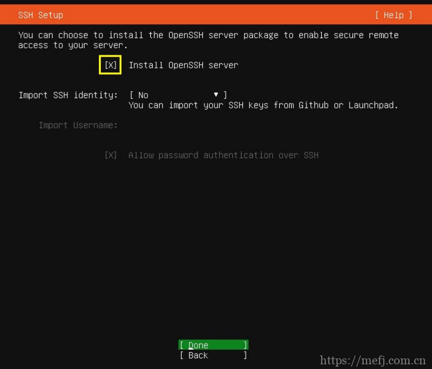

### 选择语言

### **选择键盘**

### **配置网络**

最后一个为DNS为公共可用DNS。 

### **配置磁盘分区**

## **配置系统信息**

 配置系统主机名、登录用户和密码。

### **安装****openssh****远程连接工具**

按空格键勾选图中的小方框内为小叉子，然后按tab键选择Done继续。

 

 

等待安装完成

### 配置网卡

修改网卡配置注意事项

1. ubuntu从17.10开始，已放弃在/etc/network/interfaces里固定IP配置，即使配置也不会生效，而 是改成netplan方式。
2. 配置写在/etc/netplan/01-netcfg.yaml或者类似名称的yaml文件里。 3.修改配置以后不用重启，执行 netplan apply 命令可以让配置直接生效。

~~~shell
# This is the network config written by 'subiquity'
network:
  version:
          2
  renderer:
          networkd
  ethernets:
    ens33:
      addresses:
              - 192.168.1.119/24
      dhcp4:
              no
      gateway4:
              192.168.1.1
      nameservers:
           addresses:
                   [114.114.114.114]

~~~

