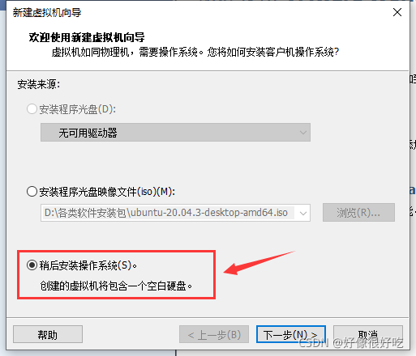

# VMware虚拟机安装Ubuntu20.04详细图文教程

### [VMware](https://so.csdn.net/so/search?q=VMware&spm=1001.2101.3001.7020)虚拟机安装Ubuntu20.04详细图文教程

- 1 VM和Ubuntu下载
- 2 VM安装Ubuntu
- 3 更改Ubuntu软件源
- 4 Windows与Ubuntu跨系统复制粘贴

# 1 VM和[Ubuntu](https://so.csdn.net/so/search?q=Ubuntu&spm=1001.2101.3001.7020)下载

**Ubuntu系统下载官方链接：**[Ubuntu系统下载](https://ubuntu.com/download/desktop)


**VMware下载官方链接:** [VMware Workstation 16 Player下载 ](https://www.vmware.com/cn/products/workstation-player/workstation-player-evaluation.html)


**下完VMware直接安装就行了**

# 2 VM安装Ubuntu

**双击打开VMware Workstation 16 Player**
**点击创建新虚拟机**

**选择稍后安装操作系统，再点下一步**

**然后注意这两个地方，选择操作系统和版本如下，再点下一步**

**自己定一个系统存储位置，再下一步**

**最大磁盘大小按需修改，选择存储为单个文件，再下一步**

**点击自定义硬件**

**选择使用ISO映像文件，浏览选中刚开始下载的Ubuntu系统，然后点右下角的关闭，再点完成**

**选中，点击播放虚拟机**

**然后等待…**

**进入之后，下拉选中 中文简体，再点Ubuntu安装**

**再双击chinese。这里因为Ubuntu系统显示器大小不对，下面的界面显示不出来，我们在下一步先来修改它的显示器大小**

**到这里后，本来右下箭头所指地方有 继续 按钮，但是显示不出来，我们先关掉安装界面，退出安装**

**等待…然后进入如下页面，点击右上角倒三角形，再点击设置**

**下拉找到显示器，点击分辨率**

**任意改为另一个，例如1024x768，再点击应用**

**选择保留更改**

**然后点击左上角图标，重新进入系统安装**

**可以看到这时能显示继续的按钮，点击继续**


**点击现在安装**

**再点击继续**

**选择地区**
点中国所在范围

**自行填写以下信息**

**然后便进入安装等待界面**

**下载文件时间较长，可点击展开选择skip，然后再等待一段时间…**

**安装完成，提示重启，点击重启**

**然后根据提示，进入系统，显示如下界面，即安装完成。**


# 3 更改Ubuntu软件源

**配置系统的软件源，提高下载速度**
**先点左下角矩形网格，找到并打开 软件与更新**

**按图示修改**

**点击选择一个服务器，如第一个，再点选择服务器**

**再点关闭**

**点击重新载入，并等待**

**其中需输入密码，即之前自行设置的密码，此后有软件更新点击更新即可**
**到这里软件源更改完成。**

# 4 Windows与Ubuntu跨系统复制粘贴

**打开终端，手动输入以下命令，再重启ubuntu系统就可以了**
**即通过安装VMtools实现了Windows与Ubuntu跨系统复制粘贴，也实现了Ubuntu窗口自适应**

```
sudo apt-get autoremove open-vm-tools
sudo apt-get install open-vm-tools
sudo apt-get install open-vm-tools-desktop
123
```

参考：[Copy/paste and drag&drop not working](https://askubuntu.com/questions/691585/copy-paste-and-dragdrop-not-working-in-vmware-machine-with-ubuntu/824341#824341)